# 🏛️ GovBiz

**Ai Agent 정부지원 사업 탐색·신청 관리 플랫폼**

<a id="팀-소개"></a>

## 1. 팀 소개

<!-- 팀원 소개는 보존된 3차 프로젝트 README의 이름·GitHub 프로필을 참고했습니다. -->

<table>
  <tr>
    <td align="center">
      <br>
      <b>김건우(PM)</b><br>
      <a href="https://github.com/ilil1">
        
      </a>
    </td>
    <td align="center">
      <br>
      <b>김동섭</b><br>
      <a href="https://github.com/20220348-kim">
        
      </a>
    </td>
    <td align="center">
      <br>
      <b>이성민</b><br>
      <a href="https://github.com/lsm15111">
        
      </a>
    </td>
  </tr>
</table>

<a id="프로젝트-개요"></a>

## 2. 프로젝트 개요

### 어떤 서비스인가요?

GovBiz는 여러 기관에 흩어진 정부지원사업 공고를 모아 기업의 조건과 목적에 맞게 탐색하도록 돕는 서비스입니다.
사용자는 AI 대화 또는 직접 필터로 공고를 찾고, 추천 이유와 지원 조건을 원문에서 확인합니다.
관심 공고 저장, 신청 문서 작성, 진행 단계 관리, 중복 지원 검토와 협업 제안으로 이어갈 수 있습니다.

### 해결하려는 문제

| 사용자가 겪는 문제 | GovBiz의 해결 방법 |
|---|---|
| 기관마다 공고가 흩어져 있어 찾고 비교하기 어려움 | 공식 제공처 4곳의 공고를 수집·정규화하고 통합 검색 |
| 키워드만으로 우리 기업에 맞는 사업을 고르기 어려움 | AI 대화로 조건을 구체화하고 키워드·의미 검색을 결합 |
| AI 답변의 근거와 신청 조건을 확인하기 어려움 | 공식 본문의 인용 근거, 추천 이유와 자격 확인 정보를 함께 표시 |
| 공고 탐색 이후 문서·일정·협업을 따로 관리해야 함 | 관심함·달력·신청 문서·진행 관리·협업 기능을 연결 |
| 모델이나 프롬프트 변경의 영향을 확인하기 어려움 | 같은 평가 자료로 결과를 비교하고 검토·사용량·실패 이력을 보존 |

<a id="주요-기능"></a>

## 3. 주요 기능과 사용 흐름

### 사용자는 이렇게 이용합니다

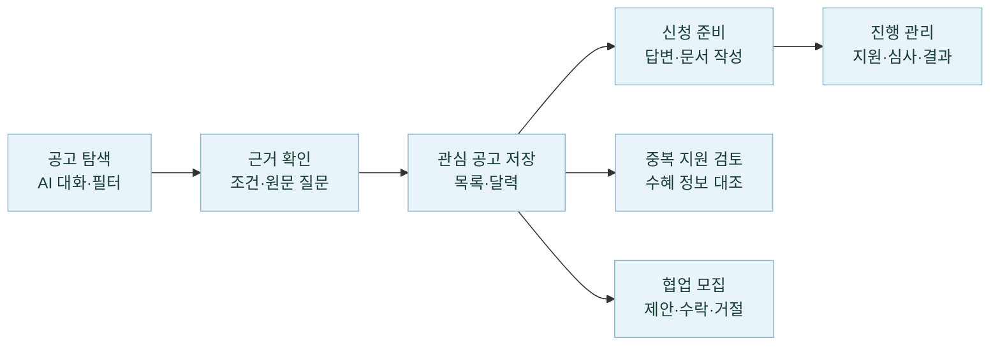

### 관리자는 이렇게 운영합니다


### 기능별 상세 설명

| 기능 | 현재 구현 |
|---|---|
| **공고 검색·추천** | AI 대화로 조건을 제안하고 사용자 확인 후 검색합니다. 직접 필터 검색은 키워드·지역·분야·출처·접수 상태와 K-Startup 추가 조건, 정렬·페이지 이동을 제공합니다. AI 추천은 키워드·의미 검색 후보를 결합해 관련도와 자격 근거를 표시합니다. |
| **공고 상세·원문 질문** | 접수 기간·신청 방법·공식 문의처·지원 조건을 조회하고 공식 원문으로 이동합니다. 기업마당·K-Startup 상세 HTML에 질문하면 답변과 인용 근거를 확인할 수 있습니다. |
| **관심 공고·진행 관리** | 공고 저장·해제, 목록·달력·진행 관리 보기와 신청 문서의 준비·지원·심사·결과 단계를 관리합니다. |
| **신청 문서 작성** | 공식 양식·문항 발견, 문항별 답변 저장·검토, AI 초안과 생성 작업 조회, 지원 형식의 원본 문서 작성·다운로드를 제공합니다. 모바일은 파일 저장·공유로 연결합니다. [형식별 지원 범위](docs/application-document-mcp-architecture.md) |
| **중복 지원·수혜 검토** | 선택한 공고·기존 수혜 정보를 공식 근거와 대조하고 사업쌍별 판단·인용·기관 확인 사항을 저장합니다. 비동기 분석 상태와 결과를 다시 조회할 수 있습니다. |
| **협업·파트너** | 모집글 목록·상세·작성·수정, 내 모집글, 받은·보낸 제안과 수락·거절·철회를 제공합니다. 기업 등록·사업자 상태에 따른 이용 조건을 적용합니다. |
| **계정·기업 정보** | 이메일 인증 가입·로그인, 비밀번호 재설정, 설정된 소셜 로그인, 사업자 조회·기업 등록·수정, 회원별 대화 보관·복원을 제공합니다. |
| **맞춤 리포트·알림** | 기업 조건에 맞춘 리포트 생성·조회, 수신 설정과 이메일·앱 푸시, 관심 공고 마감 N일 전 알림을 구현했습니다. 발송 설정과 수신 동의·기기 등록이 필요합니다. [리포트](docs/daily-reports.md) · [마감 알림](docs/deadline-reminders.md) |
| **GovBiz 도우미** | 이용 방법 안내, 기업 정보·협업 모집 조회, 관심 공고 묶음 질문을 처리합니다. LangGraph 도우미가 권한 범위의 읽기 전용 도구를 호출합니다. |
| **관리자·LLMOps** | 회원 조회·정지·강제 로그아웃·권한 변경·감사 기록, 작업 큐 현황과 별도 LLMOps 평가·검토·비교 기준·예산 관리를 제공합니다. |

<a id="기술-스택"></a>

## 4. 기술 스택

| 영역 | 적용 기술 |
|---|---|
| 구현 언어 | Kotlin, Python 3.12, TypeScript 6 |
| 웹 프론트엔드 | React 19, Vite 8, Tailwind CSS 4, React Router, Redux Toolkit, Zod |
| 모바일 | React Native, Expo, Expo Router |
| 업무·수집 API | Spring Boot, JDK 21, MyBatis, Flyway |
| AI API·Agent | FastAPI, OpenAI, LangChain, LangGraph, OpenAI Agents SDK |
| 평가 운영 API | Django, Django REST Framework |
| 데이터 저장·검색 | MySQL 8.4, Elasticsearch(Nori/BM25), Qdrant |
| 캐시·비동기 처리 | Redis, RabbitMQ |
| LLMOps | Langfuse, Prefect, Pandera, Evidently, pandas |
| 로컬 실행·컨테이너 | Docker Compose, Kubernetes(kind), Helm |
| 검증·이미지 관리 | GitHub Actions, GitHub Container Registry(GHCR) |
| 모노레포·공통 계약 | pnpm workspace, 웹·앱 공통 TypeScript 계약 |

버전 기준은 [루트 설정](package.json), [웹](frontend/web/package.json), [모바일](frontend/mobile/package.json),
[AI](backend/ai-service/pyproject.toml), [Ops](backend/ops-service/pyproject.toml)과 각 잠금 파일입니다.
서비스별 역할은 아래 [시스템 아키텍처](#서비스-구성), 실제 배포 범위는 [평가·검증·배포](#검증배포-범위)에 정리했습니다.

<a id="서비스-구성"></a>

## 5. 시스템 아키텍처

GovBiz는 **사용자 업무·공고 수집·AI 처리·평가 운영**을 독립 서비스로 나누고,
HTTP API와 비동기 메시지로 연결합니다.

### 서비스 연결

**사용자 업무:** 웹·모바일은 같은 `core-service`를 사용하며, `core-service`가 `catalog-service`와 `ai-service`를 호출합니다.

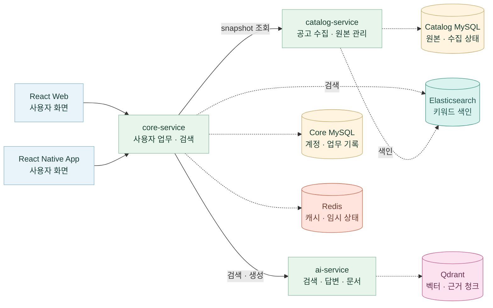

**비동기 작업:** 큐가 활성화된 업무는 `core-service`가 작업과 발행 대기 기록(Outbox)을 MySQL에 저장한 뒤
RabbitMQ로 전달합니다. 발행기와 소비자는 모두 `core-service` 내부에서 실행됩니다.

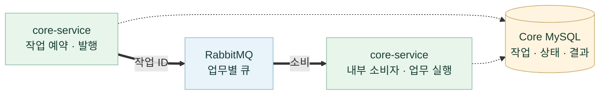

적용 업무는 **리포트 생성·메일 발송, 중복 지원 검토, 신청 양식·문항 분석, 카카오 연결 해제,
관심 공고 원문 수집·색인**입니다. 소비자는 업무에 따라 `ai-service`·공식 원문·메일 서버·카카오 API를 호출합니다.

**평가 운영:** 같은 React 웹의 관리자 화면이 `ops-service`를 호출하고, 평가 작업은 HTTP 요청 밖에서 실행됩니다.

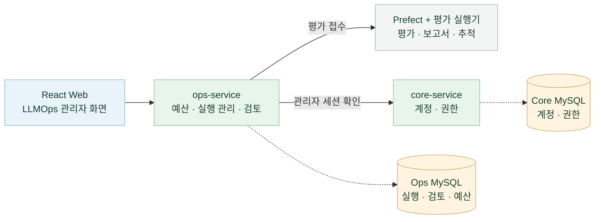

가는 실선은 서비스 호출, 굵은 실선은 큐 메시지 전달, 점선은 DB·검색 저장소·캐시 접근을 나타냅니다.
저장소는 MySQL(노랑), Qdrant(분홍), Elasticsearch(청록), Redis(주황)으로 구분합니다.
Core·Catalog·Ops의 MySQL은 같은 색을 사용하고, 서비스별 소유권은 이름으로 표시합니다.
대표적인 연결만 표시하고 응답은 생략했습니다.
웹·앱은 [Shared 패키지](docs/mobile-monorepo.md)의 업무 모델·API 계약·응답 검증을 공유합니다.

<a id="로컬-시작"></a>

### 배치 구조

아래는 코드가 제공하는 배치 구성이며, 현재 가동 상태와는 구분합니다.

| 배치 구성 | 애플리케이션 서비스·업무 저장소 | Prefect·평가 실행기·결과 저장소·Langfuse |
|---|---|---|
| **Compose** | Compose. `ops-service`는 기존 `core-service`에 연결하는 독립 구성도 제공 | 별도 LLMOps Compose |
| **Kubernetes 혼합** | Kubernetes | Compose 유지 |

Kubernetes 혼합 구성에서는 **`ops-service`와 `ops-sync`가 같은 Pod**에서 실행되고,
내부 HTTP 브리지로 Compose의 Prefect와 `ops-artifacts` 결과 서버에 접근합니다.
결과 볼륨은 Compose에 유지하며 인증된 HTTP로 읽습니다.
이 연결은 저장 응답 재평가를 대상으로 하며, 유료 실행의 Kubernetes 예산 API 연결은 별도입니다.

[서비스 호출 상세](docs/architecture.md) · [배치 구성도](docs/assets/architecture/README-local.md) ·
[Ops 연결 계약](infrastructure/gitops/docs/ops-runtime.md)

<a id="erd"></a>

## 6. ERD와 데이터 소유권

### 서비스 경계와 데이터 소유권

| 서비스 | 사용 저장소·관리 범위 |
|---|---|
| [core-service](backend/core-service/README.md) | Core MySQL — 계정·업무 기록·공고 복제본 관리<br/>Redis — 검색 결과·첨부 목록 캐시·문서 작업 임시 상태 관리<br/>Elasticsearch — Catalog가 준비한 키워드 색인 직접 조회 |
| [catalog-service](backend/catalog-service/README.md) | Catalog MySQL — 공고 원본·수집·공개 상태 관리<br/>Elasticsearch — 키워드 검색용 공고 문서·버전 생성·갱신 |
| [ai-service](backend/ai-service/README.md) | Qdrant — 검색 벡터·근거 청크 |
| [ops-service](backend/ops-service/README.md) | Ops MySQL — 평가·검토·예산·일정 관리 |

각 서비스는 다른 서비스의 MySQL에 직접 접근하지 않고 API로 연동합니다.
`core-service`는 `catalog-service`의 공고 원본을 받아 조회용 복제본을 유지합니다.
Elasticsearch 색인은 `catalog-service`가 생성·갱신하고, `core-service`가 직접 조회해 키워드 검색 후보를 구합니다.
Redis는 `core-service`가 검색 결과 복원, 첨부 목록 캐시, 문서 생성 잠금·임시 다운로드 권한·양식 변경 승인안 보관에 사용합니다.

아래 ERD는 현재 스키마의 **주요 엔터티와 키**를 서비스별로 요약한 것입니다.
관계선은 같은 DB 안의 외래 키(FK)를 나타내며, 서비스 사이에는 FK가 없습니다.
`PK`는 기본 키, `UK`는 유일 키이며, `||`는 1개, `o|`는 0~1개, `o{`는 0개 이상을 뜻합니다.
실선은 부모 키가 자식의 기본 키에 포함되는 관계, 점선은 포함되지 않는 관계입니다.

### Core MySQL: 계정·관심 공고·신청 문서

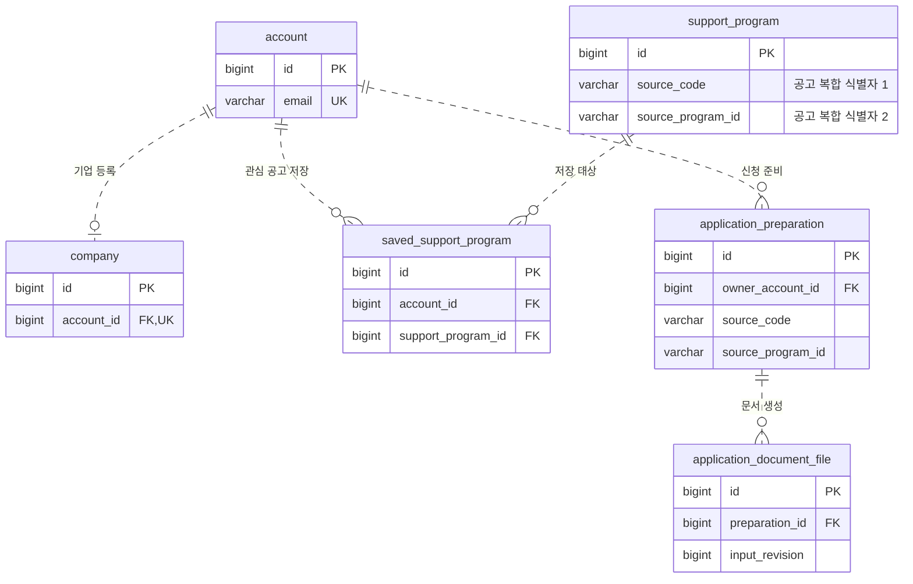

Core의 `support_program`은 Catalog에서 받은 **조회용 복제본**입니다.
`(source_code, source_program_id)`와 관심 공고의 `(account_id, support_program_id)`에는 각각 복합 UNIQUE 제약이 있습니다.
신청 준비는 공고의 복합 식별자를 저장하지만 `support_program`에 대한 FK는 두지 않습니다.
세션·협업·리포트·작업 큐 등 나머지 테이블과 전체 컬럼은 [Core Flyway migration](backend/core-service/src/main/resources/db/migration)에서 관리합니다.

### Catalog MySQL: 공고 원본·수집·공개 상태

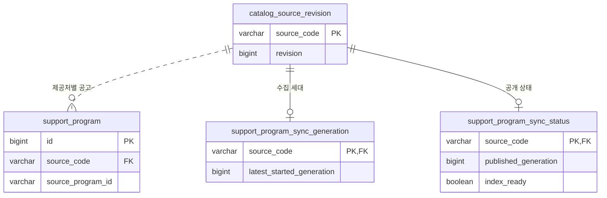

Catalog가 공고 원본과 제공처별 수집·공개 버전을 소유합니다.
공고의 `(source_code, source_program_id)`는 복합 UNIQUE이며, Core와 Catalog의 숫자 `id`가 같다고 가정하지 않습니다.
독립 카탈로그 식별용 `catalog_instance`와 전체 컬럼은 [Catalog Flyway migration](backend/catalog-service/src/main/resources/db/migration)에 정의되어 있습니다.

### Ops MySQL: 평가·검토·비교 기준·예산

Ops는 읽기 쉽도록 **Django 모델 이름**으로 표시했습니다. FK 컬럼은 실제 저장되는 `_id` 이름입니다.

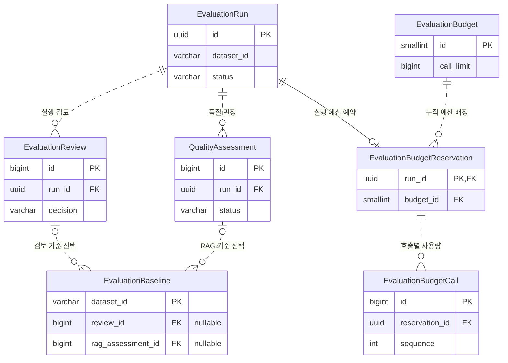

비교 기준은 자료별로 검토 또는 RAG 품질 판정 중 하나를 선택하며, 해제하면 두 참조를 비워 이력·버전을 유지합니다.
사례별 검토·정기 일정·변경 이력과 전체 제약은 [Ops 모델](backend/ops-service/apps/evaluations/models.py)과
[Django migration](backend/ops-service/apps/evaluations/migrations)에 정의되어 있습니다.
Qdrant·Elasticsearch·Redis와 평가 결과 파일의 연결은 [서비스 연결도](#서비스-연결)에서 확인할 수 있습니다.

<a id="데이터-준비"></a>

## 7. 데이터 준비와 검색 구성

### 공식 공고 데이터

| 제공처 | 수집 자료 | 식별 코드 |
|---|---|---|
| 기업마당 | 중앙부처·지자체·공공기관 기업지원사업 | `BIZINFO` |
| K-Startup | 창업지원사업 | `KSTARTUP` |
| 과학기술정보통신부 | 과학기술·연구개발 사업 | `MSIT` |
| 충남 온라인수출지원시스템 | 충청남도 기업 수출지원사업 | `CNTRADE_NOTICE` |

Catalog가 공식 API의 제목·기관·신청 기간·지역·분야·지원 대상·원문 URL·신청 경로를 정규화합니다.
공고는 **제공처 코드 + 원본 ID**로 구분하고, 접수 상태는 신청 기간과 서울 기준 현재 날짜로 계산합니다.

**수집·색인 준비:** `catalog-service`가 수집 결과를 검증·정규화하고, 키워드 색인과 의미 검색 벡터를 준비합니다.

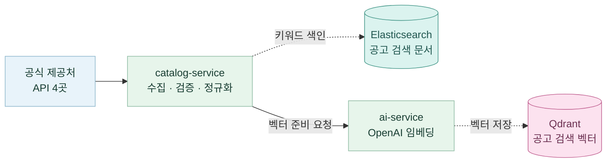

**공개·동기화:** 수집과 두 색인 준비가 모두 성공하면 Catalog MySQL에 공개합니다.
`core-service`는 인증된 HTTP snapshot을 조회·검증해 Core MySQL의 조회용 복제본을 갱신합니다.

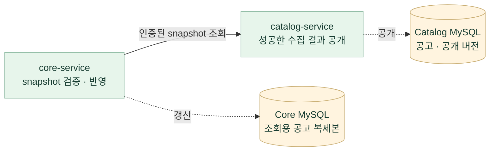

- 같은 공고를 다시 수집하면 갱신하며, 성공적으로 수집한 제공처 범위에서만 누락 공고를 비활성화합니다.
- 수집·응답 검증·색인 준비가 실패하면 기존 공개 자료를 유지합니다.

### 사용자 검색과 최종 데이터 구성

**화면에 표시할 공고 내용은 Core MySQL에서 읽고, Elasticsearch·Qdrant는 관련 공고를 고르는 데 사용합니다.**
검색어가 들어오면 `core-service`가 검색 가능한 현재 공고를 먼저 읽어 메모리에 보관하고,
‘접수 중만 보기’ 조건을 적용한 뒤 키워드 검색과 의미 검색을 차례로 실행합니다.

**공고 조회·후보 검색:** 번호는 `core-service`가 조회·검색을 요청하는 순서입니다.

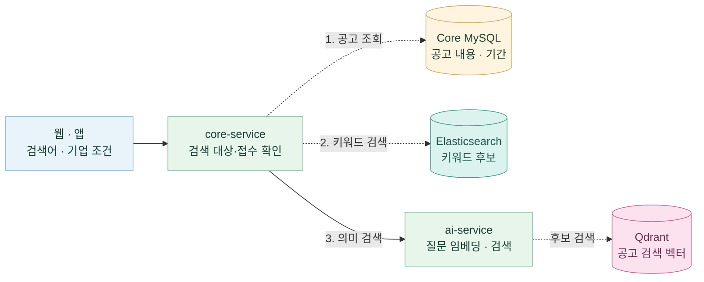

**후보 결합·최종 응답:** 공고 ID·순위로 후보를 합친 뒤, 읽어 둔 공고 내용에 AI 평가 결과를 더합니다.

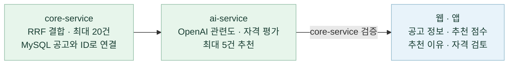

두 검색의 결과는 **제공처 코드 + 원본 ID**로 연결합니다. 예를 들어 `BIZINFO:123`이 양쪽 검색에 나오면
하나의 후보로 합치고, **RRF**로 두 검색의 순위를 결합합니다. 선택한 ID에 해당하는 공고 내용은
처음 읽어 둔 MySQL 데이터에서 찾아 AI 평가에 전달하므로, 검색 후 공고마다 DB를 다시 조회하지 않습니다.
두 색인 모두 현재 MySQL 공고의 ID·내용 버전을 기준으로 검색 범위를 제한하고 결과를 검증합니다.

| 최종 응답에 포함되는 내용 | 데이터 출처 |
|---|---|
| 제목·기관·설명·지원 대상·신청 기간·신청 경로·원문 링크 | Core MySQL에서 읽어 둔 공고 정보 |
| 접수 상태 | 저장된 신청 기간과 서울 기준 현재 날짜로 계산 |
| 추천 점수·추천 이유·자격 검토 결과 | 후보 공고에 대한 이번 검색의 AI 평가 결과를 `core-service`가 검증해 추가 |

사용자 검색은 미리 동기화된 **Core MySQL**을 사용하며 Catalog MySQL을 직접 조회하지 않습니다.
최종 추천은 최대 5건으로, 기준에 맞는 공고가 없으면 더 적거나 0건일 수 있습니다. 비로그인 사용자에게는 최대 2건을 먼저 표시합니다.
검색어가 없으면 키워드·의미 검색과 AI 평가를 생략하고, MySQL 공고를 최신순으로 최대 5건 반환합니다.
상세 공고 질문에서 원문 청크를 찾는 Qdrant 검색은 아래 [근거 기반 답변 흐름](#공고-상세의-근거-기반-답변rag)에서 별도로 설명합니다.

[Catalog 구현·계약](backend/catalog-service/README.md) · [서비스 분리 설명](docs/catalog-service-extraction.md) ·
[한국어 키워드 검색](docs/elasticsearch-lexical-search.md)

<a id="ai-처리-흐름"></a>

## 8. 주요 AI 기능의 처리 흐름

### AI 대화 검색

**질문 → 조건 제안 → 사용자 확인 → 키워드·의미 검색 → 후보 결합 → 추천·근거 검증** 순서입니다.
LangChain·OpenAI가 검색 조건을 제안하고, 사용자가 확인한 조건으로 Core가 검색을 실행합니다.
추천 Agent는 후보 공고의 본문과 기업 조건을 보고 관련도·추천 이유·자격 확인 정보를 생성합니다.
조건 해석과 추천은 별도의 모델 호출이며, 추천 관련도를 선정 확률이나 자격 충족 확률로 표시하지 않습니다.

### 공고 상세의 근거 기반 답변(RAG)

RAG는 **검색한 공식 원문을 모델에게 함께 전달해 답변의 근거로 사용하는 방식**입니다.
현재 상세 공고 질문은 기업마당·K-Startup 공식 HTML 본문을 사용합니다.

**원문 준비·근거 검색:** 저장한 원문이 없거나 갱신이 필요하면 공식 HTML을 읽어 MySQL에 저장하고 청크로 나눕니다.

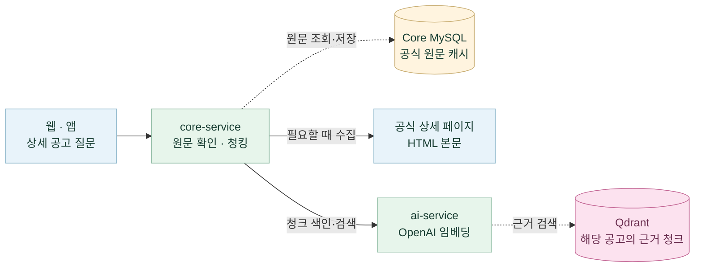

**검증·답변·출처 표시:** 검색된 청크의 ID·해시를 원문과 대조한 뒤 답변을 생성하고 인용을 확인합니다.

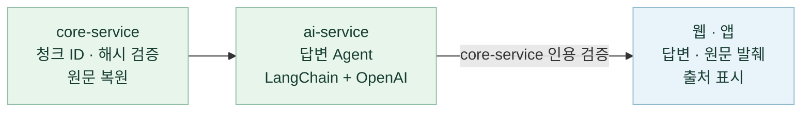

근거가 부족한 질문은 확인할 수 없다고 안내하고, 외부 서비스 장애는 오류로 반환합니다.
상세 공고의 HTML 질문과 신청 문서의 첨부파일 분석은 입력·처리 경로가 다릅니다.

### 신청 문서 작성과 GovBiz 도우미

| 기능 | 처리 흐름 | 사용자 확인 지점 |
|---|---|---|
| 신청 문서 | 공식 양식·문항 분석 → 답변 입력·초안 생성 → 원본 입력 위치 연결 → 형식별 기입·검증 → 다운로드 | 문항별 답변과 생성 결과를 확인합니다. 공식 사이트의 최종 제출은 사용자가 수행합니다. |
| GovBiz 도우미 | 의도 분류 → 도움말 또는 권한 범위의 Core 자료 조회·관심 공고 RAG → 응답 검증 | 안내·자료 조회와 실제 검색·신청 동작을 구분합니다. |

문서 작성은 지원 형식과 구조에 맞춰 Core 편집기·MCP 도구를 사용합니다.
도우미의 의도 분류는 Agents SDK, 도구 실행 흐름은 LangGraph로 구성합니다.

[실제 호출 경로](docs/architecture.md) · [AI Service](backend/ai-service/README.md) ·
[문서 작성·형식별 지원 범위](docs/application-document-mcp-architecture.md)

<a id="llmops-평가운영"></a>

## 9. LLMOps 평가·운영

**모델이나 프롬프트를 바꿨을 때, 같은 질문에 대한 답변 품질이 좋아졌는지 확인하는 관리자 기능**입니다.
평가 자료와 비교 대상을 고정한 뒤 결과·사용량·실패·사람의 판단을 함께 기록합니다.
예를 들어 같은 공고의 지원 대상 질문을 이전 모델과 새 모델에 적용하고,
답변에서 빠진 조건이나 잘못 인용한 근거를 확인한 후 다음 평가의 비교 기준을 정할 수 있습니다.

평가 도구는 **Langfuse + Prefect + Pandera + Evidently + pandas**로 구성하고,
**React는 운영 화면, Django는 인증·실행 관리 API**를 담당합니다.

### 다섯 도구의 역할

| 도구 | 담당하는 일 | 확인할 수 있는 결과 |
|---|---|---|
| **Langfuse** | 모델 호출과 평가 점수를 연결해 추적 | 모델·지연·토큰 사용량·오류·trace |
| **Prefect** | 평가 작업 실행과 단계·상태 관리 | 실행 상태·실패 단계·작업 로그 |
| **pandas** | 사례별 결과를 표로 정리하고 집계 | 비교·지표 계산에 사용하는 데이터 |
| **Pandera** | ID·상태·수치 범위 등 데이터 형식 검증 | 잘못된 입력·결과의 조기 거절 |
| **Evidently** | 후보와 기준의 지표를 비교해 보고서 생성 | 비교 HTML 보고서 |

프로젝트 평가기가 지표를 계산하고, Django의 품질 정책과 사람 검토로 합격·비교 기준을 결정합니다.
데이터 형식 검증이나 작업 성공만으로 답변의 정확성을 승인하지 않습니다.

### 전체 처리 흐름

**접수·권한·예산 확인:** 관리자의 요청을 검증하고 HTTP 요청 밖의 평가 실행으로 연결합니다.

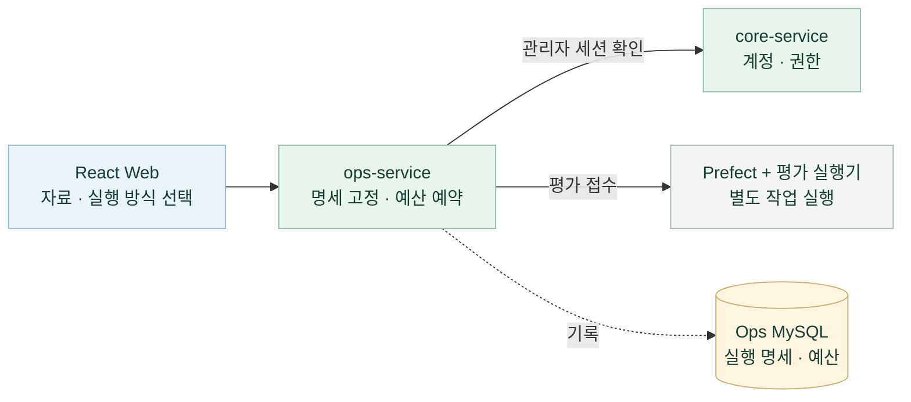

**평가 실행·분석:** 세 가지 방식 중 하나를 실행하고 공통 지표 계산으로 연결합니다.

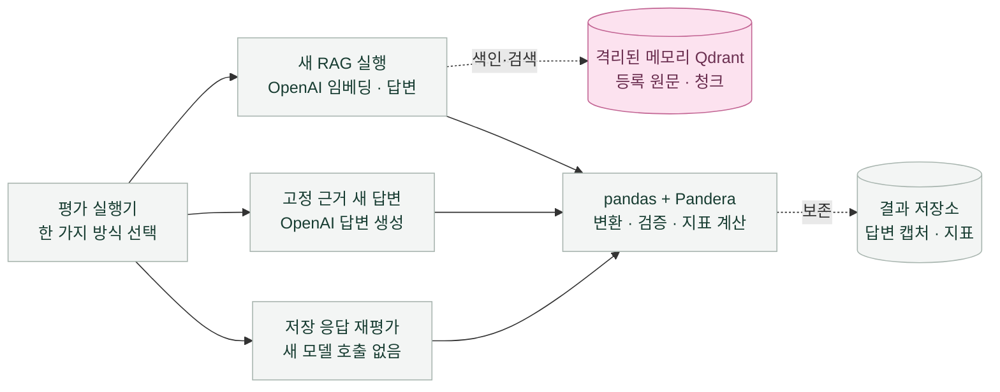

**결과 확인·사람 검토:** 보고서와 추적을 확인하고, 검토·품질 판정을 거쳐 관리자가 비교 기준을 지정합니다.
Langfuse의 실제 모델 호출 추적은 실행 중에도 수집합니다.

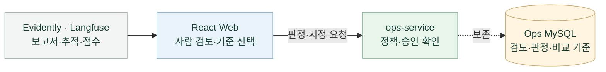

1. **관리자 접수:** 기존 Core 관리자 계정으로 로그인하고 React의 `/ops/evaluations`에서
   자료·실행 방식·비교 대상을 선택합니다. Django Ops가 관리자 권한과 실행 명세를 확인하고,
   새 모델 호출이 있으면 승인된 호출·토큰 한도를 검사해 예산을 예약합니다.
2. **평가 실행:** Prefect가 별도 평가 실행기에 작업을 전달합니다. 저장된 응답을 다시 평가하거나,
   고정 근거로 새 답변을 만들거나, 고정 원문·청크로 검색부터 답변까지 새로 실행합니다.
   Django의 HTTP 요청 안에서 모델 평가를 수행하지 않습니다.
3. **결과 분석:** 실행기는 **pandas**로 데이터를 정리하고 **Pandera**로 형식을 검증해 지표를 계산합니다.
   **Evidently**는 비교 보고서, **Langfuse**는 모델 호출 추적·사용량 관측·평가 점수를 제공합니다.
   호출 추적은 실행 중에도 수집하며, 과거 저장 응답에 없던 trace를 새로 만들지는 않습니다.
4. **사람 검토와 기준 지정:** 관리자가 자료와 사례별 답변을 검토하고 실행 검토를 승인합니다.
   검토 기록과 품질 정책으로 판정한 뒤, 합격한 결과를 관리자가 비교 기준으로 지정합니다.
   다음 평가에서는 같은 자료의 이 기준과 새 결과를 비교합니다.

### 세 가지 평가 방식

| 방식 | 무엇을 확인하나요? | 새 모델 호출 |
|---|---|---|
| **저장 응답 재평가** | 이미 저장된 답변·검색 결과로 지표와 비교 보고서를 다시 생성합니다. 과거 응답은 당시 모델의 기록으로 표시합니다. | 없음 |
| **고정 근거 새 답변** | 같은 질문·근거에서 모델이나 프롬프트 변경이 답변에 미치는 영향을 확인합니다. 새 검색·임베딩은 수행하지 않습니다. | 답변 생성 |
| **새 RAG 실행** | 등록된 원문·청크를 새로 임베딩하고 격리된 메모리 Qdrant에서 검색한 뒤 답변을 생성합니다. 검색·인용·답변 지표를 구분합니다. | 임베딩·답변 생성 |

새 RAG 평가는 **등록 자료 범위의 검색·답변 평가**입니다. 운영 공고 재수집·Core 재청킹·운영 색인 전체의
성능 측정을 포함하지 않습니다. 자동 지표와 사람의 답변 검토는 별도로 기록합니다.

Core HTTP의 저장 실행 기록도 요청·원문·검색·인용을 대조한 뒤 재평가 목록에 등록할 수 있습니다.
무료 AI 대역과 당시 실제 모델의 저장 응답을 구분하며, 이 등록·재평가로 새 모델을 호출하지 않습니다.
[Core HTTP 기록 연결](evaluation/support-program-evidence/README.md#core-http-기록을-ops-rag-평가에-연결)

### 운영 화면에서 할 수 있는 일

| 기능 | 동작 |
|---|---|
| 평가 실행·이력 조회 | 실행 전 설정과 예산을 확인하고 요청합니다. 진행 상태·실패 단계·결과·사용량·비교 보고서를 조회하며, 같은 요청 재전송으로 실행을 중복 생성하지 않습니다. |
| 근거와 답변 검토 | 질문·원문·참조 조건·후보 답변을 대조하고 사례별 판단과 사유를 저장합니다. RAG는 검색된 근거와 답변의 인용도 함께 확인합니다. |
| 품질 판정·비교 기준 | 자료 검토, 사례 검토, 실행 승인, 품질 판정과 기준 변경 이력을 보존합니다. 필요한 사람 검토가 없으면 합격·기준 지정을 차단합니다. |
| 예산·취소 | 누적·일별 호출 수와 입력·출력 토큰 한도를 관리합니다. 동시 요청에도 예약량을 합산하고, 사용량이 불명확한 호출을 0으로 정산하지 않습니다. 취소는 후속 호출을 중단하며 이미 발생한 사용량은 남습니다. |
| 실패 후처리 복구 | 모델 응답은 저장됐지만 보고서·점수 등록이 실패한 경우, 검증된 캡처로 후처리를 다시 실행합니다. 새 모델 호출 없이 원본 실패와 복구 이력을 함께 보존합니다. |
| 정기 평가 | 종료일이 있는 일별 일정을 등록·중지할 수 있습니다. 기본값은 비활성화이며, 활성화해도 동일한 승인·예산 검사를 거칩니다. |

**`COMPLETED`는 평가 작업 완료이며 품질 합격을 뜻하지 않습니다.**
품질 합격과 비교 기준 지정은 별도 단계이고, 기준은 사람이 검토한 자료 범위에서만 유효합니다.

### 처음 확인하는 방법과 기록 보존

1. [로컬 통합 개발 안내](docs/ops-monorepo-migration.md)에 따라 루트 Compose 환경을 준비합니다.
   빈 Ops DB에는 공유된 실행·검토·보고서가 자동 적재되므로, 저장 기록을 보는 데 새 모델 호출은 필요 없습니다.
2. 기존 프로젝트의 **관리자 계정**으로 로그인하고
   [평가 목록](http://localhost:5173/ops/evaluations)을 엽니다. 일반 회원은 접근할 수 없습니다.
3. 실행을 선택해 **후보·기준 답변 → 사례별 검토 → 품질 판정 → 현재 비교 기준** 순서로 확인합니다.
   새 평가를 실행하려면 [LLMOps 실행 환경](infrastructure/llmops/README.md)의 Prefect·실행기·Langfuse 연결을 준비합니다.

실행·예산·검토 이력은 **Ops MySQL**, 답변 캡처와 보고서는 **결과 저장소**에 보존합니다.
팀원은 [공유 검토 기록 자동 초기화](docs/ops-local-review-copy.md)로 이미 승인된 기준을 재사용할 수 있습니다.
공유 자료에는 실제 공고 2개·고정 근거 질문 6건에 대한 사람 검토와 새 모델의 비교 기준이 포함됩니다.
각 환경에서 추가한 검토는 해당 DB에 저장되며 Git으로 실시간 동기화되지 않습니다.
기존 DB는 자동 초기화로 덮어쓰지 않으며, 로컬 추가 기록은 [암호화 백업·복원](docs/ops-upgrade-runbook.md)으로 보존합니다.

[Ops 기능·API 상세](backend/ops-service/README.md) ·
[평가 자료·지표 설명](evaluation/support-program-evidence/README.md) ·
[구현·실제 평가 기록](docs/llmops-next-development-plan.md)

처음 이용한다면 [LLMOps 상세 사용 가이드 PDF · 23쪽](output/pdf/govbiz-llmops-user-guide-ko.pdf)를 참고하세요.
화면별 기능, 평가 방식, 결과 해석, 사람 검토, 예산·복구와 환경 이전을 설명합니다.
PDF의 화면·수치는 문서에 표시한 작성 시점의 예시입니다.

<a id="검증배포-범위"></a>

## 10. 평가·검증·배포 범위

### 기능 검증과 모델 품질 평가

| 구분 | 확인하는 것 | 현재 기록과 해석 |
|---|---|---|
| 자동 테스트·CI | API 계약·권한·DB·장애 처리·빌드·컨테이너 연결 | 아래 5개 워크플로로 검증합니다. 실제 성공 여부는 대상 커밋의 실행 결과로 확인합니다. |
| 사람 검토 기준 | 원문과 답변의 조건·인용을 사람이 검토했는가 | 2026-10-05 기록 기준 실제 공고 2개·고정 근거 질문 6건의 `gpt-6-luna` 결과가 승인된 비교 기준입니다. |
| RAG 실평가 | 검색한 근거와 생성 답변이 참조 조건을 보존하는가 | 등록 원문·청크로 실평가한 기록이 있으며, 2026-10-06 v2 결과의 H01 조건 누락과 미승인 상태를 별도로 기록했습니다. |

[사람 검토·실평가 기록](docs/llmops-next-development-plan.md) ·
[검색 평가 도구·저장 결과](evaluation/support-program-search/README.md) ·
[근거 답변·RAG 평가 도구](evaluation/support-program-evidence/README.md)

과거 검색 지표나 무료 대역 테스트 결과를 현재 모델의 정확도로 환산하지 않습니다.
승인된 6건의 기준도 해당 공고·질문·근거 범위에서 사용합니다.

### 실행·배포 범위

| 구분 | 현재 범위 |
|---|---|
| 로컬 통합 실행 | 루트 Compose의 Catalog 분리·Core 조회 복제·Ops 독립 DB·공유 검토 최초 적재 경로를 제공합니다. 기존 환경의 데이터 이전은 [이전 안내](docs/ops-monorepo-migration.md)에 따라 진행합니다. |
| LLMOps | 평가·검토·비교 기준·예산·복구·정기 실행 기능을 제공합니다. 고정 근거의 사람 승인 기준과 RAG 결과는 별도로 관리하며 [실제 평가 기록](docs/llmops-next-development-plan.md)에 검증 범위를 남깁니다. |
| 모바일 | 사용자 기능과 네이티브 연결을 구현했습니다. CI의 iOS·Android JS export는 실기기 실행·스토어 배포·푸시 실수신 검증과 구분합니다. |
| Kubernetes | Helm·kind 실행과 로컬 이미지 반영 도구를 제공합니다. Intel Mac·Linux amd64 및 Windows x64 WSL2가 안내 대상입니다. [Windows 소스 빌드·웹 연결 확인](docs/windows-kubernetes-setup.md)과 [기존 MSA 검증](infrastructure/gitops/docs/msa-validation-20260920.md)의 환경·범위를 참고하세요. |
| 이미지 발행 | 개인 포크에서 명시적으로 활성화합니다. 같은 소스 SHA의 필수 CI, 패키지 소유·공개 범위·포크 연결, 이미지 결과를 검증한 뒤 GHCR에 발행합니다. |
| GitOps | **별도 `deploy/fork` 브랜치·배포 PR은 제거했습니다.** 로컬 소스 이미지의 `up --local-images`와 검증된 GHCR의 `up`을 지원합니다. 새 Argo 자동 배포 연결은 제공하지 않으며 기존 설정·검증 기록은 보존합니다. |
| 운영 배포 | 현재 운영 환경은 없습니다. 기존 AWS EC2 Compose·CodeBuild·Vercel 설정은 재배포용으로 보존하며, 실제 클라우드 배포·운영 검증은 별도입니다. |

자동 리포트·푸시·마감 알림·LLMOps live·정기 평가는 해당 기능의 설정과 승인 조건을 충족해야 실행됩니다.
기능 코드가 있다는 이유로 모든 외부 연동이 켜져 있는 것은 아닙니다.
요금제 화면은 안내 단계이며, 파트너 제안·새 공고 알림은 현재 발송 기능이 없습니다.

### 공동 개발과 이미지 사용

1. **기능 개발:** 개인 `skn-*` 브랜치 → 교육기관 원본 `main`에 PR → 병합 후 자기 포크의 `main` 동기화.
2. **로컬 개발:** [개인 개발 안내](docs/local-fork-development.md)에 따라 소스 이미지를 빌드하거나
   검증된 GHCR 이미지로 초기화합니다. 개발 모드에서는 변경한 서비스만 다시 빌드해 자기 kind에 반영합니다.
3. **선택적 이미지 발행:** [패키지 준비](docs/private-ghcr-setup.md) 후 자기 포크에서
   `MSA_RELEASE_ENABLED=true`를 설정합니다. **`MSA_PROMOTION_ENABLED=false`는 유지**합니다.
   이미지 발행 뒤 별도 배포 PR이나 Argo 자동 배포는 실행하지 않습니다.

로컬 `git pull`만으로 원격 Actions가 시작되지는 않습니다. 이미지 사용에 필요한 같은 SHA의 CI·발행 결과는
[이미지 발행 안내](docs/msa-image-release.md)에서 확인합니다. 소스 빌드 경로에는 GHCR·PAT가 필요 없습니다.
[WSL2·kind 수동 설치](docs/windows-kubernetes-setup.md) ·
[배포 브랜치 제거·현재 경로](infrastructure/gitops/docs/deployment-candidates.md) ·
[Kubernetes 도구 안내](infrastructure/gitops/README.md)

### CI 구성

| 워크플로 | 검증 영역 |
|---|---|
| [GovBiz CI](.github/workflows/ci.yml) | Web·Shared·Mobile, Core 전체 빌드·MySQL 통합 테스트, AI 테스트·패키지·검색 저장소, 컨테이너 연동 |
| [Catalog separation CI](.github/workflows/catalog-ci.yml) | Catalog 전체 빌드·MySQL, Catalog → Core 연동과 장애 시 데이터 보존 |
| [GovBiz Ops CI](.github/workflows/ops-ci.yml) | Ruff, Django 설정·migration, 실제 MySQL 테스트와 Ops 컨테이너 |
| [LLMOps CI](.github/workflows/llmops-ci.yml) | 무료 평가·추적·실행 계약, 평가 환경·예산·취소·복구 관련 검증 |
| [Infra CI](.github/workflows/infra-ci.yml) | 저장소 경계, Kubernetes·Helm 렌더링·정책·도구 검증 |

위 표는 저장소의 검증 구성입니다. 특정 변경의 완료 여부는 **최신 커밋 SHA의 실제 CI 결과**로 확인합니다.
로컬에서는 [변경 범위별 검증](AGENTS.md#변경-범위별-검증)에 따라 관련 테스트를 선택하고,
전체 빌드·실제 DB·컨테이너 검증은 해당 CI에서 수행합니다.

이전 환경의 기록은 [2026-09-21 GitOps 검증](docs/fork-gitops-validation-20260921.md),
[통합 전 Kubernetes](docs/assets/architecture/README-kubernetes.md),
[기존 Compose·AWS 구성](docs/assets/architecture/README.md)에서 확인할 수 있습니다.

<a id="저장소-구성"></a>

## 11. 저장소 구성

애플리케이션·평가 도구·Kubernetes 설정을 함께 관리하는 모노레포입니다.
기준 저장소는 [`SKNETWORKS-FAMILY-AICAMP/SKN34-4th-1Team`](https://github.com/SKNETWORKS-FAMILY-AICAMP/SKN34-4th-1Team), 기본 브랜치는 `main`입니다.
별도 submodule이나 두 번째 clone은 필요하지 않습니다. 서비스 프로세스·의존성·DB 책임은 분리합니다.

```text
SKN34-4th-1Team/
├─ frontend/
│  ├─ web/                   React 웹·관리자·LLMOps 화면
│  ├─ mobile/                Expo·React Native 앱
│  └─ packages/shared/       공통 업무 모델·API 계약·응답 검증
├─ backend/
│  ├─ core-service/          공개 API·사용자 업무
│  ├─ catalog-service/       공고 수집·원본·색인 공개
│  ├─ ai-service/            내부 검색·AI·문서 도구
│  └─ ops-service/           평가 운영 API·전용 DB
├─ evaluation/               검색·근거 답변·문서 등의 평가 자료·실행기
├─ infrastructure/
│  ├─ llmops/                Langfuse·Prefect·실행기·복구 도구
│  ├─ gitops/                Helm·kind·인프라 검증·기존 Argo 설정
│  └─ …                      Compose·이미지 발행·기존 AWS 배포 템플릿
├─ .github/workflows/        앱·Catalog·Ops·LLMOps·인프라 CI
├─ docs/                     기능·운영 안내와 구조도·검증 기록
├─ output/pdf/               LLMOps 사용자 가이드
├─ pnpm-workspace.yaml       웹·모바일·공통 패키지 workspace
└─ compose.yaml              로컬 통합 개발 진입점
```

<a id="문서-안내"></a>

## 12. 문서 안내

| 보고 싶은 내용 | 문서 |
|---|---|
| 전체 문서·이전 프로젝트 결과 | [문서 목록](docs/README.md) · [기술 README](docs/technical-readme.md) · [3차 프로젝트 README](docs/third-project/README.md) |
| 실행·데이터 이전 | [로컬 시작](docs/local-start.md) · [통합 Compose](docs/ops-monorepo-migration.md) · [Catalog 분리](docs/catalog-service-extraction.md) · [모노레포 통합 배경](docs/repository-integration.md) |
| 서비스 설계·호출 흐름 | [계층·책임](docs/architecture/README.md) · [호출·데이터 흐름](docs/architecture.md) · [기술·저장소 상세](docs/technology.md) |
| 웹·모바일 | [웹](frontend/web/README.md) · [모바일](frontend/mobile/README.md) · [공통 코드](docs/mobile-monorepo.md) · [앱 푸시](docs/mobile-report-push.md) |
| 백엔드 | [Core](backend/core-service/README.md) · [Catalog](backend/catalog-service/README.md) · [AI](backend/ai-service/README.md) · [Ops](backend/ops-service/README.md) |
| 신청 문서·중복 검토 | [문서 작성 구조·형식별 경계](docs/application-document-mcp-architecture.md) · [문서 도구 실행](docs/application-document-mcp-setup.md) · [중복 검토](docs/duplicate-support-review-design.md) |
| LLMOps | [사용 가이드 PDF](output/pdf/govbiz-llmops-user-guide-ko.pdf) · [실행 환경](infrastructure/llmops/README.md) · [평가 자료·지표](evaluation/support-program-evidence/README.md) · [검토 기록 재사용](docs/ops-local-review-copy.md) · [갱신·백업·복구](docs/ops-upgrade-runbook.md) |
| Kubernetes·이미지 | [현재 지원 경로](infrastructure/gitops/README.md) · [개인 개발](docs/local-fork-development.md) · [이미지 발행](docs/msa-image-release.md) · [Windows 설치](docs/windows-kubernetes-setup.md) |

각 검증 문서의 날짜·대상 커밋·환경을 함께 확인하세요. 과거 모델의 평가 결과나 배포 성공 기록을
현재 모델·모든 실행 환경의 검증 결과로 해석하지 않습니다.
