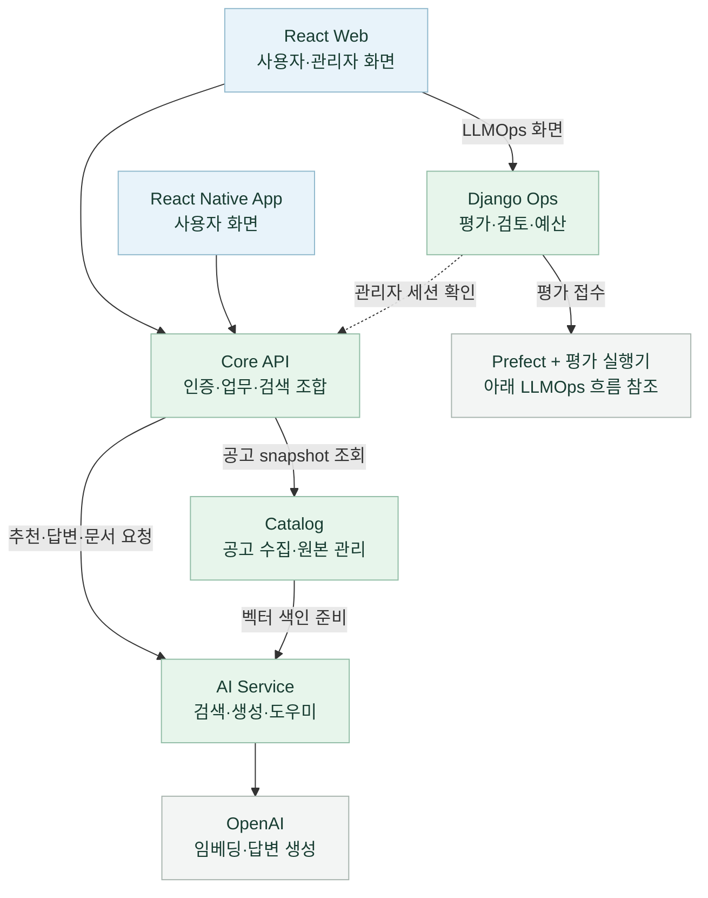
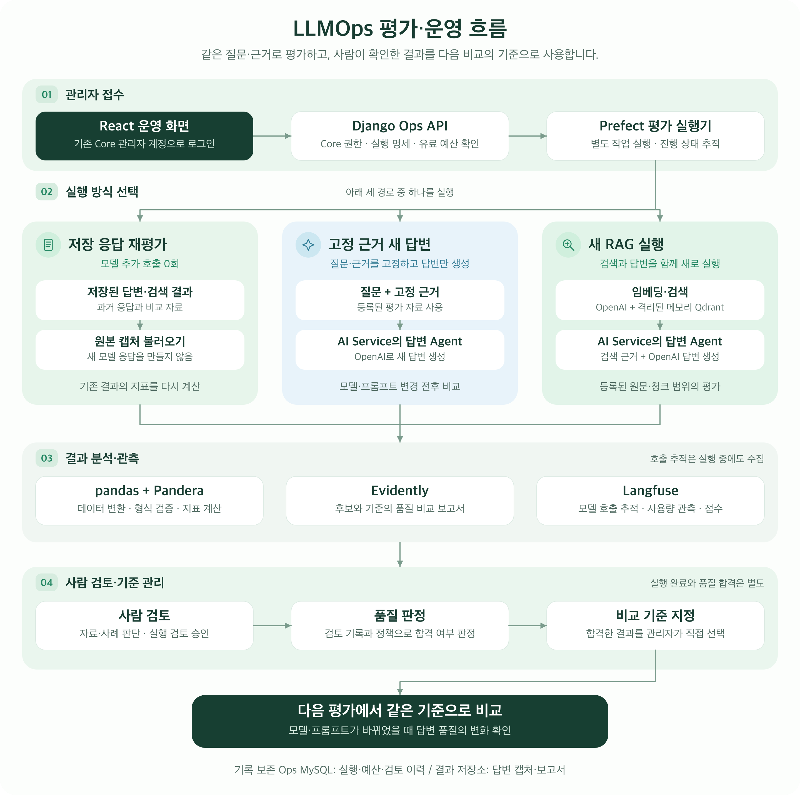

# 🏛️ GovBiz

**LLM 기반 정부지원사업 탐색·신청 관리 플랫폼**

공고 검색부터 근거 확인, 신청 문서 작성, 협업과 맞춤 리포트까지 웹·모바일에서 제공합니다.
관리자는 같은 프로젝트의 LLMOps 화면에서 AI 답변을 평가하고, 사람이 검토한 결과를 비교 기준으로 관리합니다.

**문서 기준: 2026-10-06 저장소의 코드·설정.** 기능 구현, 실제 환경 검증, 운영 배포는 아래에서 구분합니다.

[주요 기능](#주요-기능) · [서비스 구성](#서비스-구성) · [로컬 시작](#로컬-시작) ·
[LLMOps](#llmops-평가운영) · [검증·배포 범위](#검증배포-범위) · [문서 안내](#문서-안내)

## 주요 기능

| 기능 | 현재 구현 |
|---|---|
| **공고 검색·추천** | AI 대화로 조건을 제안하고 사용자 확인 후 검색합니다. 직접 필터 검색은 키워드·지역·분야·출처·접수 상태와 K-Startup 추가 조건, 정렬·페이지 이동을 제공합니다. AI 추천은 키워드·의미 검색 후보를 결합해 관련도와 자격 근거를 표시합니다. |
| **공고 상세·원문 질문** | 접수 기간·신청 방법·공식 문의처·지원 조건을 조회하고 공식 원문으로 이동합니다. 기업마당 상세 HTML에 질문하면 답변과 인용 근거를 확인할 수 있습니다. |
| **관심 공고·진행 관리** | 공고 저장·해제, 목록·달력·진행 관리 보기와 신청 문서의 준비·지원·심사·결과 단계를 관리합니다. |
| **신청 문서 작성** | 공식 양식·문항 발견, 문항별 답변 저장·검토, AI 초안과 생성 작업 조회, 지원 형식의 원본 문서 작성·다운로드를 제공합니다. 모바일은 파일 저장·공유로 연결합니다. [형식별 지원 범위](docs/application-document-mcp-architecture.md) |
| **중복 지원·수혜 검토** | 선택한 공고·기존 수혜 정보를 공식 근거와 대조하고 사업쌍별 판단·인용·기관 확인 사항을 저장합니다. 비동기 분석 상태와 결과를 다시 조회할 수 있습니다. |
| **협업·파트너** | 모집글 목록·상세·작성·수정, 내 모집글, 받은·보낸 제안과 수락·거절·철회를 제공합니다. 기업 등록·사업자 상태에 따른 이용 조건을 적용합니다. |
| **계정·기업 정보** | 이메일 인증 가입·로그인, 비밀번호 재설정, 설정된 소셜 로그인, 사업자 조회·기업 등록·수정, 회원별 대화 보관·복원을 제공합니다. |
| **맞춤 리포트·알림** | 기업 조건에 맞춘 리포트 생성·조회, 수신 설정과 이메일·앱 푸시, 관심 공고 마감 N일 전 알림을 구현했습니다. 발송 설정과 수신 동의·기기 등록이 필요합니다. [리포트](docs/daily-reports.md) · [마감 알림](docs/deadline-reminders.md) |
| **GovBiz 도우미** | 이용 방법 안내, 기업 정보·협업 모집 조회, 관심 공고 묶음 질문을 처리합니다. LangGraph 도우미가 권한 범위의 읽기 전용 도구를 호출합니다. |
| **관리자·LLMOps** | 회원 조회·정지·강제 로그아웃·권한 변경·감사 기록, 작업 큐 현황과 별도 LLMOps 평가·검토·비교 기준·예산 관리를 제공합니다. |

웹의 회원 기능은 `/app/*`, LLMOps는 `/ops/evaluations`에서 제공합니다.
모바일은 같은 Core 계정·API를 사용하며 검색·관심함·리포트·전체 메뉴에서 개인 기능으로 이동합니다.
관리자 화면은 웹에서 제공합니다. [웹 화면 안내](frontend/web/README.md#화면과-현재-동작) ·
[모바일 기능 안내](frontend/mobile/README.md#현재-제공하는-기능)

공고 수집 대상은 **기업마당·K-Startup·과학기술정보통신부·충남 온라인수출지원시스템**입니다.
환경별 API 키와 수집 설정에 따라 조회 가능한 자료가 달라집니다. 추천 관련도는 선정 확률이 아니며,
원문 질문의 HTML 근거 확인과 신청 문서의 첨부파일 분석은 별도 경로입니다.

## 서비스 구성

| 구성 요소 | 기술 | 책임 |
|---|---|---|
| [Web](frontend/web/README.md) | React 19 · TypeScript · Vite · Tailwind CSS | 사용자·관리자·LLMOps 브라우저 화면, Core 쿠키 세션 |
| [Mobile](frontend/mobile/README.md) | Expo · React Native · Expo Router | iOS·Android 사용자 화면, 모바일 세션 보관, 기기 파일 저장·공유·푸시 연결 |
| [Shared](docs/mobile-monorepo.md) | TypeScript · Zod · pnpm workspace | 웹·모바일 공통 업무 모델·API 계약·응답 검증. 화면·인증 방식은 각 앱에서 관리 |
| [Core API](backend/core-service/README.md) | JDK 21 · Kotlin · Spring Boot · MyBatis · Flyway | 공개 API, 계정·기업·신청·협업·리포트·관리자 업무, 검색 조합과 원문 검증 |
| [Catalog](backend/catalog-service/README.md) | JDK 21 · Kotlin · Spring Boot · MyBatis · Flyway | 제공처 공고 수집·색인 준비·원본 공개, Core에 인증된 HTTP snapshot 제공 |
| [AI Service](backend/ai-service/README.md) | Python 3.12 · FastAPI · OpenAI · LangChain · LangGraph | 임베딩·의미 검색·추천·근거 답변·문서 작성·도우미의 AI 처리 |
| [Ops](backend/ops-service/README.md) | Python 3.12 · Django · DRF | Core 관리자 권한 확인, 평가 실행·예산·사람 검토·품질 판정·비교 기준 관리 |

대화 조건 해석·추천·근거 답변·중복 검토·신청 문서는 LangChain을 사용하고,
도구를 호출하는 GovBiz 도우미는 LangGraph를 사용합니다. LLMOps의 평가 작업은 Prefect가 실행합니다.



위 그림은 주요 서비스 요청 관계입니다. 상세 호출과 저장소 연결은 [서비스 호출·데이터 흐름](docs/architecture.md)을 참고하세요.

| 저장·처리 도구 | 역할 |
|---|---|
| **MySQL 8.4** | Core 업무 DB, Catalog 공고 원본 DB, Ops 평가 DB를 분리합니다. Core는 Catalog DB를 직접 읽지 않고 HTTP snapshot을 자체 조회용 복제본에 반영합니다. |
| **Elasticsearch + Nori·BM25 / Qdrant** | 한국어 키워드 후보와 임베딩 기반 의미 후보를 검색합니다. Core가 두 순위를 RRF로 결합하며, Qdrant는 원문 근거 청크 검색에도 사용합니다. |
| **Redis** | 로그인 전후 검색 결과 복원, 일부 작업의 실행 잠금 등 기능별 임시 상태를 보관합니다. 회원·공고 원본 DB와 역할이 다릅니다. |
| **RabbitMQ** | 리포트 생성·메일 발송, 중복 검토, 공식 양식 분석, 카카오 연결 해제 작업을 전달합니다. 작업 상태와 Outbox는 MySQL에 보존합니다. |

## 저장소 구성

애플리케이션·평가 도구·Kubernetes 설정을 함께 관리하는 모노레포입니다.
기준 저장소는 [`SKNETWORKS-FAMILY-AICAMP/SKN34-4th-1Team`](https://github.com/SKNETWORKS-FAMILY-AICAMP/SKN34-4th-1Team), 기본 브랜치는 `main`입니다.
별도 submodule이나 두 번째 clone은 필요하지 않습니다. 서비스 프로세스·의존성·DB 책임은 분리합니다.

```text
SKN34-4th-1Team/
├─ frontend/
│  ├─ web/                   React 웹·관리자·LLMOps 화면
│  ├─ mobile/                Expo·React Native 앱
│  └─ packages/shared/       공통 업무 모델·API 계약·응답 검증
├─ backend/
│  ├─ core-service/          공개 API·사용자 업무
│  ├─ catalog-service/       공고 수집·원본·색인 공개
│  ├─ ai-service/            내부 검색·AI·문서 도구
│  └─ ops-service/           평가 운영 API·전용 DB
├─ evaluation/               검색·근거 답변·문서 등의 평가 자료·실행기
├─ infrastructure/
│  ├─ llmops/                Langfuse·Prefect·실행기·복구 도구
│  ├─ gitops/                Helm·kind·인프라 검증·기존 Argo 설정
│  └─ …                      Compose·이미지 발행·기존 AWS 배포 템플릿
├─ .github/workflows/        앱·Catalog·Ops·LLMOps·인프라 CI
├─ docs/                     기능·운영 안내와 검증 기록
├─ pnpm-workspace.yaml       웹·모바일·공통 패키지 workspace
└─ compose.yaml              로컬 통합 개발 진입점
```

## 로컬 시작

### 통합 Compose

루트 `compose.yaml`이 Core·Catalog·AI·Ops와 웹·저장소를 연결합니다.
`infrastructure/compose.yaml`만 단독 실행하는 방식은 기존 embedded 수집 호환 경로입니다.
처음 구성할 때는 [통합 개발 안내](docs/ops-monorepo-migration.md#로컬-개발-시작)를 따릅니다.

| 환경 파일 | 용도 |
|---|---|
| `.env` | 웹·Core·Catalog·AI 설정. `OPENAI_API_KEY`, 서버 간 공유할 32자 이상 `CATALOG_INTERNAL_TOKEN`과 필요한 제공처·문서·메일 설정 |
| `backend/ops-service/.env` | Ops DB·Django 전용 설정 |
| `.env.compose` | 위 두 환경 파일의 위치와 Compose 프로젝트명 |

각 예시 파일(`.env.example`, `backend/ops-service/.env.example`, `.env.compose.example`)을
**해당 파일이 없을 때만** 복사하고 로컬 값을 입력합니다. 설정을 준비한 뒤 저장소 루트에서 실행합니다.

```bash
python3 infrastructure/scripts/check-compose.py
docker compose --env-file .env.compose config --quiet
docker compose --env-file .env.compose up -d --build
```

기본 웹 주소는 [localhost:5173](http://localhost:5173), Core API는 `http://localhost:8080`입니다.
공고 자동 수집·색인·AI 기능은 활성화한 설정에 따라 외부 API를 호출합니다.
기존 데이터가 있으면 먼저 [Catalog 전환](docs/catalog-service-extraction.md)과
[기존 볼륨 연결](docs/ops-monorepo-migration.md#기존-컨테이너데이터-이전)을 확인합니다.

### 웹·모바일 개발

Node **24.x**·pnpm **11.22.x**를 사용하며 의존성은 루트에서 한 번 설치합니다.
백엔드를 실행한 뒤 필요한 앱을 선택합니다. Compose의 웹을 실행 중이라면 호스트 웹과 포트가 겹치지 않게 구성합니다.

```bash
pnpm install --frozen-lockfile
pnpm dev:web
# 모바일을 개발할 때 별도 터미널에서 실행
pnpm dev:mobile
```

모바일은 `frontend/mobile/.env.example`에 따라 `EXPO_PUBLIC_API_BASE_URL`을 설정합니다.
iOS 시뮬레이터의 `localhost:8080`, Android 에뮬레이터의 `10.0.2.2:8080`, 실기기의 PC LAN 주소를 구분합니다.
푸시·소셜 로그인은 플랫폼 인증과 네이티브 빌드가 추가로 필요합니다.
[모바일 실행 안내](frontend/mobile/README.md) · [공통 코드 관리](docs/mobile-monorepo.md)

Core·Catalog를 직접 개발할 때는 JDK 21, AI·Ops는 Python 3.12를 사용합니다.
Kubernetes 도구의 Python 3.13 환경은 애플리케이션 Python 환경과 별도입니다.

## LLMOps 평가·운영

**모델이나 프롬프트를 바꿨을 때, 같은 질문에 대한 답변 품질이 좋아졌는지 확인하는 관리자 기능**입니다.
평가 자료와 비교 대상을 고정한 뒤 결과·사용량·실패·사람의 판단을 함께 기록합니다.
예를 들어 같은 공고의 지원 대상 질문을 이전 모델과 새 모델에 적용하고,
답변에서 빠진 조건이나 잘못 인용한 근거를 확인한 후 다음 평가의 비교 기준을 정할 수 있습니다.

평가 도구는 **Langfuse + Prefect + Pandera + Evidently + pandas**로 구성하고,
**React는 운영 화면, Django는 인증·실행 관리 API**를 담당합니다.

### 전체 처리 흐름



[구조도 크게 보기](docs/assets/llmops/llmops-evaluation-flow.png) ·
[SVG 원본·그림 설명](docs/assets/llmops/README.md)

1. **관리자 접수:** 기존 Core 관리자 계정으로 로그인하고 React의 `/ops/evaluations`에서
   자료·실행 방식·비교 대상을 선택합니다. Django Ops가 관리자 권한과 실행 명세를 확인하고,
   새 모델 호출이 있으면 승인된 호출·토큰 한도를 검사해 예산을 예약합니다.
2. **평가 실행:** Prefect가 별도 평가 실행기에 작업을 전달합니다. 저장된 응답을 다시 평가하거나,
   고정 근거로 새 답변을 만들거나, 고정 원문·청크로 검색부터 답변까지 새로 실행합니다.
   Django의 HTTP 요청 안에서 모델 평가를 수행하지 않습니다.
3. **결과 분석:** 실행기는 **pandas**로 데이터를 정리하고 **Pandera**로 형식을 검증해 지표를 계산합니다.
   **Evidently**는 비교 보고서, **Langfuse**는 모델 호출 추적·사용량 관측·평가 점수를 제공합니다.
   호출 추적은 실행 중에도 수집하며, 과거 저장 응답에 없던 trace를 새로 만들지는 않습니다.
4. **사람 검토와 기준 지정:** 관리자가 자료와 사례별 답변을 검토하고 실행 검토를 승인합니다.
   검토 기록과 품질 정책으로 판정한 뒤, 합격한 결과를 관리자가 비교 기준으로 지정합니다.
   다음 평가에서는 같은 자료의 이 기준과 새 결과를 비교합니다.

### 세 가지 평가 방식

| 방식 | 무엇을 확인하나요? | 새 모델 호출 |
|---|---|---|
| **저장 응답 재평가** | 이미 저장된 답변·검색 결과로 지표와 비교 보고서를 다시 생성합니다. 과거 응답은 당시 모델의 기록으로 표시합니다. | 없음 |
| **고정 근거 새 답변** | 같은 질문·근거에서 모델이나 프롬프트 변경이 답변에 미치는 영향을 확인합니다. 새 검색·임베딩은 수행하지 않습니다. | 답변 생성 |
| **새 RAG 실행** | 등록된 원문·청크를 새로 임베딩하고 격리된 메모리 Qdrant에서 검색한 뒤 답변을 생성합니다. 검색·인용·답변 지표를 구분합니다. | 임베딩·답변 생성 |

새 RAG 평가는 **등록 자료 범위의 검색·답변 평가**입니다. 운영 공고 재수집·Core 재청킹·운영 색인 전체의
성능 측정을 포함하지 않습니다. 자동 지표와 사람의 답변 검토는 별도로 기록합니다.

### 운영 화면에서 할 수 있는 일

| 기능 | 동작 |
|---|---|
| 평가 실행·이력 조회 | 실행 전 설정과 예산을 확인하고 요청합니다. 진행 상태·실패 단계·결과·사용량·비교 보고서를 조회하며, 같은 요청 재전송으로 실행을 중복 생성하지 않습니다. |
| 근거와 답변 검토 | 질문·원문·참조 조건·후보 답변을 대조하고 사례별 판단과 사유를 저장합니다. RAG는 검색된 근거와 답변의 인용도 함께 확인합니다. |
| 품질 판정·비교 기준 | 자료 검토, 사례 검토, 실행 승인, 품질 판정과 기준 변경 이력을 보존합니다. 필요한 사람 검토가 없으면 합격·기준 지정을 차단합니다. |
| 예산·취소 | 누적·일별 호출 수와 입력·출력 토큰 한도를 관리합니다. 동시 요청에도 예약량을 합산하고, 사용량이 불명확한 호출을 0으로 정산하지 않습니다. 취소는 후속 호출을 중단하며 이미 발생한 사용량은 남습니다. |
| 실패 후처리 복구 | 모델 응답은 저장됐지만 보고서·점수 등록이 실패한 경우, 검증된 캡처로 후처리를 다시 실행합니다. 새 모델 호출 없이 원본 실패와 복구 이력을 함께 보존합니다. |
| 정기 평가 | 종료일이 있는 일별 일정을 등록·중지할 수 있습니다. 기본값은 비활성화이며, 활성화해도 동일한 승인·예산 검사를 거칩니다. |

**`COMPLETED`는 평가 작업 완료이며 품질 합격을 뜻하지 않습니다.**
품질 합격과 비교 기준 지정은 별도 단계이고, 기준은 사람이 검토한 자료 범위에서만 유효합니다.

### 처음 확인하는 방법과 기록 보존

1. [로컬 통합 개발 안내](docs/ops-monorepo-migration.md)에 따라 루트 Compose 환경을 준비합니다.
   빈 Ops DB에는 공유된 실행·검토·보고서가 자동 적재되므로, 저장 기록을 보는 데 새 모델 호출은 필요 없습니다.
2. 기존 프로젝트의 **관리자 계정**으로 로그인하고
   [평가 목록](http://localhost:5173/ops/evaluations)을 엽니다. 일반 회원은 접근할 수 없습니다.
3. 실행을 선택해 **후보·기준 답변 → 사례별 검토 → 품질 판정 → 현재 비교 기준** 순서로 확인합니다.
   새 평가를 실행하려면 [LLMOps 실행 환경](infrastructure/llmops/README.md)의 Prefect·실행기·Langfuse 연결을 준비합니다.

실행·예산·검토 이력은 **Ops MySQL**, 답변 캡처와 보고서는 **결과 저장소**에 보존합니다.
팀원은 [공유 검토 기록 자동 초기화](docs/ops-local-review-copy.md)로 이미 승인된 기준을 재사용할 수 있습니다.
공유 자료에는 실제 공고 2개·고정 근거 질문 6건에 대한 사람 검토와 새 모델의 비교 기준이 포함됩니다.
각 환경에서 추가한 검토는 해당 DB에 저장되며 Git으로 실시간 동기화되지 않습니다.
기존 DB는 자동 초기화로 덮어쓰지 않으며, 로컬 추가 기록은 [암호화 백업·복원](docs/ops-upgrade-runbook.md)으로 보존합니다.

[Ops 기능·API 상세](backend/ops-service/README.md) ·
[평가 자료·지표 설명](evaluation/support-program-evidence/README.md) ·
[구현·실제 평가 기록](docs/llmops-next-development-plan.md)

## 검증·배포 범위

| 구분 | 현재 범위 |
|---|---|
| 로컬 통합 실행 | 루트 Compose의 Catalog 분리·Core 조회 복제·Ops 독립 DB·공유 검토 최초 적재 경로를 제공합니다. 기존 환경의 데이터 이전은 [이전 안내](docs/ops-monorepo-migration.md)에 따라 진행합니다. |
| LLMOps | 평가·검토·비교 기준·예산·복구·정기 실행 기능을 제공합니다. 고정 근거의 사람 승인 기준과 RAG 결과는 별도로 관리하며 [실제 평가 기록](docs/llmops-next-development-plan.md)에 검증 범위를 남깁니다. |
| 모바일 | 사용자 기능과 네이티브 연결을 구현했습니다. CI의 iOS·Android JS export는 실기기 실행·스토어 배포·푸시 실수신 검증과 구분합니다. |
| Kubernetes | Helm·kind 실행과 로컬 이미지 반영 도구를 제공합니다. Intel Mac·Linux amd64 및 Windows x64 WSL2가 안내 대상입니다. [Windows 소스 빌드·웹 연결 확인](docs/windows-kubernetes-setup.md)과 [기존 MSA 검증](infrastructure/gitops/docs/msa-validation-20260920.md)의 환경·범위를 참고하세요. |
| 이미지 발행 | 개인 포크에서 명시적으로 활성화합니다. 같은 소스 SHA의 필수 CI, 패키지 소유·공개 범위·포크 연결, 이미지 결과를 검증한 뒤 GHCR에 발행합니다. |
| GitOps | **별도 `deploy/fork` 브랜치·배포 PR은 제거했습니다.** 로컬 소스 이미지의 `up --local-images`와 검증된 GHCR의 `up`을 지원합니다. 새 Argo 자동 배포 연결은 제공하지 않으며 기존 설정·검증 기록은 보존합니다. |
| 운영 배포 | 현재 운영 환경은 없습니다. 기존 AWS EC2 Compose·CodeBuild·Vercel 설정은 재배포용으로 보존하며, 실제 클라우드 배포·운영 검증은 별도입니다. |

자동 리포트·푸시·마감 알림·LLMOps live·정기 평가는 해당 기능의 설정과 승인 조건을 충족해야 실행됩니다.
기능 코드가 있다는 이유로 모든 외부 연동이 켜져 있는 것은 아닙니다.
요금제 화면은 안내 단계이며, 파트너 제안·새 공고 알림은 현재 발송 기능이 없습니다.

### 공동 개발과 이미지 사용

1. **기능 개발:** 개인 `skn-*` 브랜치 → 교육기관 원본 `main`에 PR → 병합 후 자기 포크의 `main` 동기화.
2. **로컬 개발:** [개인 개발 안내](docs/local-fork-development.md)에 따라 소스 이미지를 빌드하거나
   검증된 GHCR 이미지로 초기화합니다. 개발 모드에서는 변경한 서비스만 다시 빌드해 자기 kind에 반영합니다.
3. **선택적 이미지 발행:** [패키지 준비](docs/private-ghcr-setup.md) 후 자기 포크에서
   `MSA_RELEASE_ENABLED=true`를 설정합니다. **`MSA_PROMOTION_ENABLED=false`는 유지**합니다.
   이미지 발행 뒤 별도 배포 PR이나 Argo 자동 배포는 실행하지 않습니다.

로컬 `git pull`만으로 원격 Actions가 시작되지는 않습니다. 이미지 사용에 필요한 같은 SHA의 CI·발행 결과는
[이미지 발행 안내](docs/msa-image-release.md)에서 확인합니다. 소스 빌드 경로에는 GHCR·PAT가 필요 없습니다.
[WSL2·kind 수동 설치](docs/windows-kubernetes-setup.md) ·
[배포 브랜치 제거·현재 경로](infrastructure/gitops/docs/deployment-candidates.md) ·
[Kubernetes 도구 안내](infrastructure/gitops/README.md)

### CI 구성

| 워크플로 | 검증 영역 |
|---|---|
| [GovBiz CI](.github/workflows/ci.yml) | Web·Shared·Mobile, Core 전체 빌드·MySQL 통합 테스트, AI 테스트·패키지·검색 저장소, 컨테이너 연동 |
| [Catalog separation CI](.github/workflows/catalog-ci.yml) | Catalog 전체 빌드·MySQL, Catalog → Core 연동과 장애 시 데이터 보존 |
| [GovBiz Ops CI](.github/workflows/ops-ci.yml) | Ruff, Django 설정·migration, 실제 MySQL 테스트와 Ops 컨테이너 |
| [LLMOps CI](.github/workflows/llmops-ci.yml) | 무료 평가·추적·실행 계약, 평가 환경·예산·취소·복구 관련 검증 |
| [Infra CI](.github/workflows/infra-ci.yml) | 저장소 경계, Kubernetes·Helm 렌더링·정책·도구 검증 |

위 표는 저장소의 검증 구성입니다. 특정 변경의 완료 여부는 **최신 커밋 SHA의 실제 CI 결과**로 확인합니다.
로컬에서는 [변경 범위별 검증](AGENTS.md#변경-범위별-검증)에 따라 관련 테스트를 선택하고,
전체 빌드·실제 DB·컨테이너 검증은 해당 CI에서 수행합니다.

<details>
<summary>과거 로컬 Kubernetes 구성도와 검증 기록 — 2026-09-21</summary>


위 그림은 개인 포크 `ilil1/SKN34-4th-1Team`의 Intel Mac 검증 당시 구성입니다.
그림의 GHCR → Argo 자동 배포 연결을 현재 신규 환경의 실행 절차로 사용하지 않습니다.
현재 시작 방법은 위의 Compose·로컬 이미지·GHCR `up` 안내를 따릅니다.

[그림 원본·해설](docs/assets/architecture/README-local.md) ·
[당시 GitOps 검증](docs/fork-gitops-validation-20260921.md) ·
[통합 전 Kubernetes](docs/assets/architecture/README-kubernetes.md) ·
[기존 Compose·AWS 구성](docs/assets/architecture/README.md)

</details>

## 문서 안내

| 보고 싶은 내용 | 문서 |
|---|---|
| 전체 문서·이전 프로젝트 결과 | [문서 목록](docs/README.md) · [기술 README](docs/technical-readme.md) · [3차 프로젝트 README](docs/third-project/README.md) |
| 실행·데이터 이전 | [통합 Compose](docs/ops-monorepo-migration.md) · [Catalog 분리](docs/catalog-service-extraction.md) · [모노레포 통합 배경](docs/repository-integration.md) |
| 서비스 설계·호출 흐름 | [계층·책임](docs/architecture/README.md) · [호출·데이터 흐름](docs/architecture.md) · [기술·저장소 상세](docs/technology.md) |
| 웹·모바일 | [웹](frontend/web/README.md) · [모바일](frontend/mobile/README.md) · [공통 코드](docs/mobile-monorepo.md) · [앱 푸시](docs/mobile-report-push.md) |
| 백엔드 | [Core](backend/core-service/README.md) · [Catalog](backend/catalog-service/README.md) · [AI](backend/ai-service/README.md) · [Ops](backend/ops-service/README.md) |
| 신청 문서·중복 검토 | [문서 작성 구조·형식별 경계](docs/application-document-mcp-architecture.md) · [문서 도구 실행](docs/application-document-mcp-setup.md) · [중복 검토](docs/duplicate-support-review-design.md) |
| LLMOps | [실행 환경](infrastructure/llmops/README.md) · [평가 자료·지표](evaluation/support-program-evidence/README.md) · [검토 기록 재사용](docs/ops-local-review-copy.md) · [갱신·백업·복구](docs/ops-upgrade-runbook.md) |
| Kubernetes·이미지 | [현재 지원 경로](infrastructure/gitops/README.md) · [개인 개발](docs/local-fork-development.md) · [이미지 발행](docs/msa-image-release.md) · [Windows 설치](docs/windows-kubernetes-setup.md) |

각 검증 문서의 날짜·대상 커밋·환경을 함께 확인하세요. 과거 모델의 평가 결과나 배포 성공 기록을
현재 모델·모든 실행 환경의 검증 결과로 해석하지 않습니다.
