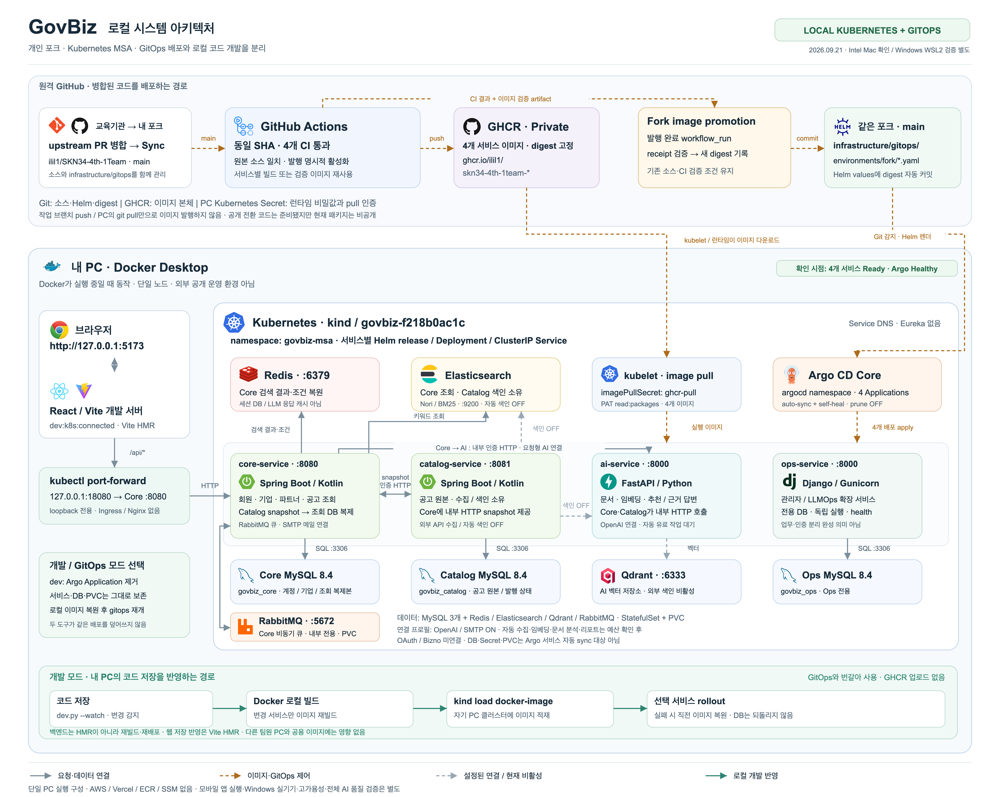

# 개인 포크 기반 로컬 시스템 아키텍처

`govbiz-architecture.png`의 로고·색상·영역 구분을 재사용하여 **2026-09-21의 개인 포크 / 로컬 Kubernetes 구성**을 새로 그렸습니다.
기존 Compose·AWS·통합 전 Kubernetes 그림은 과거 기록으로 보존합니다.



## 파일

- [PNG](govbiz-local-architecture.png): 5,640 × 4,500, GitHub·발표 첨부용.
- [SVG](govbiz-local-architecture.svg): 2,820 × 2,250, 로고가 내장된 편집 가능한 원본.
- [생성 스크립트](build-local.mjs): 기존 로컬 로고만 사용하며 클러스터·GHCR에 접근하지 않습니다.
- 로고는 [기존 Kubernetes 출처·해시](kubernetes-logo-sources.json), [RabbitMQ 출처·해시](logo-sources.json), [Devicon 라이선스](DEVICON-LICENSE)를 재사용했습니다.

## 1. 사용자 요청과 데이터

브라우저 → PC의 React/Vite `127.0.0.1:5173` → `/api` 프록시 → `127.0.0.1:18080`
port-forward → Kubernetes `core-service:8080`으로 요청합니다. 웹 개발 서버는 클러스터 밖에서 실행합니다.
이 경로에는 Vercel, Nginx, Ingress, 공개 TLS가 없습니다. port-forward와 Vite는 사용자가 별도로 실행해야 합니다.

| 서비스 | 실행 기술·내부 포트 | 책임과 데이터 소유권 |
|---|---|---|
| `core-service` | Spring Boot / Kotlin · 8080 | 회원·기업·파트너·공고 조회. `core-mysql`의 `govbiz_core` 사용 |
| `catalog-service` | Spring Boot / Kotlin · 8081 | 공고 원본·수집·색인 소유. `catalog-mysql`의 `govbiz_catalog` 사용 |
| `ai-service` | FastAPI / Python · 8000 | 문서·임베딩·추천·근거 답변. 벡터 저장은 Qdrant 사용 |
| `ops-service` | Django / Gunicorn · 8000 | 관리자·LLMOps 확장용 독립 서비스. `ops-mysql`의 `govbiz_ops` 사용 |

- Core는 Catalog의 내부 HTTP snapshot을 검증한 뒤 자기 DB에 조회용 복제본을 저장합니다. 다른 서비스 DB를 직접 읽지 않습니다.
- Redis는 Core의 검색 결과·조건 복원용이며 로그인 세션 DB나 LLM 응답 캐시로 표시하지 않았습니다.
- Elasticsearch는 Core가 조회하고 Catalog가 색인을 소유합니다. Qdrant는 AI의 벡터 저장소입니다.
- MySQL 세 개와 Redis·Elasticsearch·Qdrant·RabbitMQ는 각각 StatefulSet·PVC로 실행합니다.
- RabbitMQ는 Core의 비동기 작업 큐입니다. 클러스터 내부 AMQP를 사용하며 공인 포트를 열지 않습니다.
- 연결 프로필은 Core → AI → OpenAI, Core → SMTP를 활성화합니다. 자동 유료 작업은 별도 예산 승인·차단 조건을 적용합니다.
- 서비스 이름과 Kubernetes DNS를 사용합니다. Eureka는 도입하지 않았습니다.
- Ops 독립 기동·DB 분리는 관리자 인증과 LLMOps 업무 전체가 완성됐다는 뜻이 아닙니다.

## 2. GitOps 배포 경로

교육기관 원본 PR 병합 → **개인 포크 원격 `main` Sync** → 같은 SHA의 네 CI 통과 → 비공개 GHCR 발행
→ `Fork image promotion`이 검증 기록을 확인 → 같은 포크의 `infrastructure/gitops/environments/fork/`에
digest 자동 커밋 → 실행 중인 로컬 Argo CD가 Helm으로 네 서비스를 반영합니다.

- 그림의 `ilil1/SKN34-4th-1Team`, `govbiz-f218b0ac1c`는 확인한 환경입니다. 다른 팀원은 자기 포크와 별도 클러스터를 사용합니다.
- 현재는 소스와 배포 설정이 **한 저장소 안에** 있습니다. 별도 `GovBiz-infra` 저장소나 10분 promotion schedule을 현재 경로로 그리지 않았습니다.
- GitHub Actions가 빌드·발행하고, Argo CD가 배포 설정을 적용하며, kubelet/컨테이너 런타임이 실제 이미지를 내려받습니다.
- Argo는 `main`을 감시합니다. 로컬 작업 브랜치 push나 PC의 `git pull`만으로 원격 이미지 발행이 시작되지 않습니다.
- auto-sync와 self-heal은 켜고 prune은 끕니다. AppProject는 네 서비스의 Deployment·Service를 관리하며 DB·Secret·PVC는 자동 sync 대상이 아닙니다.
- 이미지 다운로드 인증은 `ghcr-pull`에 담긴 `read:packages` 전용 PAT입니다. DB 비밀번호와 내부 서비스 토큰도 Kubernetes Secret으로 분리합니다.
- 공개 전환 코드는 준비됐지만 **이 그림은 실제 비공개 배포 구성을 기준**으로 합니다. 공개 적용은 [별도 검증·전환 절차](../../public-ghcr-transition.md)를 따라야 합니다.

## 3. 내 PC에서 코드 수정하기

GitOps 모드와 개발 모드는 같은 Deployment를 동시에 제어하지 않습니다.

1. `fork_cluster.py dev`로 개발 모드로 전환합니다. Argo Application은 제거하되 서비스·DB·PVC는 보존합니다.
2. `dev.py --watch --service 서비스명`으로 변경을 감시합니다.
3. 파일을 저장하면 변경 서비스만 로컬 Docker 빌드 → `kind load docker-image` → 자기 클러스터 rollout을 수행합니다.
4. 이 경로는 GHCR 업로드·Git 커밋·다른 팀원 환경 변경을 하지 않습니다. 백엔드 즉시 HMR이 아니라 재빌드·재배포입니다.
5. 감시를 종료하고 로컬 이미지를 명시적으로 복원한 뒤 GitOps 모드를 다시 켭니다. 실패 시 이미지 복원과 DB migration 복원은 다릅니다.

웹 소스 저장 반영은 Vite HMR이 담당합니다. 모바일·공유 패키지는 같은 모노레포에 있지만 모바일 앱 실행은 이 그림의 검증 경로에 포함하지 않았습니다.
명령과 선행 설정은 [개인 포크 로컬 개발 안내](../../local-fork-development.md)를 따릅니다.

## 확인 범위와 표시

2026-09-21 로컬 외부 연동을 적용한 시점의 기록입니다. 기본 무료 프로필과 다르며
[명시적 연동 프로필](../../../infrastructure/gitops/docs/local-integrations.md)을 선택한 PC에만 적용됩니다.

- 네 서비스 Deployment: 모두 `1/1` Ready.
- 데이터 StatefulSet 일곱 개(RabbitMQ 포함): 연결 적용 후 모두 `1/1` Ready 확인.
- Argo Application 네 개, 감시 브랜치 `main`. 연결 프로필은 이미지 digest를 덮어쓰지 않습니다.
- 실제 AI 분류 요청 1회 HTTP 200, 가입 인증메일 요청 1회 HTTP 204 확인. 메일 수신함 도착과 전체 챗봇 품질 검증을 의미하지 않습니다.
- 기업마당 응답 디코딩 오류로 일회성 공고 수집 사전 검사가 실패했습니다. 해당 작업의 유료 임베딩·DB 발행은 시작하지 않았습니다.
- 이후 공고 1건씩 별도 읽기 검사에서 기업마당·K-Startup·과기정통부는 정상 응답을 확인했습니다. 충남 API는 HTTP 200 본문에 `HTTP_ERROR / 04`를 반환했습니다. 최소 조회 성공은 전체 페이지 수집·색인 성공을 의미하지 않습니다.
- 자동 수집·색인·문서 분석·정기 리포트·관심 공고 미리 수집은 비용 한도 조건이 해결되기 전까지 대기합니다. OAuth·Bizno는 후속 작업입니다.
- 기본 무료 프로필은 여전히 외부 연동 OFF이며, 회색 점선은 현재 활성 검증하지 않은 경로입니다.
- 실선은 요청·데이터 관계, 주황 점선은 이미지/GitOps 제어, 초록 실선은 개발 모드의 로컬 반영입니다. 모든 선이 이번에 실제 호출된 것을 뜻하지 않습니다.
- 단일 PC / Intel Mac 기준입니다. Windows x64 WSL2 실행 경로는 제공하지만 실기기 검증은 별도이며 ARM은 지원 검증 전입니다.
- 고가용성·클라우드 상시 운영·부하·백업 복원·NetworkPolicy 집행·전체 AI 품질 완료를 뜻하지 않습니다.
- 연결 작업은 개인 클러스터 Secret과 Argo 환경 override를 변경했습니다. GHCR·자동 발행 변수·공용 기본 설정은 변경하지 않았습니다.

근거: [포크별 values](../../../infrastructure/gitops/environments/fork/),
[로컬 데이터 chart](../../../infrastructure/gitops/charts/govbiz-local-data/),
[클러스터·모드 전환 도구](../../../infrastructure/gitops/scripts/fork_cluster.py),
[코드 감시 도구](../../../infrastructure/gitops/scripts/dev.py),
[이미지 발행 안내](../../msa-image-release.md),
[기존 실제 GHCR/GitOps 검증 기록](../../fork-gitops-validation-20260921.md).

## 재생성

```bash
node docs/assets/architecture/build-local.mjs

GOVBIZ_DIAGRAM_NODE_MODULES=/path/to/tooling/node_modules \
GOVBIZ_DIAGRAM_CHROME=/path/to/chrome \
node docs/assets/architecture/build-local.mjs --render
```

기존 도구 환경의 Playwright와 Chrome을 사용하며 앱 의존성을 추가하지 않습니다.
렌더러는 외부 요청을 차단하고 로고 해시·로딩·텍스트 폭·캔버스 경계를 검사합니다.
현재 상태는 문서 작성 시점의 기록이므로 환경을 바꾼 뒤에는 설정을 다시 확인하고 그림을 갱신해야 합니다.
