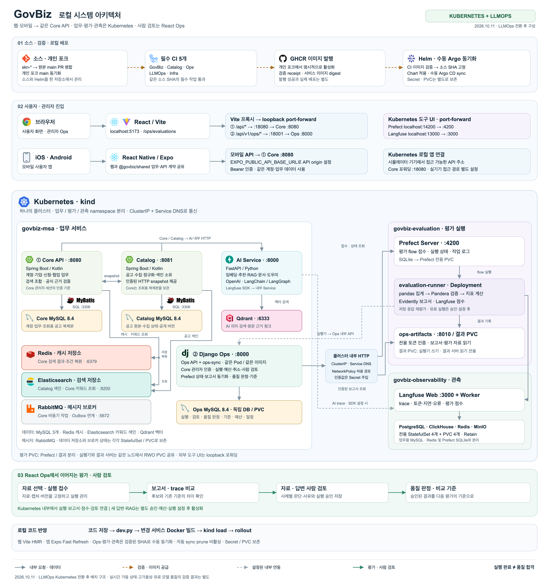

# GovBiz 로컬 시스템 아키텍처 — LLMOps Kubernetes 통합

**2026-10-11 기준, LLMOps까지 Kubernetes로 전환한 로컬 배치 구성**입니다.
업무 서비스·평가 실행·관측 저장소를 같은 kind 클러스터 안에 배치하고 namespace로 구분했습니다.
기존 그림의 Compose 평가 영역과 외부 HTTP 브리지를 Kubernetes Service·PVC로 교체했습니다.



## 파일

- [PNG](govbiz-local-architecture.png): 5,600 × 5,960, GitHub·발표 첨부용.
- [SVG](govbiz-local-architecture.svg): 2,800 × 2,980, 로고가 내장된 편집 가능한 원본.
- [생성 스크립트](build-local.mjs): 기존 로컬 로고를 사용하며 클러스터·GHCR에 접근하지 않습니다.
- 로고 출처·해시는 [Kubernetes 로고 목록](kubernetes-logo-sources.json), [RabbitMQ·MyBatis 로고 목록](logo-sources.json), [Devicon 라이선스](DEVICON-LICENSE)를 따릅니다.

## 1. 세 namespace와 데이터 소유권

| namespace | 실행 서비스 | 보존 데이터 |
|---|---|---|
| `govbiz-msa` | Core·Catalog·AI·Ops API와 같은 Pod의 `ops-sync` | Core·Catalog·Ops MySQL, 업무용 Redis·Elasticsearch·Qdrant·RabbitMQ의 PVC |
| `govbiz-evaluation` | Prefect·`evaluation-runner`·`ops-artifacts` | Prefect SQLite 전용 PVC, 보고서·캡처·요약을 담는 결과 PVC |
| `govbiz-observability` | Langfuse web·worker | PostgreSQL·ClickHouse·Redis·MinIO의 전용 StatefulSet·PVC 4개 |

- Core는 Catalog의 인증된 snapshot을 조회해 자기 DB의 공고 복제본을 갱신합니다.
- Core·Catalog는 MyBatis Mapper·XML을 통해 각자의 MySQL에 접근합니다.
- Redis는 캐시·임시 상태 저장소, Elasticsearch는 검색 색인 저장소, RabbitMQ는 비동기 메시지 브로커로 구분합니다.
- Core는 Redis에 검색 결과·조건을 저장·복원하고 Elasticsearch에서 키워드 후보를 조회합니다. Catalog는 Elasticsearch 색인을 생성·갱신합니다.
- Ops는 Core 관리자 세션으로 권한을 확인하며, 평가·검토·예산은 별도 Ops MySQL에 보존합니다.
- 실행기와 결과 서버는 같은 노드의 결과 RWO PVC를 공유합니다. 실행기는 쓰고 결과 서버는 읽기 전용으로 접근합니다.
- Langfuse 저장소는 업무 DB·Redis 및 Prefect SQLite와 분리합니다. 평가·관측 PVC는 복원·보존 절차와 `Retain` 정책을 유지합니다.

근거: [서비스 Chart](../../../infrastructure/gitops/charts/),
[평가 Chart](../../../infrastructure/gitops/charts/govbiz-evaluation/),
[관측 Chart·PVC 계약](../../../infrastructure/gitops/charts/govbiz-observability/README.md).

## 2. 내부 실행 경로

```text
React Ops → Ops API → Core 관리자 세션 확인 / Ops MySQL
                   → Prefect → evaluation-runner
                                 ├─ pandas·Pandera·프로젝트 지표·Evidently → 결과 PVC
                                 ├─ Langfuse 내부 Service → 관측 전용 저장소
                                 └─ Ops 내부 API → 승인·예산 계약

Ops API / ops-sync → Prefect 상태 조회
                  → ops-artifacts 인증 조회 → 결과 PVC·평가 자료
                  → Ops MySQL 갱신 → React 보고서·사람 검토·비교 기준

AI Service → Langfuse 내부 Service (SDK 활성화·키 설정 시)
```

namespace 사이의 요청은 **ClusterIP와 Service DNS**를 사용합니다.
Ops는 `prefect.govbiz-evaluation.svc.cluster.local:4200`과
`ops-artifacts.govbiz-evaluation.svc.cluster.local:8010`에 연결합니다.
실행기는 `ops-service.govbiz-msa.svc.cluster.local:8000` 및
`langfuse-web.govbiz-observability.svc.cluster.local:3000`을 사용합니다.
NetworkPolicy로 통신 범위를 제한하고 인증값은 Secret으로 주입합니다.

현재 평가 Chart는 **저장 응답 재평가**를 실행하며 새 답변·새 RAG·정기 실행은 비활성입니다.
Kubernetes로 옮겼다는 이유로 유료 모델 호출을 켜지 않습니다. 해당 실행은 승인·예산·실행 설정을 갖춘 뒤 활성화하는 별도 범위입니다.
실행 완료는 품질 합격과 구분하며, 사람이 검토한 결과를 관리자가 비교 기준으로 지정합니다.

## 3. 로컬 화면 접근

웹은 PC의 React/Vite에서 실행하며, API와 도구 UI는 Kubernetes Service의 loopback port-forward로 연결합니다.
모바일은 iOS·Android의 React Native·Expo 앱이며, `EXPO_PUBLIC_API_BASE_URL`에 지정한 API origin으로
같은 Core API를 호출합니다. 웹·앱은 `@govbiz/shared`의 업무 모델·API 계약·응답 검증을 공유합니다.

| 로컬 진입 | Kubernetes 대상 |
|---|---|
| `localhost:5173`의 `/api/*` | Vite → `127.0.0.1:18080` → Core `:8080` |
| 같은 웹의 `/api/v1/ops/*` | Vite → `127.0.0.1:18001` → Ops `:8000` |
| 모바일 앱의 `/api/*` | 기기에서 접근 가능한 Core API origin → Core `:8080` (Bearer 인증) |
| Prefect `localhost:14200` | `govbiz-evaluation`의 Prefect `:4200` |
| Langfuse `localhost:13000` | `govbiz-observability`의 Langfuse web `:3000` |

관리 화면은 `/ops/evaluations`이며, 기존 Core 관리자 계정을 사용합니다.
Ops 프록시는 Host·Origin을 보존해 CSRF를 검증합니다. 모바일은 Core에서 발급한 Bearer 세션을 사용합니다.

Kubernetes의 Core 포워딩 포트는 `18080`입니다. iOS 시뮬레이터는 `http://localhost:18080`,
Android 에뮬레이터는 `http://10.0.2.2:18080`을 앱의 API origin으로 지정합니다.
실기기는 PC의 loopback 주소에 직접 접근할 수 없으므로 USB `adb reverse`나 기기에서 접근 가능한
별도 개발 API 주소가 필요합니다. USB Android에서는 `adb reverse tcp:18080 tcp:18080` 후
`http://localhost:18080`을 사용합니다. 외부 ingress·TLS 및 실제 기기 연결 검증은 별도입니다.

근거: [모바일 실행·인증](../../../frontend/mobile/README.md#로컬-실행) ·
[모바일 API 주소·인증 구현](../../../frontend/mobile/src/api/client.ts) · [웹·앱 공통 계약](../../mobile-monorepo.md).

## 4. 이미지·배포·보존

동일 소스 SHA의 GovBiz·Catalog·Ops·LLMOps·Infra CI와 이미지 검증을 통과한 digest를 사용합니다.
Helm Chart와 소스 SHA를 고정하고 Argo CD는 **수동 동기화**합니다. 자동 sync·prune는 활성화하지 않습니다.
Secret·PVC는 별도 절차로 준비·보존하며, 앱 갱신과 데이터 삭제를 연결하지 않습니다.
웹 개발은 Vite HMR, 모바일 개발은 Expo Fast Refresh를 사용합니다.
선택 업무 서비스 갱신은 기존 `dev.py`의 Docker 빌드·kind 적재·rollout 경로를 사용합니다.

- [이미지 발행](../../msa-image-release.md) · [개인 Kubernetes 개발](../../local-fork-development.md)
- [평가 환경 이전·PVC 복원 기록](../../../infrastructure/gitops/docs/evaluation-kubernetes.md)
- [Langfuse·전용 저장소 이전 기록](../../../infrastructure/gitops/docs/langfuse-kubernetes.md)

## 그림의 기준

요청한 **LLMOps 전체 Kubernetes 전환 후 구조**를 표현했습니다. 저장소에는 2026-10-10 개인 환경의
Prefect·실행기·결과 서버 및 Langfuse 6개 구성요소 이전 기록이 있습니다. 실제 검증 대상과 결과는 위 이전 문서를 따릅니다.
이 그림을 만들면서 클러스터·배포·데이터를 변경하거나 새 평가를 실행하지 않았으며, 실시간 Ready 상태를 재확인한 그림은 아닙니다.
단일 kind 환경의 전환을 고가용성·외부 운영 배포·유료 모델 품질 검증 완료로 해석하지 않습니다.

## 재생성

저장소 기준 Node 24.x와 기존 도구 환경의 Playwright·Chrome을 사용합니다. 앱 의존성을 추가하지 않습니다.

```bash
node docs/assets/architecture/build-local.mjs

GOVBIZ_DIAGRAM_NODE_MODULES=/path/to/tooling/node_modules \
GOVBIZ_DIAGRAM_CHROME=/path/to/chrome \
node docs/assets/architecture/build-local.mjs --render
```

렌더러는 외부 요청을 차단하고 로고 해시·로딩·텍스트 폭·캔버스 경계를 검사합니다.
PNG를 눈으로 확인해 연결선·영역 경계·글자 겹침도 점검합니다.
