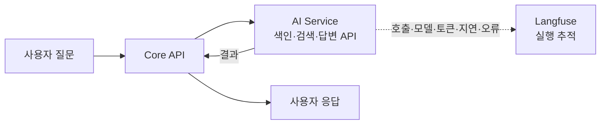
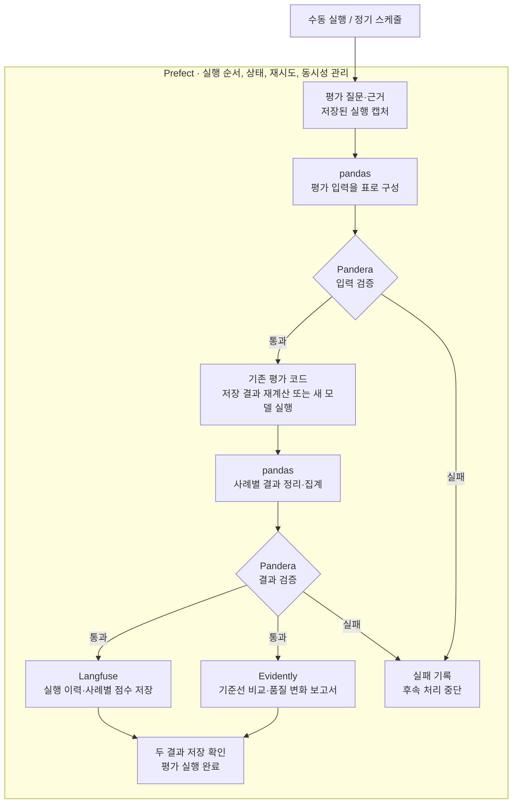

# Langfuse 기반 LLMOps 도입 전략

[문서 목록](README.md) · [AI Service](../backend/ai-service/README.md) · [기존 근거 답변 평가](../evaluation/support-program-evidence/README.md)

2026-09-26 코드 검토를 기준으로 한 도입 전략과 구현 범위다. 개발 실행 방법은 [LLMOps 실행 안내](../infrastructure/llmops/README.md)에 둔다. 실제 모델 품질 재평가와 운영 배포는 별도 작업이다.

목표 구성은 **`Langfuse + Prefect + Pandera + Evidently + pandas`**다. 원래 구성에서 MLflow의 LLM 추적·평가 이력·프롬프트 관리 역할을 Langfuse로 교체하며, 나머지 네 도구도 모두 도입 범위에 포함한다. 단계별 연결 순서는 구현 순서이며, 일부 도구의 도입을 선택 사항으로 만드는 기준이 아니다.

첫 목표는 **고정 근거 답변 한 건을 실행하고, 호출 상태·모델·토큰·지연·프롬프트 식별자를 Langfuse에서 확인하는 것**이다. 이후 평가 데이터 검증·결과 비교·정기 실행을 연결한다. 전체 스택의 첫 완료 목표는 **Prefect가 평가를 실행하고, pandas로 구성한 데이터를 Pandera가 검증하며, 결과가 Langfuse와 Evidently에 같은 실행 ID로 연결되는 것**이다.

## 현재 반영 범위

- 근거 답변 HTTP 경로와 평가 실행기의 직접 Service 호출에 본문 없는 Langfuse 추적을 추가했다.
- pandas·Pandera 입력/결과 표, 기존 지표 재계산, Evidently 비교 보고서, Prefect 수동 flow를 구현했다.
- 별도 Langfuse·Prefect 개발 Compose와 실제 저장·조회·재실행·실패 전파를 확인하는 무료 smoke 도구를 추가했다.
- AI Service의 로컬·CI·Docker와 평가 실행기·Prefect 서버를 Python 3.12로 통일하고, 새 CI 워크플로에 서버 통합 검증을 연결했다. 원격 CI 통과는 아직 확인 전이다.
- 자동 스케줄, 새 유료 모델 평가, 여러 호스트의 전역 동시성, Core부터 이어지는 전체 RAG 추적, Ops 화면은 후속 범위다. 현재 flow에는 모델 실행 단계가 없으며 모델 호출 예산은 0이다.

아래 PR 번호는 도입 단계를 나타낸다. 이번 구현은 PR 1~4의 **저장 캡처 기반 수동 파이프라인** 범위이며, 유료 실행·정기 운영까지 완료했다는 뜻은 아니다.

## 다섯 도구의 역할과 연결

| 도구 | 이 프로젝트에서 맡길 역할 |
|---|---|
| Langfuse | 요청·모델·도구 호출 추적, 프롬프트 식별, 사례별 점수와 실행 이력 |
| Prefect | 평가 파이프라인 실행 순서·스케줄·동시성·재시도·실패 상태 관리 |
| pandas | 기존 JSON 평가 자료와 캡처를 사례별 표로 변환하고 결과 집계 |
| Pandera | 평가 입력·결과 표의 타입·필수값·중복·점수 범위·집계 대상 검증 |
| Evidently | 검증된 결과의 기준선 비교, 데이터·지표 변화 보고서와 테스트 결과 |

### 사용자 요청과 실행 추적

사용자 요청은 Core와 AI Service에서 처리하고, Langfuse에 모델 호출·토큰·지연·오류를 기록합니다.
일반 요청의 질문·답변·청크 원문은 기본 수집 대상에서 제외하며, 기록 필드는 도입 단계에서 명시적으로 적용합니다.



### 평가 배치와 결과 비교

Prefect가 아래 전체 과정을 실행하고 관리합니다. 최초 검증은 저장된 평가 캡처의 무료 재계산으로 진행하고,
새 모델 평가는 정해진 전송 자료와 호출 예산 안에서 실행합니다.



Langfuse에서는 개별 실행과 평가 점수를, Evidently에서는 동일한 검증 결과를 사용한 기준선 비교 보고서를 확인합니다.
두 결과는 같은 평가 실행 ID로 연결하며, 점수 등록·보고서 생성 등 필수 단계가 실패하면 Prefect 실행도 성공으로 처리하지 않습니다.
재시도는 저장된 결과의 등록·보고서 생성과 모델 재호출을 구분합니다.

Langfuse와 Evidently는 동일한 검증 결과 표와 평가기 버전을 사용한다. 두 도구에서 같은 지표를 독립적으로 재정의하지 않는다.

## 현재 코드에서 확인한 출발점

| 현재 구성 | 도입에 활용할 지점 |
|---|---|
| AI Service의 로컬·CI·Docker·평가 Python 3.12, FastAPI, LangChain·LangGraph | 단일 실행 버전에서 검증하고 Service·Agent에 명시적인 Langfuse span 연결 |
| [근거 답변 API](../backend/ai-service/app/support_program_evidence/router.py)의 `POST /internal/v1/support-program-evidence/answers` | 첫 추적 대상 |
| [답변 Service](../backend/ai-service/app/support_program_evidence/answer_service.py)와 [Agent](../backend/ai-service/app/support_program_evidence/agent.py) | 모델 호출 후 출력·인용 검증까지 포함한 실행 상태 기록 |
| [공통 LLM 호출](../backend/ai-service/app/support_program_llm.py) | 기존 호출 계약 유지. 근거 답변 Agent에서 호출 전후를 추적하므로 이 파일은 변경하지 않음 |
| [Core 근거 답변 Facade](../backend/core-service/src/main/kotlin/ai/govbiz/core/supportprogram/facade/AiSupportProgramEvidenceFacade.kt) | 색인·검색·답변의 세 HTTP 호출을 연결할 후속 지점 |
| [기존 평가 실행기](../evaluation/support-program-evidence/evaluate.py) | 저장 캡처 재계산, 상태 일치율·인용 재현율 재사용. Service·Agent를 직접 생성하므로 HTTP 서버와 별도로 추적 초기화·종료 연결 필요 |
| [Django Ops](../backend/ops-service/README.md) | 후속 평가 실행 요청·이력 조회 화면 후보. 현재는 기본 서비스 골격 |

현재 LangSmith 추적과 OpenAI Agents 추적은 일부 경로에서 명시적으로 비활성화되어 있다. 이 설정은 각 도구의 추적 설정이며 Langfuse 전체를 금지하는 스위치가 아니다. Langfuse 연결을 별도로 추가하고, 기존 수집 정책을 유지하는지 검증한다.

## 도입 순서와 완료 조건

| 순서 | 작업 | 완료 조건 |
|---|---|---|
| 준비 | 다섯 도구의 버전·실행 환경·기록 필드 확정 | 평가용 의존성과 AI 런타임을 구분하고, 잠금 파일 해석·의존성 검사 및 개발 Langfuse 조회가 통과함 |
| PR 1 | Langfuse로 근거 답변 한 경로 추적 | 정상·근거 부족·오류·시간 초과를 구별하고, 병렬 요청의 추적이 섞이지 않음 |
| PR 2 | pandas·Pandera로 평가 데이터 구성·검증, 기존 결과를 Langfuse에 연결 | 잘못된 행을 거부하고, 재등록이 중복 집계되지 않으며, 기존 보고서와 점수가 일치함 |
| PR 3 | Evidently 기준선 비교 보고서 | 동일 입력의 재계산 결과가 일치하고, 의도한 지표 변화·누락·부분 실패를 보고서에서 구별함 |
| PR 4 | Prefect로 전체 평가 배치 자동화 | 입력 검증부터 점수 등록·보고서 생성까지 실행 이력에 연결되고, 실패·재시도·동시성·예산 제한을 검증함 |
| PR 5 | Core부터 색인·검색·답변까지 연결 | 사용자 요청 하나에서 각 단계의 시간과 실패 위치를 확인할 수 있음 |
| 후속 | 운영 화면·다른 AI 기능 확대 | 운영자가 평가를 요청·조회하고 확대된 기능의 추적·평가 결과를 확인할 수 있음 |

각 PR은 앞 단계의 완료 조건이 충족된 뒤 진행한다. PR 1 완료는 Langfuse 연결 완료이고, PR 4 완료가 다섯 도구를 연결한 첫 평가 파이프라인 완료다. 전체 서비스 추적과 프롬프트 원격 배포는 별도 변경으로 진행한다.

## 준비: 개발 환경과 기록 계약

개발 검증은 별도 Compose 프로젝트의 자체 호스팅 Langfuse를 기본안으로 한다. 개발 장비에서 기존 스택과 함께 실행할 자원을 먼저 확인한다. 리소스가 부족하면 합성·공개 평가 데이터로 Cloud에서 검증하는 대안을 검토하며, 기존 개발 서비스를 임의로 중지하지 않는다.

Langfuse 자체 호스팅에는 Web·Worker, PostgreSQL, ClickHouse, Redis/Valkey, S3 호환 저장소가 필요하다. 개발 검증 환경은 기존 업무 DB·Redis·볼륨과 분리하고, SDK·서버·이미지 버전을 고정한다. 개발 Compose 기동을 운영 배포 완료로 보고하지 않는다.

AI Service의 요청 처리에는 `langfuse`를 추가하고, 평가 실행 환경에는 `prefect`, `pandas`, `pandera[pandas]`, `evidently`를 `evaluation` 의존성 그룹으로 관리한다. 버전은 `pyproject.toml`과 `uv.lock`에 고정했다. 평가 배치는 별도 프로세스에서 실행하며 AI API 이미지에 평가 도구 전체를 설치하지 않는다.

AI Service의 `.python-version`, CI, Docker의 builder·runtime과 평가 실행기·Prefect 서버를 Python 3.12로 통일한다. 프로젝트의 `requires-python`은 `>=3.12,<3.13`으로 제한하고 잠금 파일도 같은 범위에서 해석한다. Langfuse와 기존 LangChain·OpenAI 의존성 및 다섯 평가 도구의 설치·import·무료 실행 검증을 3.12에서 수행한다. 요청 처리와 평가의 의존성 그룹은 분리하되 Python 버전을 나누지 않는다.

PR 4에서는 Prefect 서버와 평가 작업 실행 프로세스도 구성한다. 서버의 개발 DB와 실행 상태 저장소를 준비하고, Langfuse·업무 DB와 데이터 소유권을 분리한다. 기존 Django Ops의 Python 3.13 환경에 AI 평가 의존성을 모두 합치는 방식으로 시작하지 않는다.

기록할 데이터의 기본 계약은 다음과 같다.

| 구분 | 초기 기록 정책 |
|---|---|
| 실행 식별 | `trace_id`, 기능명, 환경, Git SHA, 프롬프트 해시, 모델·주요 호출 설정 |
| 실행 결과 | 완료·오류·시간 초과·취소, 답변 상태, 검증 성공 여부, 인용 수, 입력 청크 ID |
| 사용량 | 입력·출력·캐시 토큰, 경과 시간. 미제공 값은 `null` |
| 비용 | 토큰과 확인된 가격표로 추정할 때 통화·가격 기준도 기록. 미계산 값은 `null` |
| 평가 연결 | 실행 ID, 사례 ID, fixture·캡처 해시, 평가기 버전, 평가 범위 |
| 본문 | 일반 요청의 질문·답변·청크 원문·기업 정보는 기본 수집 제외. 내용을 검토한 합성·공개 평가 자료만 별도 평가 프로젝트에 기록 |
| 예외 | 안정적인 오류 코드·종류를 기록. 예외 메시지·스택에 포함된 원문과 인증정보도 수집 정책 적용 |

이번 구현은 자동 콜백 대신 명시적인 `evidence.answer`·`evidence.model` span을 사용하고 다른 span은 내보내지 않는다. 전송 직전 본문 속성도 제거하며 예외 원문·스택의 자동 기록을 막는다. 보존 기간은 개발 검증용 7일을 제안하지만 현재 자동 삭제는 설정하지 않았으며 운영 전에 실제 삭제 방법을 검증해야 한다.

## PR 1: 근거 답변 추적

대상 경로는 다음과 같다.

```text
AI HTTP /answers → AnswerService → AnswerAgent → LangChain → OpenAI
                       └ 출력·인용 검증을 포함한 root trace
                                            └ 모델 호출 observation
```

이 단계의 추적 범위는 AI 답변 생성과 검증이다. Core 원문 수집, Qdrant 검색, 사용자 응답 전체 지연은 다음 범위로 구분한다.

예상 변경 지점:

- `backend/ai-service/pyproject.toml`, `uv.lock`: SDK 의존성 고정
- `app/config.py`, `app/bootstrap.py`, `app/main.py`: 명시적 활성화, 설정 검증, 초기화와 종료 시 유한 시간의 전송 마무리
- `app/support_program_evidence/answer_service.py`, `agent.py`: 실행·검증 결과와 모델 호출 연결
- `app/support_program_evidence/tracing.py`: 명시적 span, 전송 필터, 본문 제거, 유한 종료 대기. 공통 LLM 호출부는 변경하지 않음
- `evaluation/support-program-evidence/evaluate.py`: Service·Agent 직접 생성 경로의 명시적 추적 초기화·종료 연결. 저장 캡처 재계산에는 새 모델 호출 trace를 만들지 않음
- `tests/support_program_evidence/` 및 설정·초기화 관련 테스트: 추적과 기존 응답 동작 확인
- AI Service README와 개발 Compose 안내: 실행 방법·수집 범위·제한 사항

초기 추적은 명시적으로 활성화한 개발 환경에서만 켠다. 비활성화 상태에서는 Langfuse 전송이 없어야 한다. 활성화했는데 URL·키 등 필수 설정이 잘못되면 설정 오류를 명시적으로 표시한다.

LLM·출력 검증 실패는 기존 API 오류로 유지하고 trace에도 실패로 기록한다. 정상적인 `INSUFFICIENT_EVIDENCE` 응답은 시스템 장애와 구별한다. Langfuse 전송 장애는 별도의 로컬 오류·관측 상태로 드러내고, 이미 성공한 업무 결과와 구별한다. 유실된 trace를 전송 성공으로 표시하지 않으며, 전송 실패 때문에 모델 호출을 재실행하지 않는다.

확인할 사례는 정상 답변, 근거 부족, 잘못된 인용, 모델 오류, 시간 초과, 취소, 동시 요청, Langfuse 연결 실패, 프로세스 종료다. 본문·키가 전송되지 않는지도 실제 내보내기 데이터로 확인한다.

공통 LLM 호출부는 추천·대화 기능도 사용하므로 변경 시 이 소비자들의 관련 테스트도 선택 실행한다. 이번에는 공통 호출부를 유지하고 활성화 대상을 근거 답변으로 한정한다.

## PR 2: pandas·Pandera로 평가 데이터 검증과 결과 연결

기존 fixture와 캡처는 원본으로 보존하고 pandas로 사례별 입력·결과 표를 구성한다. 표에는 실행·사례 ID, fixture·캡처·프롬프트 해시, 모델, 실행 상태, 기대·실제 답변 상태, 인용 지표, 토큰·지연, 실제 trace ID 또는 미연결 상태를 담는다.

Pandera는 이 표의 필수 열·타입·식별자 중복·지표 범위와 상태별 nullable 조건을 검증한다. 누락 행은 fixture의 선택 사례 목록과 대조한다. Pydantic의 HTTP·JSON 검증은 그대로 사용하고, Pandera는 배치 표와 집계 조건을 소유한다. 검증 실패는 평가 실패로 남기며, 잘못된 행을 조용히 제거해 점수를 높이지 않는다.

먼저 저장 캡처의 무료 재계산 결과를 등록한다. 과거 실행에는 새 실행처럼 꾸민 trace를 만들지 않고, 원 실행 시점·모델·프롬프트·자료 해시와 현재 등록 시점을 구별한다. 새로 추적한 실행부터 실제 trace ID로 점수를 연결한다.

- `statusAccuracy`와 `referenceCitationRecall`은 기존 계산을 재사용한다.
- `semanticFaithfulness`는 현재 실행기에서 미측정 값이다. 실제 의미 평가를 추가하기 전에는 계속 `null`로 유지한다.
- AI 작성 참조·AI 판정·사람 검토 여부를 별도로 기록한다. AI 작성 fixture를 사람 검토 정답으로 표시하지 않는다.
- 고정 근거 답변 점수와 전체 검색·RAG 점수를 구분하고, 서로 다른 데이터셋·프롬프트 결과를 하나의 정확도로 합치지 않는다.
- 캡처 해시·사례 ID·평가기 버전 등 안정적인 식별자로 등록 재시도를 중복 없이 처리한다. 새 모델 실행은 별도의 실행 ID를 받는다.
- 기록 전송 재시도와 모델 재실행을 분리한다. 부분 실패와 누락 사례도 보고서에 표시한다.

프롬프트는 우선 현재 코드와 Git으로 관리하고 trace에 해시를 기록한다. 원격 Prompt Management는 평가 비교가 안정된 뒤 도입하며, 그때도 실행 중 해석한 정확한 버전을 기록하고 배포·되돌리기 경계를 정한다.

새 유료 평가와 LLM judge는 전송 자료·모델·최대 호출 수·예산을 정한 실행에서만 사용한다. 도구 연결이나 스텁 통과를 답변 품질 향상으로 보고하지 않는다.

## PR 3: Evidently로 기준선 비교 보고서

PR 2의 검증된 결과 표를 Evidently에 전달한다. 동일한 평가 사례·근거·평가기 버전에서 기준 실행과 후보 실행을 비교하며, 변경 변수와 양쪽 실행 ID를 보고서에 기록한다.

첫 보고서는 상태 일치율·인용 재현율, 실행 실패·누락 비율, 토큰·지연의 변화를 다룬다. 기존 사용자 정의 지표는 이미 계산한 값을 사용한다. 누락·실패 사례를 전체 분모와 함께 표시하고, 실제 의미 평가가 없는 결과에 의미 정확도나 환각 감소를 표시하지 않는다.

보고서 파일과 데이터·설정 해시를 실행별로 보존하고 Langfuse 실행·Prefect 실행에서 같은 보고서 위치를 찾을 수 있게 한다. 데이터 분포 변화는 점검 신호로 해석하며, 그 자체를 답변 품질 저하로 단정하지 않는다. 허용 기준은 기준선 측정 뒤 정하고, 처음부터 임의의 품질 합격 수치를 고정하지 않는다.

완료 조건은 동일 입력의 재현, 알려진 지표 변화의 검출, 누락·부분 실패 표시, Langfuse 점수와 보고서 집계의 일치다. 수작업 표본 확인까지 마친 뒤 자동화한다.

## PR 4: Prefect로 다섯 도구를 연결한 평가 배치

PR 2·3에서 수동 검증한 Python 함수를 Prefect flow/task로 연결한다. 새 범용 오케스트레이터 계층은 만들지 않는다. 초기 flow의 단계는 자료 읽기 → pandas 변환 → Pandera 입력 검증 → 기존 평가 → Pandera 결과 검증 → Langfuse 점수 등록·Evidently 보고서 생성이다.

처음에는 저장 캡처 재계산만 수동 트리거로 실행하고, 실패·재실행이 검증된 뒤 정기 스케줄을 활성화한다. 모델 실행을 사용하는 모드는 평가 자료, 호출 수·비용 한도, 동시 실행 제한을 명시한다. 스케줄 설정만으로 새 유료 호출을 활성화하지 않는다.

등록·보고서 작업의 재시도는 저장된 평가 결과를 사용한다. 모델 실행 단계는 기본 자동 재시도를 끄고, 중단 후 재실행은 완료 사례·실패 사례와 소비한 호출 예산을 확인해 처리한다. 어느 필수 단계가 실패해도 flow 전체를 성공으로 표시하지 않는다.

완료 조건은 정상 실행, 입력·결과 검증 실패, 등록·보고서 실패, 재시도 중복 방지, 동시 실행 제한, 예산 소진·취소 처리를 무료 스텁으로 확인하는 것이다. 실제 서버에서도 실행 ID로 Langfuse 점수와 Evidently 보고서를 조회해야 한다. 이 단계까지 끝나야 다섯 도구를 연결한 첫 LLMOps 평가 파이프라인이 완료된다.

## PR 5: 전체 RAG와 다른 기능으로 확대

Core의 현재 근거 답변 흐름은 원문 준비 뒤 `indexChunks → searchChunks → answer`의 별도 HTTP 호출이다. 각 API에서 임의의 새 trace만 만들면 한 질문의 원인 분석이 끊어진다.

Core의 근거 답변 유스케이스에서 추적 문맥을 만들고, 각 내부 HTTP 요청에 표준 `traceparent`를 전달·복원해 부모·자식 관계를 유지하는 구성을 검증한다. Core 구간을 Langfuse에 내보낼 때는 비 LLM span의 필터 설정도 확인한다. Kotlin 측 추적 의존성과 내부 헤더 처리는 이 PR의 별도 변경으로 알린다.

```text
Core: 근거 답변 요청
  ├ 원문 준비·청킹
  ├ AI /chunks: 임베딩·Qdrant 색인
  ├ AI /search: 질문 임베딩·Qdrant 검색
  └ AI /answers: 모델 답변·출력·인용 검증
```

이때부터 검색 후보 ID·순위·점수·본문 버전 식별자와 최종 인용을 비교할 수 있다. 동시 요청, 색인 재사용, 중간 실패에도 연결이 유지되는지 확인한다. 여러 단계에서 같은 LLM 호출을 중복 기록하지 않는다.

이후 확대 순서는 지원사업 추천 → LangGraph 도우미 → 문서 작성·중복 지원 검토를 제안한다. 문서·기업 정보를 사용하는 기능은 해당 입력의 수집 범위를 먼저 정의한다. OpenAI Agents 직접 호출 경로는 LangChain 콜백만으로 자동 연결되었다고 간주하지 않는다.

## 실행 환경과 후속 운영 화면

| 실행 위치 | 도입 단계 | 맡길 역할 |
|---|---|---|
| AI Service | PR 1 | Langfuse로 요청 처리 추적 |
| 평가 전용 실행 환경 | PR 2·3 | pandas·Pandera·Evidently로 데이터 검증·평가·보고서 생성, Langfuse 결과 등록 |
| Prefect 서버·평가 실행 프로세스 | PR 4 | 평가 스케줄, 실행 상태, 재실행·동시성·호출 예산 관리 |
| Django Ops | 다섯 도구 연결 후 운영 UI 확장 | 실행 요청, 진행 상태, 예산·결과 요약, Langfuse·Evidently 결과 링크 |

Ops의 장시간 평가는 HTTP 요청 밖에서 실행한다. Langfuse의 trace 원본·UI를 Ops MySQL에 복제하기보다 실행 ID·상태·결과 링크를 소유한다. 기존 RabbitMQ 업무와 겹치는 스케줄러를 추가하지 않고, Prefect의 초기 책임은 LLM 평가 배치로 제한한다.

## 검증과 완료 판단

로컬에서는 변경한 기능의 무료 테스트를 선택한다. 아래는 구현 시 사용할 명령 예시이며, 이 전략 작성 중 실행한 결과가 아니다.

```bash
# backend/ai-service에서 실행
uv run --locked --extra dev python -m pytest tests/support_program_evidence
uv run --locked --extra dev --group evaluation python -m pytest ../../evaluation/support-program-evidence
```

공통 호출·설정·초기화 변경 시 관련 소비자 테스트를 추가한다. SDK·서버 호환성은 합성 요청 및 HTTP 스텁으로 검증하고, 실제 Langfuse에서 trace 조회까지 별도로 확인한다. 콜백 호출만 확인한 단위 테스트를 서버 저장 성공으로 간주하지 않는다.

pandas 변환은 원본 사례·누락값 보존, Pandera는 잘못된 표 거부, Evidently는 기준·후보 비교와 보고서 생성, Prefect는 실행 순서·실패 전파·재시도 중복 방지를 검증한다. 평가 전용 의존성 그룹을 설치하는 CI 작업을 추가하고, 라이브러리가 설치되었다는 이유만으로 해당 기능의 검증이 완료됐다고 보지 않는다.

[GovBiz CI](../.github/workflows/ci.yml)는 push·pull request에서 Python 3.12로 AI 잠금 파일·설치 정합성, 전체 pytest, 패키지 빌드, Qdrant 통합, 평가 도구 무료 검증을 수행한다. 평가 테스트에 `evaluation` 그룹을 추가했다. [LLMOps CI](../.github/workflows/llmops-ci.yml)도 Python 3.12에서 유료 모델·외부 Cloud 키 없는 Langfuse·Prefect 서버 저장·조회 검증을 수행한다. 별도의 다중 버전 호환성 작업은 두지 않으며 워크플로 정의와 원격 실행 통과 여부는 구별한다.

개발 Compose는 구문·환경변수·포트·볼륨 격리 및 기동·저장·조회까지 확인한다. Prefect 추가 시 서버·평가 실행 프로세스와 보고서 저장소의 무료 통합 검증도 CI에 연결한다. PR 5의 Core 변경은 JDK 21 관련 선택 테스트와 양쪽 내부 헤더 계약을 확인한다. Kubernetes 전환은 별도 단계로 두며, 매니페스트 렌더링과 실제 배포 완료를 구별한다.

최신 커밋의 필수 CI 실제 통과, 해당 단계의 서버 조회 증거, 미검증 범위를 함께 보고한다. 본문 기록 범위 확대·Cloud로의 데이터 전송·유료 평가 예산은 해당 시점의 구체적인 자료와 범위를 기준으로 결정한다.

## 첫 작업의 산출물

첫 구현 작업은 **“개발 Langfuse에 근거 답변의 추적을 연결하고, 무료 스텁으로 실패·수집 정책을 검증한다”**로 잡는다.

준비와 PR 1의 구현·검증 순서는 다음과 같다. 현재 반영 범위와 후속 범위는 문서 상단을 기준으로 한다.

| 순서 | 바로 수행할 작업 | 남길 결과와 통과 기준 |
|---|---|---|
| 1 | 기존 가상 평가 자료와 저장 캡처를 검증용 기준으로 선정 | 자료·캡처 해시, 선택 사례 목록, 기존 보고서의 점수와 미측정 항목 기록. API 호출 없이 재계산한 결과가 기존 보고서와 일치 |
| 2 | 다섯 도구의 버전 조합과 의존성 그룹 확정 | Python 3.12로 통일한 실행 환경과 잠금 파일, AI·평가 의존성 그룹의 설치·import·무료 검증 결과 |
| 3 | 자원·포트 확인 후 별도 개발 Langfuse 기동 | 합성 이벤트를 보내고 서버에서 같은 trace ID로 조회. SDK 전송만 성공한 상태와 서버 저장 성공을 구별 |
| 4 | 근거 답변 Service와 모델 호출 연결 | HTTP 요청과 평가 실행기의 직접 호출 모두에서 실행·모델 호출·출력 검증이 하나의 trace로 연결. 모델 응답은 HTTP 스텁 사용 |
| 5 | 실패·동시 요청·수집 정책 및 CI 검증 | 정상·근거 부족·잘못된 인용·시간 초과를 구별하고, 전송 실패로 모델이 재호출되지 않으며, 본문·키가 내보내기 데이터에 없음. 최신 커밋의 해당 CI와 서버 조회 확인 |

1번의 첫 자료는 [대상 조건 fixture](../evaluation/support-program-evidence/target-coverage-fixture.json)와 [6개 사례의 저장 캡처](../evaluation/support-program-evidence/runs/target-coverage-20260907-v1/capture.json), [기존 보고서](../evaluation/support-program-evidence/runs/target-coverage-20260907-v1/report.json)를 사용한다. 이 자료는 AI 작성 가상 사례이며 과거 구현의 결과다. 새 구현의 품질 기준선으로 간주하지 않고, 재계산·표 변환·결과 등록의 정합성을 검증하는 입력으로 사용한다. 이후 기존 부분 실행·실패 캡처를 추가해 누락과 오류 처리도 확인한다.

PR 1의 최종 산출물은 SDK·서버 버전과 실행 방법, 두 진입 경로의 추적 코드, 무료 회귀 테스트, 정상·실패 trace 조회 기록이다. 다음 구현은 PR 2의 pandas·Pandera 결과 표와 Langfuse 점수 연결, PR 3의 Evidently 보고서, PR 4의 Prefect 자동화 순서로 진행한다. 각 도구의 구체적인 책임과 완료 조건은 위 PR별 절을 따른다.

다섯 도구 전체의 첫 완료 시연은 **저장 캡처 하나로 Prefect flow를 수동 실행해 입력·결과 검증을 통과하고, 같은 평가 실행 ID로 Langfuse 점수와 Evidently 보고서를 조회하는 것**이다. 같은 입력의 재등록 중복 방지와 필수 단계 실패 전파까지 확인한다. 정기 실행·새 유료 평가·전체 RAG 추적·Ops 화면은 각각 앞서 정의한 검증 조건을 충족한 뒤 확장한다.

## 공식 문서

- [LangChain·LangGraph 콜백 연동](https://langfuse.com/integrations/frameworks/langchain)
- [SDK 및 서버 호환성](https://langfuse.com/docs/observability/sdk/overview)
- [자체 호스팅 구성](https://langfuse.com/self-hosting)
- [내보내기 필터·마스킹·샘플링](https://langfuse.com/docs/observability/sdk/advanced-features)
- [Prefect flow](https://docs.prefect.io/v3/concepts/flows)
- [Pandera 데이터 검증](https://pandera.readthedocs.io/en/stable/)
- [Evidently 평가·모니터링](https://docs.evidentlyai.com/introduction)

공식 기능을 바탕으로 위 도입 순서를 제안했으며, GovBiz의 실제 버전 조합·부하·운영 환경에서 검증한 결과는 아니다.
