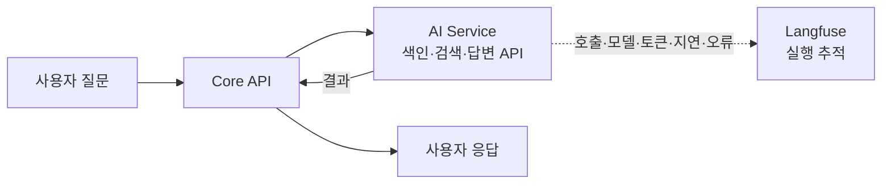
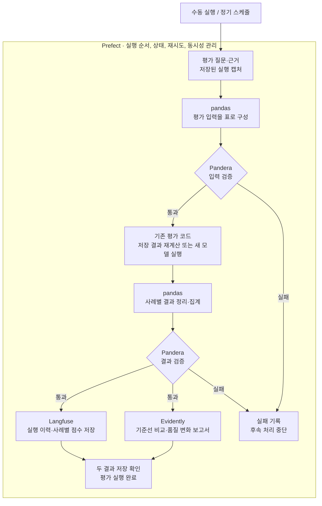

# Langfuse 기반 LLMOps 도입 전략

[문서 목록](README.md) · [AI Service](../backend/ai-service/README.md) · [기존 근거 답변 평가](../evaluation/support-program-evidence/README.md)

2026-09-28 코드 검토를 기준으로 한 도입 전략과 구현 범위다. 개발 실행 방법은 [LLMOps 실행 안내](../infrastructure/llmops/README.md)에 둔다. 실제 모델 품질 재평가와 운영 배포는 별도 작업이다.

목표 구성은 **`Langfuse + Prefect + Pandera + Evidently + pandas`**다. 원래 구성에서 MLflow의 LLM 추적·평가 이력·프롬프트 관리 역할을 Langfuse로 교체하며, 나머지 네 도구도 모두 도입 범위에 포함한다. 단계별 연결 순서는 구현 순서이며, 일부 도구의 도입을 선택 사항으로 만드는 기준이 아니다.

첫 목표는 **고정 근거 답변 한 건을 실행하고, 호출 상태·모델·토큰·지연·프롬프트 식별자를 Langfuse에서 확인하는 것**이다. 이후 평가 데이터 검증·결과 비교·정기 실행을 연결한다. 전체 스택의 첫 완료 목표는 **Prefect가 평가를 실행하고, pandas로 구성한 데이터를 Pandera가 검증하며, 결과가 Langfuse와 Evidently에 같은 실행 ID로 연결되는 것**이다.

## 현재 반영 범위

- 근거 답변 HTTP 경로와 평가 실행기의 직접 Service 호출에 본문 없는 Langfuse 추적을 추가했다.
- pandas·Pandera 입력/결과 표, 기존 지표 재계산, Evidently 비교 보고서, Prefect 수동 flow를 구현했다.
- 별도 Langfuse·Prefect 개발 Compose와 실제 저장·조회·재실행·실패 전파를 확인하는 무료 smoke 도구를 추가했다.
- AI Service의 로컬·CI·Docker와 평가 실행기·Prefect 서버를 Python 3.12로 통일하고, 새 CI 워크플로에 서버 통합 검증을 연결했다. 기존 `4f28a05` 커밋의 CI 5개는 통과했다.
- React 웹의 기존 Core 관리자 로그인 연동·평가 요청/이력/상세 화면과 Django Ops API, Prefect 상시 실행기, 읽기 전용 결과 공유와 보고서 조회를 추가했다. Ops도 Python 3.12로 통일했다.
- Ops에서 허용된 기준·후보 캡처를 선택하고 지표 변화·사례별 결과·프롬프트와 모델 식별자를 비교할 수 있다. 기존 가상 6건 재현을 유지하고, 과거 프롬프트 두 버전의 공통 E01 한 건 비교를 추가했다. 전체 원본을 먼저 검증하며 비교 범위를 자동으로 축소하지 않는다. 토큰 연결 정보가 없는 기록은 미측정으로 표시한다.
- Ops의 새 응답 생성 경로를 연결했다. 운영자가 전송 자료·모델·호출 예산을 확인하면 기존 Service·Agent로 응답을 생성하고, 선택한 저장 기준과 비교한다. 기본은 비활성화이며 실제 유료 평가·모델 품질 검증은 별도 승인 후 실행한다.
- 승인된 `gpt-6-luna` 실제 호출 1회로 가상 E01의 응답·토큰·Langfuse trace/점수·Evidently 보고서를 확인했다. [실제 호출 기록](../infrastructure/llmops/README.md#gpt-6-luna-실제-api-1회-검증)에 수치와 한계를 보존하며, 전체 품질 검증으로 해석하지 않는다.
- 완료 실행의 질문·근거·응답 검토와 관리자 검토 이력, 데이터셋별 비교 기준 지정을 추가했다. 검토 승인과 기준 지정은 별도 동작이며 접수 시 기준 응답 해시를 고정한다. AI 작성 참조 자료의 출처와 의미 충실도 미측정 상태는 유지한다.
- 실패한 후처리를 완료 응답으로 복구하는 API·React 화면·Prefect 경로를 추가했다. 원본 이력·호출 수를 보존하고 입력 해시 고정·복사, 동시 접수 차단, 추가 모델 호출 0회를 검증한다. 실행 방법은 [후처리 복구](../infrastructure/llmops/README.md#후처리-복구)를 따른다. `skn-25 / 0b7eebf`의 필수 CI 5개가 통과했다.
- `ops-sync`의 백그라운드 상태 확인, React 목록 자동 갱신·확인 지연 표시, 무료 후처리 복구의 실제 서버 CI 경로를 추가했다. `skn-26 / b7722a7`의 필수 CI 5개가 통과했다.
- 관리자별 같은 탭의 접수 복원, 기준 지정·교체·해제 버전과 변경 이력, 기준 변경과 접수의 DB 잠금을 추가했다. `skn-28 / 8da3ae6`의 관련 로컬 테스트 91개와 Ops·LLMOps·Infra·Catalog CI는 통과했다. GovBiz CI는 기준 커밋에도 존재한 Core 테스트 실패로 전체 통과하지 못했다.
- 사례별 판단·사유·검토 이력과 검토 기준 버전을 추가했다. 필수 사례 전체가 적합이어야 전체 승인할 수 있고, 사례 변경은 기존 승인 자격·활성 기준을 해제한다. migration 0008은 과거 전체 승인을 보존하되 사례별 적합 기록으로 소급 변환하지 않는다. `skn-34 / caabdac`로 푸시했고 `main / ab7add7`에 병합됐다. 원격 검증은 아래 최신 커밋별 상태로 구분한다.
- 접수 시 실행 명세·자료·사례·코드·의존성을 고정하고 실제 실행기에서 대조한다. 재전송은 최초 명세를 보존하며 평가기가 달라진 후처리 복구를 차단한다. `skn-35 / 5626586`의 Ops CI 회귀는 `b32efa1`에서 수정했고 수정 SHA의 필수 CI 5개가 모두 통과했다.
- 평가 기준 자료 검토와 버전별 품질 판정 이력·React 화면·기준 지정 제한을 구현했다. 실행 완료와 품질 합격을 분리하며 미검토 자료·응답을 합격 처리하지 않는다. 사용자 승인으로 기존 실행에 무료 판정 1건을 저장해 `NEEDS_REVIEW`와 재전송 중복 방지를 확인했다. 이 기능은 `skn-36`으로 관리하며 해당 변경의 원격 CI 결과는 별도로 확인한다.
- 실제 사람의 자료 검토와 현재 모델 기준 확보, 자동 스케줄, 여러 호스트의 전역 동시성, Core부터 이어지는 전체 RAG 추적은 후속 범위다.

아래 PR 번호는 도입 단계를 나타낸다. 현재 구현은 PR 1~4의 **저장 응답 재평가·승인 기반 새 응답 생성·관리자 검토와 기준 지정** 범위다. 실제 호출은 E01 한 건으로 확인했으며 평가 자료 전반의 모델 품질 검증·정기 운영은 후속 범위다. 실행 설정과 제한은 [새 모델 평가](../infrastructure/llmops/README.md#ops에서-새-모델-평가)를 따른다.

## 후속 개발 전략 — skn-35 이후

### 최신 코드 감사 — 54e2a19 기준

검토일은 2026-09-28, 최종 기준은 `main / 54e2a19aca0304c68dfc562e3d3eb0c9ee36887a`다.
검토 중 `aa86601`에서 이 커밋으로 작업 트리가 갱신되어 변경된 코드와 CI를 다시 확인했다.
이전 Ops 테스트 실패는 수정되었고 **자료 검토·품질 판정·판정 이력·기준 지정 제한도 이미 구현됐다.**
따라서 해당 기능을 다시 만드는 계획은 제외한다. 현재 남은 중심 과제는 실제 검토 기준 확보,
누적 비용·취소 통제, 배포 차단 연결, 전체 RAG 및 운영 검증이다.

현재 SHA의 원격 결과는 [GovBiz](https://github.com/ilil1/SKN34-4th-1Team/actions/runs/36411521261),
[Ops](https://github.com/ilil1/SKN34-4th-1Team/actions/runs/36411521436),
[LLMOps](https://github.com/ilil1/SKN34-4th-1Team/actions/runs/36411521196),
[Infra](https://github.com/ilil1/SKN34-4th-1Team/actions/runs/36411521368),
[Catalog](https://github.com/ilil1/SKN34-4th-1Team/actions/runs/36411521222) CI 모두 성공이다.
Ops의 MySQL 검사와 컨테이너 job도 실제 성공했다. 이는 현재 모델 품질 측정이나 운영 배포 완료를 의미하지 않는다.
[이미지 후보 workflow](https://github.com/ilil1/SKN34-4th-1Team/actions/runs/36412787852)는
workflow가 성공이지만 `publish` job은 건너뛰었다. 이미지 발행 성공의 증거로 쓰지 않는다.

| 우선순위 | 코드에서 확인한 남은 공백 | 조치 |
|---|---|---|
| P0 · 배포 전 | 감사 기준 SHA에는 [발행 gate](../infrastructure/release/gate.py)와 [trigger](../.github/workflows/msa-images.yml)에 LLMOps CI가 없었다 | 후속 작업 브랜치에서 다섯 CI·필수 job·발행/승격 재검증을 연결했다. 로컬 검증과 아래 구현 기록을 참조하며, 변경 SHA의 원격 CI 검증은 대기 중이다. |
| P0 · 로컬 실행 전 | [명세 검사](../backend/ops-service/apps/evaluations/execution_spec.py)가 기존 Windows checkout에서 실패 | AI 파일 5개의 CRLF가 원인이다. Git blob 및 LF 변환 바이트는 manifest와 일치한다. 확인한 파일만 LF로 복구하고 재검증한다. manifest 재생성으로 차이를 승인하지 않는다. |
| P1 · 품질 | [품질 정책](../backend/ops-service/apps/evaluations/quality_policy.py)과 [판정 이력](../backend/ops-service/apps/evaluations/quality.py)은 구현됐지만 실제 사람 검토·현재 모델 기준은 미확보 | 개발 테스트의 `PASS`와 사람이 승인한 평가 기준을 구별한다. 자료 검토 → 승인 범위의 새 응답 → 사례 검토 → 품질 판정 → 별도 기준 지정 순서로 진행한다. |
| P1 · 반복 실행 전 | [호출 설정](../backend/ops-service/apps/evaluations/catalog.py), [실행기](../evaluation/support-program-evidence/ops_flow.py), [API](../backend/ops-service/apps/evaluations/urls.py) | 실행별 호출 수·출력 토큰은 있지만 누적 예산 장부·취소 API가 없다. `CANCELLED` 상태 수신과 취소 기능은 다르다. `serve(limit=1)`·로컬 FileLock은 다중 실행기의 전역 제한이 아니다. |
| P2 · 자료 확대 전 | [평가기](../evaluation/support-program-evidence/evaluate.py)의 `load_fixture`·`report` | `synthetic`·`ai-authored`, 문서 최대 3개·사례 최대 12개로 제한된다. 자동 의미 충실도는 미측정이며 인용 recall은 불필요한 인용을 벌점 처리하지 않는다. 실제 공고·사람 참조·범위 확장은 자료 계약과 검토 기준부터 확장한다. |
| P2 · 운영 전 | [추적](../backend/ai-service/app/support_program_evidence/tracing.py)과 [개발 Compose](../infrastructure/llmops/compose.ops.yaml) | 허용 span은 답변·모델 두 개다. 전체 RAG 연결, 운영 인증·보존 기간·백업/복원·결과 저장소 운영 검증이 남았다. |

### skn-35 초기 검토 기록

최초 분석 대상은 `skn-35 / 562658605de6a907f11731634642fd77346bf0dc`다.
이전 `main / ab7add7`의 필수 CI 5개 통과와 이번 변경의 검증을 구분한다.
아래 표는 2026-09-28 16:49 KST 당시의 조회 기록이며 현재 수정본의 상태는 이어지는 P0 절을 따른다.

| 워크플로 | 확인 상태 | 의미 |
|---|---|---|
| [GovBiz Ops CI](https://github.com/ilil1/SKN34-4th-1Team/actions/runs/36393149437) | 실패 | MySQL 테스트 80개 중 1개 실패. 이를 선행 조건으로 하는 컨테이너 검증도 완료 아님 |
| [Infra CI](https://github.com/ilil1/SKN34-4th-1Team/actions/runs/36393149427) | 통과 | 인프라 검사 통과 |
| [GovBiz CI](https://github.com/ilil1/SKN34-4th-1Team/actions/runs/36393149531) | 실행 중 | AI·Web/Shared·Mobile 작업은 통과했으나 전체 완료 아님 |
| [LLMOps CI](https://github.com/ilil1/SKN34-4th-1Team/actions/runs/36393149486) | 실행 중 | 실제 서버 검증 완료 대기 |
| [Catalog CI](https://github.com/ilil1/SKN34-4th-1Team/actions/runs/36393149485) | 실행 중 | 최종 결과 대기 |

아래 순서가 **현재 작업 우선순위**이며, 뒤의 PR 1~5는 최초 도입 설계로 보존한다.
기능 구현, 자동 테스트 통과, 실제 모델 품질 검증, 운영 배포를 각각 별도로 판단한다.

### P0: CI 회귀 수정 완료

실패한 테스트는 `apps.evaluations.test_reviews.ReviewTests.test_reference_is_pinned_and_retry_survives_baseline_revocation`이다.
`test_reviews.py`의 새 접수 payload에 `execution_profile`이 없고, 218행의 HTTP 202 기대에서 400이 반환됐다.
새 계약의 `services.py:submit_run`은 전달 프로필과 접수 명세의 `profile_sha256`이 다르면 거절한다.
테스트를 새 계약에 맞추지 않은 부분을 수정했다.
기존 로컬 55개 Ops 선택 테스트에는 이 테스트가 포함되지 않았으며 전체 검증 완료로 볼 수 없다.

테스트의 세션 응답에서 해당 데이터셋의 프로필을 받아 접수하고, 최초 접수 후 기준을 철회해도
동일 UUID·명세 재전송은 성공하며 신규 UUID는 거절되는 원래 보장을 유지했다. 최초 실행 명세와
해시가 그대로인지도 확인한다. 격리 MySQL의 검토·명세·기준 관련 선택 테스트 22개가 통과했다.

수정 커밋 `b32efa1d9e9bd490026c28c2ec92d4743ca1fa57`의 필수 CI 5개가 모두 완료·통과했다.
Ops 전체 MySQL 테스트와 컨테이너 검사도 포함한다.
[Ops CI](https://github.com/ilil1/SKN34-4th-1Team/actions/runs/36407486657),
[GovBiz CI](https://github.com/ilil1/SKN34-4th-1Team/actions/runs/36407486729),
[LLMOps CI](https://github.com/ilil1/SKN34-4th-1Team/actions/runs/36407486603),
[Infra CI](https://github.com/ilil1/SKN34-4th-1Team/actions/runs/36407486639),
[Catalog CI](https://github.com/ilil1/SKN34-4th-1Team/actions/runs/36407486610).
이 결과는 아래 P1 변경에 대한 CI 통과를 의미하지 않는다.

### 해결한 이전 CI 차단 요인

[`skn-23` Ops CI](https://github.com/ilil1/SKN34-4th-1Team/actions/runs/36311401977)의
컨테이너 통합 단계가 실패했다. 새 검토 테스트 7개가 사용하는 저장 캡처를 단독·루트 Ops
Compose에서 연결하지 않아 `FileNotFoundError`가 발생했다. Python/MySQL 검사 통과만으로
컨테이너에서도 동작한다고 판단할 수 없다.

해결 범위는 단독 Ops Compose의 `LLMOPS_EVIDENCE_DIR`·읽기 전용 자료 마운트와 루트 Compose
경로 검증이다. 루트 구성은 단독 구성을 상속하므로 같은 수정이 적용된다. 검토 테스트를
생략하거나 자료가 없을 때 성공 처리하지 않는다.

같은 커밋의 [GovBiz CI](https://github.com/ilil1/SKN34-4th-1Team/actions/runs/36311401895)도
AI Service의 기본 모델 테스트 1개에서 실패했다. 이전 `910cf7b`의 모델 전환 후 테스트 기대값에
`gpt-5.6-luna`가 남았으며 실제 기본값은 요청대로 `gpt-6-luna`다. 기대값을 현재 계약으로 수정한다.
이 실패로 건너뛴 Container integration도 다음 검증에 포함한다.

로컬에서 `python3 -B infrastructure/scripts/check-compose.py --smoke`로 격리 MySQL 8.4의
Ops 테스트 35개, Django 설정·migration, HTTP·서비스 DNS 확인을 통과했다.
AI Service에서는 `uv run --locked --extra dev python -m pytest tests/assistant_agent/test_bootstrap.py tests/test_config.py -q`가 통과했다.
두 수정은 외부 모델 호출 없이 검증한 뒤 `skn-25 / 0b7eebf`로 푸시했다. 해당 커밋의 필수 CI는
건너뛰었던 Container integration을 포함해 모두 통과했다. **후속 변경도 그 변경 커밋의 필수 CI를 별도로 확인한다.**

### 우선순위와 진입·완료 조건

이 표는 **54e2a19 이후의 실행 계획**이다. 완료된 테스트 수정·품질 판정 구현을 다시 과제로 잡지 않는다.
담당은 역할 기준이며 이름·일정은 배정 전이다. 각 PR은 한 책임으로 나누고 다음 단계의 진입 조건을 지킨다.

| 순서 | 작업·담당 | 진입 조건 | 완료 증거 |
|---|---|---|---|
| 0 | CI/Infra: LLMOps CI의 발행·승격 차단 연결 | 로컬 구현, 원격 검증 대기 | 동일 SHA의 필수 CI 5개 및 실제 필수 job 성공. LLMOps 실패/누락/취소/실행 중/다른 SHA/최신 재실행 실패에서 발행·승격 차단 |
| 1 | 제품·검토자: 기존 가상 6건의 평가 기준 검토 | 기존 검토 화면·고정 자료 | 기대 상태·필수 인용·필수 사실·금지 주장 전 사례 검토. 검토자·사유·자료 해시 기록. 잘못된 자료는 새 버전으로 수정 |
| 2 | 평가·검토자: 현재 모델의 제한된 첫 기준 | 1 완료, 실행 환경 정합성, 자료·모델·예산 승인 | 승인된 최대 6회 생성, 사용량·trace·점수·보고서 대조, 전 사례 사람 검토와 현행 품질 판정 후 명시적 기준 지정 |
| 3A | Ops·실행기: 누적 예산 예약·정산 | 무료 구현은 1~2와 독립 진행 가능 | 같은 UUID 중복 예약 방지, 다른 UUID의 전역 한도, 중단/사용량 미확인의 예약 보존을 실제 MySQL 경합으로 확인 |
| 3B | Ops·Web·실행기: 취소·재시작 | 3A와 상태/예약 계약 확정 | 대기/사례 사이/전송 후 취소, 완료와 취소 경합, 실행기 재시작에서 중복 모델 호출 방지 및 실제 중단 상태 표시 |
| 4 | 평가·제품: 평가 자료 확장·회귀 판정 | 첫 기준 확보, 반복 실행 비용 통제 | 위험 범주별 검토 자료, 개발용/최종 확인용 분리, 버전·해시 고정, 범주별 결과와 실패 사례 보고 |
| 5 | Ops·실행기: 정기 실행·알림 | 2·3 완료, 필요한 주기·한도·수신 대상 확정 | 중복 tick·재시작·예산 소진·미확정 비용·알림 실패 검증 후 명시적으로 활성화 |
| 6 | Core·AI·평가: 전체 RAG 평가·추적 | 고정 근거의 판정·비용 통제 안정화 | 검색/근거 선택/답변 지표 분리, Core→검색→답변 실행 연결과 실패 위치 확인 |
| 7 | Infra·운영: 배포·복원·롤백 | 배포 SHA의 필수 CI와 배포 기능의 품질 증거 | 실제 프록시 인증, 결과·DB 백업 복원, 실행기 재시작, 이전 검증 버전 복귀를 스테이징에서 검증 |

무료 자료 검토와 예산 구현은 독립 진행할 수 있다. **정기 유료 실행은 누적 예산·취소 검증보다 앞서지 않는다.**
고정 근거 기능만 배포하면 전체 RAG 구현을 필수로 묶지 않되 검증 범위를 정확히 표시한다.
이번 전략은 새 유료 호출·스케줄·외부 알림·배포의 승인이 아니다.

### 발행 차단 연결 — 로컬 구현, 원격 검증 대기

`54e2a19`에서 분기한 `skn-37`에서 구현했다. 대상은
`infrastructure/release/gate.py`, `test_release.py`, `.github/workflows/msa-images.yml`,
`llmops-ci.yml`, 승격 도구의 안내 문구·회귀 테스트와 관련 문서다.

발행 흐름은 **동일 SHA의 다섯 CI 및 필수 job 성공 → 이미지 발행 → 승격 직전 같은 조건 재검증**이다.
LLMOps CI 완료를 발행 trigger에 추가했고, 모든 push에서 실행하여 문서 변경·빈 커밋의 검사 누락을 막는다.
PR은 기존 관련 경로 필터를 유지하고 발행·승격 도구 경로를 추가했다. 유료 모델 호출은 추가하지 않았다.

공유 gate는 workflow 경로·이벤트·SHA·브랜치·저장소와 최신 실행·재실행 결과를 확인한다.
필수 job 전체의 실제 성공, 정확한 이름·실행·SHA와 응답 완전성을 검사하며 job 조회 중 재실행도 거부한다.
발행기와 승격기가 기존의 각 재검증 지점에서 이 gate를 호출하므로 실패·누락·취소·실행 중·job skip은
발행 또는 승격을 차단한다. workflow의 job 이름·matrix 변경은 gate 정책과 계약 테스트도 함께 갱신한다.
원격 브랜치 보호/Ruleset은 별도 조회 대상이며 코드 변경만으로 설정 완료라 하지 않는다.

무료 로컬 검증은 gate 및 발행 회귀, 실제 gate를 사용한 승격 차단, YAML의 필수 job·push·완료 trigger 계약 검사다.
Python 3.13에서 다음 선택 검증을 통과했다. GitOps 검증 환경은 기존 `scripts/requirements.txt`의 PyYAML을 사용했다.

- `python -X utf8 -B -m unittest discover -s infrastructure/release -p test_release.py -q`: 40개 통과.
- `work/llmops-release-check/Scripts/python.exe -X utf8 -B -m unittest discover -s infrastructure/gitops/scripts -p test_sync_images.py -q`: 18개 통과.

전체 release 테스트는 GovBiz CI의 AI Service job에서, 승격·워크플로 계약 테스트는 Infra CI의
`kubernetes-manifests` job에서 실행하도록 기존 discovery 경로에 포함되어 있다.
수정 SHA의 원격 CI와 실제 원격 차단 결과는 아직 확인 전이다. 기반 SHA의 기존 CI 성공을 이번 변경의 증거로 쓰지 않는다.

로컬 명세 오류는 별도 환경 복구다. 확인된 대상은 AI의
`support_program_evidence/{models,prompt,errors}.py`, `support_program_identity.py`, `support_program_llm.py`다.
사용자 편집 여부와 Git 내용 일치를 다시 확인하고 해당 파일만 LF로 맞춘다.
전체 reset이나 manifest 재생성으로 해결하지 않는다.

### 첫 기준 측정의 운영 절차

1. 검토자는 6건의 기대 상태·기대 인용·필수 사실·금지 주장과 근거 원문을 대조해 자료 검토 이력을 남긴다.
2. 잘못된 참조는 현재 fixture를 덮어쓰지 않고 새 버전으로 수정한다. AI 작성 출처는 유지하고 사람 검토를 별도 기록한다.
3. 전송 자료·사례·모델·프롬프트·명세·호출 수·토큰 한도를 고정한 실행 계획을 승인받는다. 과거 E01 1회 승인을 재사용하지 않는다.
4. 승인된 실행을 수행하고 호출 시도·성공/실패·입력/출력 토큰·trace·점수·보고서를 대조한다. 호출 중 오류는 자동 유료 재시도로 숨기지 않는다.
5. 사람의 사례별 검토 → 명시적 품질 판정 → 전체 승인·기준 지정을 수행한다. 단계별 서버 조건을 충족한 경우에만 진행한다.

`PASS`는 해당 자료·정책·사례 집합에 대한 판정이다. 전체 서비스 정확도나 현재 검색 품질의 보장이 아니다.
모델 비교는 프롬프트를, 프롬프트 비교는 모델을 고정한다. AND/OR, 필수/우대, 예외/제외, 지역·업력·기업유형,
복수 청크, 근거 부족·모순, 불필요한 인용을 범주로 관리한다. 위험이 큰 조건은 다른 검토자가 재확인한다.
6건으로 일반 정확도·p95 기준을 정하지 않고 사례 수·범주별 결과·미측정을 함께 보고한다.

실제 공고·사람 작성 참조는 현재 v1과 호환되는 새 자료 계약이 필요하다. 출처를 허위로 `synthetic`·`ai-authored`로
표시해 검증을 우회하지 않는다. 문서/사례/호출 상한을 바꾸면 실행 명세·UI 예산도 함께 검증한다.
대규모 실행 전에 `llmops.py:publish_scores`의 100개 단일 조회를 배치/페이지 처리로 보완하고
100개 초과 점수 누락·재등록 검증을 추가한다. 현재 12건 상한에서 이미 발생한 장애라는 뜻은 아니다.

### 누적 예산·취소·자동화의 계약

호출 수·출력 토큰은 금액 예산이 아니다. 입력 토큰도 비용에 포함된다. 장부는 Django/MySQL이 소유하고
실행기는 전송 전에 예약을 확인한다. 기간 기준, 모델/단가 버전, 최대 입력·출력, 예약량·확정 사용량·
사용량 미확인을 기록한다. 금액 상한을 약속하려면 입력 상한과 보수적인 예약액까지 필요하다.
응답 유실·전송 후 중단의 미확인 비용을 0원으로 환급하지 않는다.

같은 UUID는 같은 예약, 다른 UUID는 전역 한도에서 원자적으로 예약한다. DB/예약 확인 실패 시 다음 전송을 차단한다.
여러 실행기가 같은 작업을 중복 소유하지 않게 하며 소유권 상실·사용량 미확인은 자동 유료 재시도로 해결하지 않는다.
취소 요청과 실제 중단 확인을 구분한다. 대기 중·사례 사이·이미 전송한 호출을 따로 처리하며 이미 전송한 요청의
과금 취소를 보장하지 않는다. 후처리 복구의 추가 모델 호출은 계속 0회다.

동시 예약, 예약 직후 종료, 전송 직후 종료, 사용량 저장 실패, 접수 응답 유실, 중복 실행,
취소/완료 경합, 재시작을 무료 대역과 실제 MySQL로 검증한다. 이후에만 스케줄을 활성화한다.
누락 실행을 몰아서 유료 재생성하지 않는다. 외부 알림은 승인된 수신 대상에만 연결한다.

### 운영과 전체 RAG의 완료 증거

전체 RAG는 [기존 검색 평가](../evaluation/support-program-search/README.md),
[실제 흐름 실행](../evaluation/support-program-evidence/serve_flow.py),
[흐름 검증](../evaluation/support-program-evidence/verify_flow.py)을 재사용한다.
검색 후보·필터·순위·근거 선택·답변 지표를 분리하고 index/문서 snapshot·chunker/embedding/reranker 버전을
해당 기능에 맞게 고정한다. Core부터 내부 요청에 추적 문맥을 전달해 검색 실패·근거 부족·모델 오류를 구분한다.
추가 추적 의존성이 필요하면 구현 전에 알린다.

운영 배포 완료에는 다음 증거가 필요하다.

- 배포 이미지·실행 명세·품질 기록이 같은 대상 버전을 가리킨다. 과거 다른 정책/모델 결과로 새 이미지를 승인하지 않는다.
- 실제 프록시에서 관리자 로그인·CSRF·일반 회원 차단·공유 로그아웃, Langfuse/Prefect 접근 제어를 검증한다.
- Ops DB·결과 파일·Langfuse/Prefect 저장소의 보존·삭제 범위를 정하고 백업을 실제 복원한다. 활성 기준의 캡처를 먼저 삭제하지 않는다.
- 실행기 재시작·접수 미확인·trace 전송 실패를 구분하고 모델 재호출 없는 후처리 복구 가능 범위를 확인한다.
- 품질 악화·승인 철회 시 신규 유료 실행/승격 차단과 이전 검증 버전 복귀를 연습한다. 진행 중 호출과 기존 이력은 별도 처리한다.

첫 품질 gate는 기존 사람 승인·버전이 고정된 판정으로 운영한다. 자동 기준 승격, 모든 push의 유료 평가,
새 LLM 제공자·Airflow·Celery·범용 정책 엔진은 이 계획에 포함하지 않는다.

### 이번 코드 감사의 검증 경계

- 최신 커밋의 5개 CI 결과와 Ops MySQL·컨테이너 성공을 조회했다. 앞서 발견한 aa86601의 Ops 실패는 최신 커밋에서 해결됐다.
- `infrastructure/release`에서 `python -X utf8 -B -m unittest test_release.ReleaseGateTests -q`: 10개 통과. 이 코드는 검토 중 갱신되지 않았다. 기존 4개 CI 정책의 검사이며 LLMOps 차단 구현 완료를 뜻하지 않는다.
- `python -X utf8 -B backend/ops-service/apps/evaluations/execution_spec.py`: 최신 checkout에서도 로컬 바이트 불일치로 실패. Git blob과 작업 파일을 대조했으며 원본 변경과 CRLF 차이를 구분했다.
- 로컬은 Python 3.13.14 표준 라이브러리 검사만 수행했다. 프로젝트의 Python 3.12 실행·잠금 의존성 검증을 대체하지 않는다. `uv`를 찾지 못해 AI/Ops 전체 테스트를 새로 실행하지 않았고 MySQL/Compose는 기동하지 않았다.
- 이번 작업은 전략 문서만 수정한다. 유료 모델 호출·사람 품질 승인·스케줄·배포·원격 설정 변경은 수행하지 않았다.

### P1: 품질 판정 구현 — 병합 커밋의 원격 검증 완료

현재 `EvaluationRun.status`는 실행 상태이고, `EvaluationCaseReview`는 특정 응답의 적합 여부다.
`evaluate.py:report`의 `semanticFaithfulness`는 항상 미측정이며, `capture_catalog.json`은 가상 6건과
E01 1건만 제공한다. 이번 구현은 **어떤 정책과 검토를 근거로 품질을 판단했는지**를 저장한다.
아래 계약을 Django·React에 반영했으며 세부 API와 사용법은
[Ops README](../backend/ops-service/README.md#평가-기준-검토와-품질-판정)를 따른다.

1. **평가 기준 검토와 응답 검토를 분리한다.** 가상 fixture의 기대 상태·기대 인용·필수 사실·금지
   주장도 AI 작성이다. 기존 응답 검토를 fixture 정답 검토 완료로 취급하지 않는다. fixture 해시·사례
   집합·검토 기준 버전·검토자·판단·사유를 가진 작은 검토 기록을 추가한다. 자료 수정은 새 버전으로
   등록하고 기존 `ai-authored` 출처는 유지한다. 임의 자료 업로드·편집 플랫폼까지 만들 필요는 없다.
2. **정책은 서버의 버전이 있는 고정 정의 하나로 시작한다.** 필요한 사례·기계적 필수 조건·사람 검토
   요건을 명시하고 정책 내용과 해시를 새 접수 명세에 포함한다. 웹에서 임의 기준식을 실행하거나
   새 규칙 엔진·LLM 심판을 추가하지 않는다. 6건만으로 일반 정확도 95%나 p95 기준을 정하지 않는다.
3. **Django가 판정 이력을 소유한다.** 평가 자료·응답·비교 결과 해시, 실행 명세, 정책 스냅샷,
   사용한 기준/사례 검토 ID, 판정과 사유 코드를 한 판정 기록에 보존한다. 검토·정책 변경은 이전
   판정을 덮어쓰지 않는다. 과거 실행에는 자동 합격을 채우지 않고 필요할 때 명시적 재판정을 남긴다.
4. **React는 실행 상태와 품질 상태를 함께 표시한다.** 실패/검토 필요의 사례와 이유, 적용 정책,
   미측정 항목을 노출한다. 기계 점수·사람 판단·비교 기준 지정을 하나의 승인 버튼으로 합치지 않는다.
5. **기준 지정 조건을 서버에서 확인한다.** 해당 정책 판정의 유효성, 최신 사례별 검토·전체 승인,
   정확한 입력 해시가 모두 맞을 때만 새 기준을 지정한다. 과거 기준·승인 기록은 보존하며 새 정책
   적격성은 별도로 표시한다. 정책/검토 변경과 접수의 경합에서 기존 기준 잠금·스냅샷 계약을 유지한다.

| 품질 상태 | 판단 조건 |
|---|---|
| `NOT_EVALUATED` | 판정 기록이나 신뢰할 수 있는 평가 입력이 없음. 실행 실패·결과 손상 자체를 모델 품질 불합격으로 단정하지 않음 |
| `NEEDS_REVIEW` | 기계적 위반은 없으나 기준 자료 또는 필수 사례가 미검토·보류이거나 필요한 판단이 미확정 |
| `FAIL` | 검토된 정책의 필수 조건 위반 또는 해당 응답의 필수 사례에 부적합 판단이 있음. 평균으로 상쇄하지 않음 |
| `PASS` | 명시한 자료·사례 범위에서 정책 필수 조건과 실제 사람 검토가 모두 충족됨. 전체 모델 품질 보장 아님 |

필요 없는 인용의 `해당 없음`과 의미 정확성의 `미측정`은 구별한다. 의미 판단은 사례별 사람 검토로
충족시킬 수 있으나 자동 `semanticFaithfulness` 수치를 만들어 넣지 않는다. Langfuse의 기존 숫자 점수와
Evidently 보고서는 유지하고 판정의 원본은 Django에 둔다. 다른 화면으로 판정을 복제하는 작업은 이후로 둔다.

P1의 검증 조건은 다음과 같으며 무료 저장 응답·스텁과 격리 MySQL을 사용했다.

- 실행 완료지만 미검토이면 합격하지 않고, 필수 사례 한 건의 부적합이 평균 점수에 가려지지 않는다.
- 미측정·해당 없음·자료 손상을 서로 구별하며, 가상 과거 실행이 현재 모델 측정으로 바뀌지 않는다.
- 정책을 바꿔도 과거 판정 내용이 유지되고, 동일 입력·정책·검토에 대한 재요청은 중복 이력을 만들지 않는다.
- 검토 철회·판정·기준 지정·신규 접수가 겹칠 때 실제 MySQL 검증으로 잠금과 이력 정합성을 확인한다.
- React뿐 아니라 API 직접 호출도 미충족 판정을 기준으로 지정할 수 없다.
- migration은 기존 실행·승인·기준을 보존하고 로컬 선택 검사와 수정 SHA의 전체 CI를 구분한다.

로컬에서는 Ops 관련 50개, 실행기 관련 53개, React 44개 테스트가 통과했다. 기존 개발 DB에는
추가 migration `0010_quality_assessments`를 적용하고 실행 19건과 원래 명세를 보존했다.
사용자가 승인한 기존 실행 `f5f5fe26-76cb-4979-a58b-b0735406be04`의 품질 판정은
기준 자료·6개 답변 미검토에 따른 `NEEDS_REVIEW`다. 같은 입력을 다시 저장해도 이력은 1건이다.
자료/답변의 사람 검토 승인이나 기준 지정은 하지 않았고 추가 모델 호출은 0회다.
자세한 명령·검증 경계는 [로컬 검증 기록](../infrastructure/llmops/README.md#품질-판정과-평가-기준-검토--2026-09-28)에 둔다.
P1 변경은 사용자 요청에 따라 `skn-36`으로 관리한다. 로컬 검증과 해당 커밋의 전체 CI 완료를 구분한다.

### 다음 작업과 제외 범위

P0의 테스트 계약 누락 수정과 P1의 정책·판정·자료 검토 기록·API·React는 병합 커밋 `54e2a19`의
CI까지 통과했다. 다음 작업은 위 최신 코드 감사와 우선순위 표를 따른다. 실제 사람 검토·현재 모델 기준은 별도다.
P1 중 정책 판정의 소유자는 Django이고 Prefect는 기존 평가 배치,
AI Service는 기존 답변 생성, React는 확인·표시를 계속 담당한다.
참조 자료의 실제 사람 검토와 최대 6회 새 모델 평가는 P2에서 수행하며 이번 전략 작성은 실행 승인이 아니다.
Airflow·Celery 추가, 자동 기준 승격·배포, 임의 정책 편집기, 정기 유료 실행은 이번 구현 묶음에 넣지 않는다.

### 직전 구현의 결과와 검증 경계

**0. Core 실패를 재현하고 로컬에서 수정했다.** Core의 `AccountPasswordResetFlowIntegrationTest` 중
`concurrentRequestsCannotReuseTheSamePasswordResetToken()`이 139행 인증번호 검증의 HTTP 200 기대에서
실패했다. 병렬 비밀번호 변경 구간에 진입하기 전의 오류다. `skn-28`에는 Core 변경이 없고
[기준 커밋 5eb035c의 CI](https://github.com/ilil1/SKN34-4th-1Team/actions/runs/36377074395)도
같은 테스트·같은 줄에서 실패했다. 실제 MySQL 8.4로 클래스 전체를 실행해 HTTP 429
`LOGIN_RATE_LIMITED`를 재현했다. DB를 비워도 Spring의 IP별 로그인 제한은 테스트 사이에 남아
같은 기본 주소의 요청이 누적됐다. 테스트마다 서로 다른 주소를 사용하도록 고쳤으며 production
로그인 제한은 유지했다. 비밀번호 재설정 통합 3개·로그인 제한 단위 4개가 통과했다.
수정본은 `caabdac`로 푸시했다. Core 전체 작업을 포함한 원격 CI 완료 여부는 위 커밋별 상태와 구분한다.

로컬 Core를 기존 DB·계정으로 다시 기동했고 React의 `localhost:5173` origin을 맞췄다.
기존 관리자 로그인 → 무료 저장 응답 6건 접수 → 즉시 새로고침 → 같은 UUID 상세 복원 → 완료를
실제 브라우저에서 확인했다. 검토 화면에서는 새 무료 평가에 기능 확인용 보류만 저장하며,
실제 평가를 개발 확인만으로 승인하거나 기준으로 지정하지 않는다.
로그아웃 후 일반 회원의 접근 거절과 관리자 재로그인 뒤 같은 상세·보류 이력 복원도 확인했다.
저장소 손상 시 접수 차단은 구현되어 있으나, 사용자 화면에서 확인 후 정리하는 경로는 별도 보완 대상이다.
서버 접수 여부가 불명확한 기록을 지우고 새 UUID를 발급하는 식으로 복구하지 않는다.

**1. 사례별 검토를 구현했다.** 실행 전체 판단·의견만 저장하던 `EvaluationReview`에 사례 검토
스냅샷을 연결하고, Django 평가 앱과 React 검토 화면에 사례별 기록을 추가했다.
새로운 작업 프레임워크나 라이브러리는 추가하지 않았다. 구현 계약은 다음과 같다.

- 각 사례에 `적합 / 부적합 / 판단 보류`, 필수 사유, 검토자와 시각을 기록한다. 미검토는 기록이
  없는 상태로 구별한다. 신청 조건의 누락·추가, 근거와의 일치, 인용 적절성을 검토 항목으로 명시한다.
- 기록은 실행·사례 ID·자료/응답 해시·검토 기준 버전에 연결한다. 수정은 이전 판단을 덮어쓰지 않고
  새 이력으로 남기며 응답 유실 재전송은 중복 기록을 만들지 않는다.
- 서버는 해당 실행의 정확한 필수 사례 집합을 검사한다. 누락·중복·알 수 없는 사례 ID,
  자료/응답 해시 불일치, 부적합·보류가 있으면 전체 승인과 신규 기준 지정을 막는다.
- 새 사례 검토, 전체 승인, 기준 지정, 다음 평가 접수는 기존 데이터셋 기준 잠금 순서를 지킨다.
  오래된 검토 화면의 저장을 거절하고, 검토가 변경되면 전체 승인·기준 자격을 다시 확인한다.
  이미 접수한 평가의 기준 스냅샷은 보존한다.
- 기존 전체 검토는 그대로 보존하되 사례별 적합 기록으로 소급 변환하지 않는다. 기존 기준은
  `사례별 재검토 필요`로 구별하고 새 접수에 쓸 자격을 별도로 검증한다. 과거 실행은 변경하지 않는다.
- 완료 조건은 API 직접 호출로도 우회 불가, 검토 변경과 기준 지정의 실제 MySQL 경합 검증,
  관리자 분리·새로고침·응답 유실 React 검증, 최신 SHA의 필수 CI 통과다. 새 모델 호출은 필요 없다.

로컬 선택 검증·실제 실행 기록은 [사례별 검토 검증 기록](../infrastructure/llmops/README.md#사례별-검토와-core-검증-보완--2026-09-28)에 둔다.

### 접수 시 실행 명세 고정 — 구현 및 검증

목표는 **관리자가 확인한 실행 조건과 실제 작업 조건이 다르면 과금 전에 중단하는 것**이다.
모델 이름·프롬프트 해시가 같다는 이유로 응답이 완전히 재현된다고 보장하지 않는다.

구현 전 확인한 공백은 다음과 같았다. 아래 저장·전달 계약과 실행 방식별 검증을 적용했다.
로컬 검증 결과와 원격 CI 미완료 범위는 [실행 명세 검증 기록](../infrastructure/llmops/README.md#실행-명세-고정-검증--2026-09-28)에 구분한다.

- `catalog.py:live_config`는 모델·fixture 해시·호출 수·출력 토큰만 고정한다. 사례 ID와 순서는 실행 시 카탈로그에서 읽는다.
- `evaluate.py:execute`는 실행 시 프롬프트 해시를 기록한다. `runnerSha256`은 `evaluate.py` 한 파일의 해시이므로 Agent·Service·공통 호출 함수·의존성 변경 전체를 대표하지 않는다.
- `llmops.py:EVALUATOR_VERSION`은 실행 시 `evaluate.py + llmops.py`로 계산한다. 결과 식별에는 사용하지만 접수 당시 평가기와의 일치를 검증하지 않는다.
- `recover_saved_capture`는 고정된 입력을 현재 `evaluate_capture`로 처리한다. 따라서 평가기 변경 후의 처리가 원래 후처리 복구인지 새로운 재평가인지 명확히 구분해야 한다.
- Ops는 호스트 평가 자료를 읽기 전용으로 마운트하고 실행기는 빌드 때 자료를 복사한다. 같은 배포 명칭만으로 두 환경의 내용이 같다고 판단할 수 없다.

#### 저장·전달 계약

`0009_execution_spec` migration으로 `EvaluationRun`에 버전이 있는 `execution_spec`과 명세 SHA-256을 추가했다.
`live_config`, `reference_config`, 기준 버전 계약을 한꺼번에 제거하지 않고 기존 호출자와의 호환 경계를 유지한다.

| 묶음 | 접수 때 고정할 내용 |
|---|---|
| 공통 | 명세 스키마 버전, 실행 방식, 데이터셋 ID·fixture 해시, 순서가 있는 사례 ID 목록 |
| 답변 생성 | 모델, 실제 프롬프트 해시, 출력 제한·추론 설정·timeout·재시도 등 유효 호출 설정, 생성 경로 코드·의존성 식별자 |
| 평가 | 평가 코드·의존성 식별자, 보고서/점수 계산 계약 |
| 비교 입력 | 후보·기준 캡처 해시, 검토 기준을 사용하면 승인 ID·기준 버전·원본 실행 ID |

신뢰하는 단일 생성 도구로 코드 파일 목록·잠금 파일을 검증한 릴리스 manifest를 만들고 Ops와 실행기에
같이 공급한다. Ops에 AI SDK 전체를 설치하거나 독립적으로 추정한 해시를 하드코딩하지 않는다.
처음에는 현재 생성·평가 경로의 명시적 파일 목록을 사용하고 범용 registry나 플러그인 계층을 만들지 않는다.
manifest 자체·생성 시각을 입력 해시에 넣어 순환하거나 같은 내용의 해시가 매번 달라지지 않도록 한다.
실행기는 전달받은 해시를 그대로 신뢰하지 않고 실제 파일·잠금 파일과 유효 설정을 대조한다.

React는 서버가 제시한 명세 식별자를 확인해 보내고 Django는 현재 허용된 명세인지 검증한 뒤 DB에
저장한다. 파일 경로·임의 코드·사용자가 만든 명세를 실행하지 않는다. 접수 transaction 이후 Prefect에
저장된 명세를 전달하며 `request.json`, 결과 manifest, Ops 상세가 같은 명세를 가리키게 한다.
기존 UUID 재전송은 처음 저장한 명세를 유지한다. 배포가 바뀌었다고 같은 UUID를 새 명세로 갱신하지 않는다.
접수 후 데이터셋의 활성 비교 기준을 교체·해제해도 이미 접수한 요청은 당시 고정한 캡처를 사용한다.
실행 시 확인할 것은 고정 입력의 무결성이며 현재 활성 기준과 같아야 한다는 새 조건을 추가하지 않는다.

#### 실행 방식별 검증

| 방식 | 실행 직전 확인 | 과거 정보 처리 |
|---|---|---|
| 새 응답 생성 | 생성·평가 코드, 프롬프트, 실제 호출 설정, 자료·사례·기준 모두 접수 명세와 일치 | 불일치는 모델 호출 전 실패. 최신 값으로 자동 대체하지 않음 |
| 저장 응답 재평가 | 이번 평가 코드와 저장 입력·사례·기준이 접수 명세와 일치 | 과거 캡처의 모델·프롬프트는 출처 정보로 보존. 현재 생성 프롬프트와 다르다는 이유만으로 무료 재평가를 막지 않음 |
| 후처리 복구 | 원본 입력 보존, 원래 평가기 식별과 현재 평가기 호환 확인 | 평가기가 다르면 단순 복구로 진행하지 않음. 다른 평가기로 재계산하는 별도 작업은 이후 명시적으로 추가 |

구형 완료 결과는 조회·비교·검토 이력을 보존한다. 구형 미실행 유료 요청의 누락 명세를 현재 버전으로
채워 실행하지 않는다. 명세가 없는 원본의 복구는 기존 manifest에서 당시 평가기·입력 계약을 검증할 수
있을 때만 허용하고, 확인 불가하면 차단 사유를 표시한다. 단지 현재 모델 설정이 바뀌었다는 이유로
완료 캡처의 무료 후처리를 막지는 않는다.

`EXECUTION_SPEC_MISMATCH` 같은 안정적인 실패 코드를 사용해 변경된 항목과 재확인 필요를 표시한다.
실행기가 호출 전 중단을 확인한 경우에만 호출 0회를 기록한다. 상태를 확인할 수 없는 실패는 미확인으로
남기며 0회로 추정하지 않는다. 응답 유실·새로고침·재로그인 때 기존 UUID 조회를 먼저 수행하는 계약도 유지한다.

#### 변경 범위와 구현 순서

1. 명세 스키마·결정적인 해시·릴리스 생성/검사 도구와 무료 테스트를 먼저 만든다.
2. Django 모델·추가 migration·접수/복원·Prefect 파라미터·결과 검증에 명세를 연결한다.
3. `ops_flow.py`, `evaluate.py`, `llmops.py`, `recovery_inputs.py`에서 생성/재평가/복구의 검증 경계를 적용한다.
4. React 자료·예산 확인과 상세 화면에 실행 버전 및 불일치 사유를 표시하고 보관 요청 스키마의 구형 호환을 검증한다.
5. Ops/실행기 빌드·Compose·실제 서버 smoke에 두 구성의 불일치 검증을 연결한다. 문서는 기존 Ops/Web/LLMOps README와 이 전략 문서를 갱신한다.

롤아웃은 새 실행 접수 제한 → additive migration·Ops/실행기/React 동시 버전 갱신 → 무료 확인 → 접수
재개 순서로 설계한다. 기존 DB·결과 볼륨을 지우지 않고, 평가 중인 유료 작업을 임의로 끊지 않는다.
이미 진행 중인 작업은 기존 실행기에서 마무리하고 미실행 구형 유료 요청의 처리 결과를 별도로 확인한다.

#### 완료 조건

- 접수 뒤 프롬프트, Agent/Service, 공통 모델 호출 코드, 잠금 파일, 평가기, 사례 집합/순서 또는 고정한 기준 캡처의 내용을 바꾸면 실행 전에 감지한다. 활성 기준의 정상 교체는 이미 접수한 요청을 무효화하지 않는다.
- Django 명세 A와 실행기 명세 B를 실제 Compose 환경에 공급하면 호출 전 실패한다. 이 검증은 모델 호출을 금지한 대역으로 수행한다.
- 같은 UUID 재전송은 명세와 Prefect 실행이 그대로이며, 다른 명세를 같은 UUID로 보내면 거절한다.
- 저장 응답 재평가는 과거 생성 프롬프트를 보존하며 추가 모델 호출 0회다. 복구의 평가기 불일치를 별도 재평가로 위장하지 않는다.
- 구형 완료 기록 조회, 구형 요청의 안전한 차단, 기존 기준·사례 검토, 후처리 복구, 응답 유실 복원의 관련 테스트가 통과한다.
- 실패 사유와 요청/실행 명세 연결을 실제 React·Ops·Prefect 흐름에서 확인하고 최신 변경 SHA의 필수 CI가 모두 통과한다.

이번 개발 범위는 **실행 명세 고정과 그 회귀 검증**이다. 새 모델 호출·새 라이브러리·스케줄러 도입은
필요 없다. 기존 여섯 건의 실제 사람 검토는 구현과 별도로 진행할 수 있지만 기능 검증용 보류 기록을
품질 승인으로 취급하지 않는다. 품질 정책·첫 현재 모델 기준은 그다음 단계이며, 유료 평가는 해당
자료·명세·호출 예산이 구체적으로 승인된 실행에서만 수행한다.

### 상태 동기화와 CI 보강

기존 목록 API는 DB 상태만 반환하고 상세 조회에서 Prefect를 확인해, 화면을 닫으면 대기/실행 중 상태가
남을 수 있었다. `ops-sync`를 추가해 화면과 독립적으로 기존 실행을 확인한다. 목록 API의 외부 호출은
추가하지 않고 React가 DB 결과를 5초마다 다시 읽는다. 확인 성공·시도 시각과 60초 이상 지연을 구분한다.
접수 응답 유실은 기존 Prefect idempotency key·인자를 조회해 연결하며 자동 모델 실행을 생성하지 않는다.
새 라이브러리 없이 같은 Django 이미지를 사용하는 별도 프로세스이며 migration 이후 시작한다.

기존 복구의 로컬 실제 서버 검증을 `LLMOps CI`에도 연결한다. CI 전용 파일의 publish 실패 주입,
새 대기 이력 등록, 관리자 복구 API의 같은 UUID 재전송, 목록만 조회한 완료 확인, 원본 해시 보존과
Langfuse 점수 22개 readback을 확인한다. 실제 모델 호출은 0회다.

### 접수 복원·기준 동시성의 후속 구현

응답 유실 뒤 같은 화면에서 UUID를 유지하는 기존 처리를 관리자별 탭 저장소로 확장했다.
복원 시 기존 요청을 GET으로 먼저 확인하고 404여도 자동 모델 접수는 하지 않는다. 운영자가 재확인하면
같은 UUID·명세를 사용한다. 인증정보와 평가 본문은 보관하지 않으며 탭 종료·저장소 삭제까지 보장하는 기능은 아니다.

기준 행은 해제 뒤에도 보존하고 버전·지정/교체/해제 이력을 기록한다. 같은 데이터셋 행을 잠근 뒤
기준 검증과 평가 접수를 함께 커밋한다. 외부 전송은 커밋 이후다. 최초 지정 경합, 철회 선행 시 거절,
접수 선행 시 기준 보존, 이력 저장 실패 rollback을 실제 MySQL 8.4의 격리 테스트 DB에서 검증한다.
이관은 기존 기준만 보존하고 과거 승인·변경 기록은 소급 생성하지 않는다.

사례별 검토와 접수 시 실행 명세 고정을 구현했다. 명세 고정 변경의 필수 CI를 확인한 뒤
다음 품질 판정 단계로 진입한다. 프롬프트·실행기·평가기·기준 버전 불일치는 실행 전에 차단한다.

### 후처리 복구의 구현·검증 기준

Evidently·Langfuse 작업의 자동 재시도는 각각 한 번이다. 이 재시도가 소진된 실행의 수동 복구를
Ops에 구현했으며 상태 동기화·복구 CI도 통과했다. 아래 기준과 접수 복원·기준 변경 정합성을 유지하면서 **사례별 검토와 실행 명세 고정**의 검증을 마무리한다.
현재 수정본의 필수 원격 CI 통과와 유료 평가 승인은 별도이며 로컬 구현 완료로 대체하지 않는다.

- React 상세에서 응답 생성 상태와 후처리 상태·오류를 구분하고, 복구 가능한 경우에만
  **후처리 다시 실행**을 제공한다.
- Django는 요청자·복구 요청 UUID·원본 실행·캡처/자료/비교 기준 해시를 기록한다.
  중복 접수는 같은 복구 시도로 연결하고, 원본 실행과 실패 기록을 덮어쓰지 않는다.
- Prefect는 완전히 생성된 캡처와 고정된 비교 입력을 검증한 뒤 기존 검증·보고서·점수 등록 함수를
  호출한다. 복구 시도별 출력 경로를 사용하고 점수는 같은 콘텐츠 식별자로 중복을 막는다.
- 자료·기준 스냅샷 또는 응답이 누락·변조된 경우 복구를 거절한다. 응답 생성이 중단된 부분 캡처를
  완료 결과로 처리하거나 누락된 응답을 자동 생성하지 않는다.
- 무료 실패 주입으로 보고서 오류, Langfuse 전송 후 응답 유실, 동시 중복 접수, 실행기 재시작,
  캡처 훼손을 검증한다. 모델 호출 함수를 호출하면 실패하는 테스트로 **추가 호출 0회**를 보장한다.
- 구현 지점은 `backend/ops-service/apps/evaluations`, `frontend/web`의 평가 상세,
  `evaluation/support-program-evidence/ops_flow.py`·`llmops.py`다. 범용 작업 엔진이나 새 스케줄러는 필요 없다.

### 평가 기준과 품질 판정

현재 Ops에서 선택 가능한 범위는 가상 TC01~TC06 여섯 건과 고정 근거 E01 한 건이다.
GPT-6 Luna 실제 호출 E01 한 건은 API·기록 연결 검증이다. 의미 충실도는 미측정이며,
기준과 후보의 프롬프트도 달라 해당 결과로 모델 교체 효과나 전체 품질을 판단하지 않는다.

먼저 기존 여섯 건의 AND/OR 조건, 근거에 없는 조건, 제외 사유와 예외, 우대와 필수 조건을
사람이 검토한다. 구현된 **사례별 적합·부적합·판단 보류, 이유와 검토자, 검토 대상 해시** 기록을
사용한다. 이 기록 기능의 개발 검증은 사람의 실제 품질 검토 완료를 의미하지 않는다. 사람이 검토한 판단은 별도 기록으로 보존하고,
AI 작성 참조 자료의 출처를 일괄 변경하지 않는다. 자료 수정 시 새 버전·해시를 발행하며 기존 자료를 덮어쓰지 않는다.
기준 교체·검토 철회·새 평가 접수가 겹치는 DB 통합 테스트로, 접수 시 확정된 기준과 이후 변경의 경계도 확인한다.

다음 실제 품질 측정의 제안 범위는 검토된 여섯 건, 최대 모델 호출 6회, 호출당 출력 2,000토큰이다.
이는 **미승인 계획**이며 이번 전략 수립에서는 실행하지 않는다. 기존 E01 1회 승인은 추가 실행의
승인으로 사용하지 않는다. 입력 토큰도 비용에 포함되므로 출력 한도를 금액 한도로 표시하지 않는다.
`gpt-6-luna`·프롬프트·근거 버전을 고정해 첫 기준을 확보한다. 모델 비교는 프롬프트를,
프롬프트 비교는 모델을 고정한다. 기준 지정은 관리자의 실제 검토 후 수행한다.

품질 상태는 실행 성공 여부와 별도로 `PASS / FAIL / NEEDS_REVIEW / NOT_EVALUATED`를 둔다.
잘못된 인용, 필수 사례 누락, 자료 해시 불일치 등 기계적으로 확인 가능한 오류와 사람이 확인해야
하는 의미 정확도를 구분한다. 중요한 신청 조건 오류는 평균 점수가 높아도 가려지지 않게 한다.
미측정 값을 0점이나 합격으로 바꾸지 않고, E01 한 건이나 가상 여섯 건만으로 일반 정확도·p95 기준을 확정하지 않는다.
정확도·비용·지연의 수치 기준은 검토된 평가 자료와 제품 요구에 근거해 정한다.
판정에는 정책 버전·평가 자료·프롬프트·모델·비교 기준 해시를 보존한다. 자동 기준 승격·배포 차단 연결은 이후 별도 작업이다.

### 자동화와 확대의 제한

현재 실행별 호출 수·출력 토큰 제한은 유지한다. 정기 실행 전에 일별 누적 예산 예약·정산과
동시 접수 검증을 추가한다. `serve(limit=1)`은 여러 호스트 전체의 동시성 제한으로 해석하지 않는다.
호출 전 예약, 사용량 미확인 상태, 프로세스 중단을 보존하며 미확인 지출을 0으로 환급하지 않는다.
취소는 대기 중·사례 사이·모델 호출 중을 구분하고, 이미 전송한 요청의 비용이 사라진다고 표시하지 않는다.

스케줄은 기본 비활성화하며 실행 중복 방지, 주기별 한도, 실패 상태를 무료 검증한 후 활성화한다.
알림은 구체적인 수신 대상·전송 승인이 정해졌을 때 연결한다. 그전에는 Ops 상태 표시를 사용한다.
전체 RAG는 저장소에 이미 있는 검색·전체 흐름 평가 도구를 재사용해 Ops에 연결한다.
고정 근거 평가를 전체 검색·RAG 품질 평가로 표시하지 않는다.

책임은 React의 화면, Django의 인증·실행/검토/정책/예산 기록, Prefect의 배치 실행,
AI Service의 모델 호출, Langfuse의 추적·점수, Evidently의 비교 보고서로 유지한다.
이 계획에 Airflow·Celery·MLflow나 추가 LLM 제공자는 필요하지 않다.
운영 배포 전에는 같은 origin의 인증·프록시, 결과 볼륨과 DB의 백업·복구,
실행기 재시작 후 접수 실행 처리와 보존 기간을 검증한다.

각 단계는 변경 범위의 무료 로컬 검사와 최신 커밋의 필수 CI 결과를 구분해 보고한다.
검증 실패, 입력 불일치, 예산 미승인·소진이 있으면 해당 실행·활성화 단계에서 중단하고
실패를 정상 응답으로 바꾸지 않는다. 완료 조건을 충족하기 전에는 다음 유료 실행·자동화를 확대하지 않는다.

## 다섯 도구의 역할과 연결

| 도구 | 이 프로젝트에서 맡길 역할 |
|---|---|
| Langfuse | 요청·모델·도구 호출 추적, 프롬프트 식별, 사례별 점수와 실행 이력 |
| Prefect | 평가 파이프라인 실행 순서·스케줄·동시성·재시도·실패 상태 관리 |
| pandas | 기존 JSON 평가 자료와 캡처를 사례별 표로 변환하고 결과 집계 |
| Pandera | 평가 입력·결과 표의 타입·필수값·중복·점수 범위·집계 대상 검증 |
| Evidently | 검증된 결과의 기준선 비교, 데이터·지표 변화 보고서와 테스트 결과 |

### 사용자 요청과 실행 추적

사용자 요청은 Core와 AI Service에서 처리하고, Langfuse에 모델 호출·토큰·지연·오류를 기록합니다.
일반 요청의 질문·답변·청크 원문은 기본 수집 대상에서 제외하며, 기록 필드는 도입 단계에서 명시적으로 적용합니다.


```mermaid
flowchart LR
    U["사용자 질문"] --> C["Core API"]
    C --> A["AI Service<br/>색인·검색·답변 API"]
    A -->|결과| C
    C --> R["사용자 응답"]
    A -. "호출·모델·토큰·지연·오류" .-> L["Langfuse<br/>실행 추적"]
```

### 평가 배치와 결과 비교

Prefect가 아래 전체 과정을 실행하고 관리합니다. 최초 검증은 저장된 평가 캡처의 무료 재계산으로 진행하고,
새 모델 평가는 정해진 전송 자료와 호출 예산 안에서 실행합니다.


```mermaid
flowchart TB
    START["수동 실행 / 정기 스케줄"]

    subgraph PIPE["Prefect · 실행 순서, 상태, 재시도, 동시성 관리"]
        DATA["평가 질문·근거<br/>저장된 실행 캡처"]
        P1["pandas<br/>평가 입력을 표로 구성"]
        V1{"Pandera<br/>입력 검증"}
        EVAL["기존 평가 코드<br/>저장 결과 재계산 또는 새 모델 실행"]
        P2["pandas<br/>사례별 결과 정리·집계"]
        V2{"Pandera<br/>결과 검증"}
        LF["Langfuse<br/>실행 이력·사례별 점수 저장"]
        EV["Evidently<br/>기준선 비교·품질 변화 보고서"]
        DONE["두 결과 저장 확인<br/>평가 실행 완료"]
        FAIL["실패 기록<br/>후속 처리 중단"]

        DATA --> P1 --> V1
        V1 -->|통과| EVAL
        V1 -->|실패| FAIL
        EVAL --> P2 --> V2
        V2 -->|통과| LF
        V2 -->|통과| EV
        V2 -->|실패| FAIL
        LF --> DONE
        EV --> DONE
    end

    START --> DATA
```

Langfuse에서는 개별 실행과 평가 점수를, Evidently에서는 동일한 검증 결과를 사용한 기준선 비교 보고서를 확인합니다.
두 결과는 같은 평가 실행 ID로 연결하며, 점수 등록·보고서 생성 등 필수 단계가 실패하면 Prefect 실행도 성공으로 처리하지 않습니다.
재시도는 저장된 결과의 등록·보고서 생성과 모델 재호출을 구분합니다.

Langfuse와 Evidently는 동일한 검증 결과 표와 평가기 버전을 사용한다. 두 도구에서 같은 지표를 독립적으로 재정의하지 않는다.

## 현재 코드에서 확인한 출발점

| 현재 구성 | 도입에 활용할 지점 |
|---|---|
| AI Service의 로컬·CI·Docker·평가 Python 3.12, FastAPI, LangChain·LangGraph | 단일 실행 버전에서 검증하고 Service·Agent에 명시적인 Langfuse span 연결 |
| [근거 답변 API](../backend/ai-service/app/support_program_evidence/router.py)의 `POST /internal/v1/support-program-evidence/answers` | 첫 추적 대상 |
| [답변 Service](../backend/ai-service/app/support_program_evidence/answer_service.py)와 [Agent](../backend/ai-service/app/support_program_evidence/agent.py) | 모델 호출 후 출력·인용 검증까지 포함한 실행 상태 기록 |
| [공통 LLM 호출](../backend/ai-service/app/support_program_llm.py) | 기존 호출 계약 유지. 근거 답변 Agent에서 호출 전후를 추적하므로 이 파일은 변경하지 않음 |
| [Core 근거 답변 Facade](../backend/core-service/src/main/kotlin/ai/govbiz/core/supportprogram/facade/AiSupportProgramEvidenceFacade.kt) | 색인·검색·답변의 세 HTTP 호출을 연결할 후속 지점 |
| [기존 평가 실행기](../evaluation/support-program-evidence/evaluate.py) | 저장 캡처 재계산, 상태 일치율·인용 재현율 재사용. Service·Agent를 직접 생성하므로 HTTP 서버와 별도로 추적 초기화·종료 연결 필요 |
| [Django Ops](../backend/ops-service/README.md) | Core 관리자 세션 확인·평가 실행 요청·이력·결과 조회 |

현재 LangSmith 추적과 OpenAI Agents 추적은 일부 경로에서 명시적으로 비활성화되어 있다. 이 설정은 각 도구의 추적 설정이며 Langfuse 전체를 금지하는 스위치가 아니다. Langfuse 연결을 별도로 추가하고, 기존 수집 정책을 유지하는지 검증한다.

## 도입 순서와 완료 조건

| 순서 | 작업 | 완료 조건 |
|---|---|---|
| 준비 | 다섯 도구의 버전·실행 환경·기록 필드 확정 | 평가용 의존성과 AI 런타임을 구분하고, 잠금 파일 해석·의존성 검사 및 개발 Langfuse 조회가 통과함 |
| PR 1 | Langfuse로 근거 답변 한 경로 추적 | 정상·근거 부족·오류·시간 초과를 구별하고, 병렬 요청의 추적이 섞이지 않음 |
| PR 2 | pandas·Pandera로 평가 데이터 구성·검증, 기존 결과를 Langfuse에 연결 | 잘못된 행을 거부하고, 재등록이 중복 집계되지 않으며, 기존 보고서와 점수가 일치함 |
| PR 3 | Evidently 기준선 비교 보고서 | 동일 입력의 재계산 결과가 일치하고, 의도한 지표 변화·누락·부분 실패를 보고서에서 구별함 |
| PR 4 | Prefect로 전체 평가 배치 자동화 | 입력 검증부터 점수 등록·보고서 생성까지 실행 이력에 연결되고, 실패·재시도·동시성·예산 제한을 검증함 |
| PR 5 | Core부터 색인·검색·답변까지 연결 | 사용자 요청 하나에서 각 단계의 시간과 실패 위치를 확인할 수 있음 |
| 후속 | 운영 화면·다른 AI 기능 확대 | 운영자가 평가를 요청·조회하고 확대된 기능의 추적·평가 결과를 확인할 수 있음 |

각 PR은 앞 단계의 완료 조건이 충족된 뒤 진행한다. PR 1 완료는 Langfuse 연결 완료이고, PR 4 완료가 다섯 도구를 연결한 첫 평가 파이프라인 완료다. 전체 서비스 추적과 프롬프트 원격 배포는 별도 변경으로 진행한다.

## 준비: 개발 환경과 기록 계약

개발 검증은 별도 Compose 프로젝트의 자체 호스팅 Langfuse를 기본안으로 한다. 개발 장비에서 기존 스택과 함께 실행할 자원을 먼저 확인한다. 리소스가 부족하면 합성·공개 평가 데이터로 Cloud에서 검증하는 대안을 검토하며, 기존 개발 서비스를 임의로 중지하지 않는다.

Langfuse 자체 호스팅에는 Web·Worker, PostgreSQL, ClickHouse, Redis/Valkey, S3 호환 저장소가 필요하다. 개발 검증 환경은 기존 업무 DB·Redis·볼륨과 분리하고, SDK·서버·이미지 버전을 고정한다. 개발 Compose 기동을 운영 배포 완료로 보고하지 않는다.

AI Service의 요청 처리에는 `langfuse`를 추가하고, 평가 실행 환경에는 `prefect`, `pandas`, `pandera[pandas]`, `evidently`를 `evaluation` 의존성 그룹으로 관리한다. 버전은 `pyproject.toml`과 `uv.lock`에 고정했다. 평가 배치는 별도 프로세스에서 실행하며 AI API 이미지에 평가 도구 전체를 설치하지 않는다.

AI Service의 `.python-version`, CI, Docker의 builder·runtime과 평가 실행기·Prefect 서버를 Python 3.12로 통일한다. 프로젝트의 `requires-python`은 `>=3.12,<3.13`으로 제한하고 잠금 파일도 같은 범위에서 해석한다. Langfuse와 기존 LangChain·OpenAI 의존성 및 다섯 평가 도구의 설치·import·무료 실행 검증을 3.12에서 수행한다. 요청 처리와 평가의 의존성 그룹은 분리하되 Python 버전을 나누지 않는다.

PR 4에서는 Prefect 서버와 평가 작업 실행 프로세스도 구성한다. 서버의 개발 DB와 실행 상태 저장소를 준비하고, Langfuse·업무 DB와 데이터 소유권을 분리한다. Django Ops도 Python 3.12를 사용하되 평가 SDK는 실행기에만 설치하고, Ops는 Prefect HTTP API로 접수·상태 조회를 처리한다.

기록할 데이터의 기본 계약은 다음과 같다.

| 구분 | 초기 기록 정책 |
|---|---|
| 실행 식별 | `trace_id`, 기능명, 환경, Git SHA, 프롬프트 해시, 모델·주요 호출 설정 |
| 실행 결과 | 완료·오류·시간 초과·취소, 답변 상태, 검증 성공 여부, 인용 수, 입력 청크 ID |
| 사용량 | 입력·출력·캐시 토큰, 경과 시간. 미제공 값은 `null` |
| 비용 | 토큰과 확인된 가격표로 추정할 때 통화·가격 기준도 기록. 미계산 값은 `null` |
| 평가 연결 | 실행 ID, 사례 ID, fixture·캡처 해시, 평가기 버전, 평가 범위 |
| 본문 | 일반 요청의 질문·답변·청크 원문·기업 정보는 기본 수집 제외. 내용을 검토한 합성·공개 평가 자료만 별도 평가 프로젝트에 기록 |
| 예외 | 안정적인 오류 코드·종류를 기록. 예외 메시지·스택에 포함된 원문과 인증정보도 수집 정책 적용 |

이번 구현은 자동 콜백 대신 명시적인 `evidence.answer`·`evidence.model` span을 사용하고 다른 span은 내보내지 않는다. 전송 직전 본문 속성도 제거하며 예외 원문·스택의 자동 기록을 막는다. 보존 기간은 개발 검증용 7일을 제안하지만 현재 자동 삭제는 설정하지 않았으며 운영 전에 실제 삭제 방법을 검증해야 한다.

## PR 1: 근거 답변 추적

대상 경로는 다음과 같다.

```text
AI HTTP /answers → AnswerService → AnswerAgent → LangChain → OpenAI
                       └ 출력·인용 검증을 포함한 root trace
                                            └ 모델 호출 observation
```

이 단계의 추적 범위는 AI 답변 생성과 검증이다. Core 원문 수집, Qdrant 검색, 사용자 응답 전체 지연은 다음 범위로 구분한다.

예상 변경 지점:

- `backend/ai-service/pyproject.toml`, `uv.lock`: SDK 의존성 고정
- `app/config.py`, `app/bootstrap.py`, `app/main.py`: 명시적 활성화, 설정 검증, 초기화와 종료 시 유한 시간의 전송 마무리
- `app/support_program_evidence/answer_service.py`, `agent.py`: 실행·검증 결과와 모델 호출 연결
- `app/support_program_evidence/tracing.py`: 명시적 span, 전송 필터, 본문 제거, 유한 종료 대기. 공통 LLM 호출부는 변경하지 않음
- `evaluation/support-program-evidence/evaluate.py`: Service·Agent 직접 생성 경로의 명시적 추적 초기화·종료 연결. 저장 캡처 재계산에는 새 모델 호출 trace를 만들지 않음
- `tests/support_program_evidence/` 및 설정·초기화 관련 테스트: 추적과 기존 응답 동작 확인
- AI Service README와 개발 Compose 안내: 실행 방법·수집 범위·제한 사항

초기 추적은 명시적으로 활성화한 개발 환경에서만 켠다. 비활성화 상태에서는 Langfuse 전송이 없어야 한다. 활성화했는데 URL·키 등 필수 설정이 잘못되면 설정 오류를 명시적으로 표시한다.

LLM·출력 검증 실패는 기존 API 오류로 유지하고 trace에도 실패로 기록한다. 정상적인 `INSUFFICIENT_EVIDENCE` 응답은 시스템 장애와 구별한다. Langfuse 전송 장애는 별도의 로컬 오류·관측 상태로 드러내고, 이미 성공한 업무 결과와 구별한다. 유실된 trace를 전송 성공으로 표시하지 않으며, 전송 실패 때문에 모델 호출을 재실행하지 않는다.

확인할 사례는 정상 답변, 근거 부족, 잘못된 인용, 모델 오류, 시간 초과, 취소, 동시 요청, Langfuse 연결 실패, 프로세스 종료다. 본문·키가 전송되지 않는지도 실제 내보내기 데이터로 확인한다.

공통 LLM 호출부는 추천·대화 기능도 사용하므로 변경 시 이 소비자들의 관련 테스트도 선택 실행한다. 이번에는 공통 호출부를 유지하고 활성화 대상을 근거 답변으로 한정한다.

## PR 2: pandas·Pandera로 평가 데이터 검증과 결과 연결

기존 fixture와 캡처는 원본으로 보존하고 pandas로 사례별 입력·결과 표를 구성한다. 표에는 실행·사례 ID, fixture·캡처·프롬프트 해시, 모델, 실행 상태, 기대·실제 답변 상태, 인용 지표, 토큰·지연, 실제 trace ID 또는 미연결 상태를 담는다.

Pandera는 이 표의 필수 열·타입·식별자 중복·지표 범위와 상태별 nullable 조건을 검증한다. 누락 행은 fixture의 선택 사례 목록과 대조한다. Pydantic의 HTTP·JSON 검증은 그대로 사용하고, Pandera는 배치 표와 집계 조건을 소유한다. 검증 실패는 평가 실패로 남기며, 잘못된 행을 조용히 제거해 점수를 높이지 않는다.

먼저 저장 캡처의 무료 재계산 결과를 등록한다. 과거 실행에는 새 실행처럼 꾸민 trace를 만들지 않고, 원 실행 시점·모델·프롬프트·자료 해시와 현재 등록 시점을 구별한다. 새로 추적한 실행부터 실제 trace ID로 점수를 연결한다.

- `statusAccuracy`와 `referenceCitationRecall`은 기존 계산을 재사용한다.
- `semanticFaithfulness`는 현재 실행기에서 미측정 값이다. 실제 의미 평가를 추가하기 전에는 계속 `null`로 유지한다.
- AI 작성 참조·AI 판정·사람 검토 여부를 별도로 기록한다. AI 작성 fixture를 사람 검토 정답으로 표시하지 않는다.
- 고정 근거 답변 점수와 전체 검색·RAG 점수를 구분하고, 서로 다른 데이터셋·프롬프트 결과를 하나의 정확도로 합치지 않는다.
- 캡처 해시·사례 ID·평가기 버전 등 안정적인 식별자로 등록 재시도를 중복 없이 처리한다. 새 모델 실행은 별도의 실행 ID를 받는다.
- 기록 전송 재시도와 모델 재실행을 분리한다. 부분 실패와 누락 사례도 보고서에 표시한다.

프롬프트는 우선 현재 코드와 Git으로 관리하고 trace에 해시를 기록한다. 원격 Prompt Management는 평가 비교가 안정된 뒤 도입하며, 그때도 실행 중 해석한 정확한 버전을 기록하고 배포·되돌리기 경계를 정한다.

새 유료 평가와 LLM judge는 전송 자료·모델·최대 호출 수·예산을 정한 실행에서만 사용한다. 도구 연결이나 스텁 통과를 답변 품질 향상으로 보고하지 않는다.

## PR 3: Evidently로 기준선 비교 보고서

PR 2의 검증된 결과 표를 Evidently에 전달한다. 동일한 평가 사례·근거·평가기 버전에서 기준 실행과 후보 실행을 비교하며, 변경 변수와 양쪽 실행 ID를 보고서에 기록한다.

첫 보고서는 상태 일치율·인용 재현율, 실행 실패·누락 비율, 토큰·지연의 변화를 다룬다. 기존 사용자 정의 지표는 이미 계산한 값을 사용한다. 누락·실패 사례를 전체 분모와 함께 표시하고, 실제 의미 평가가 없는 결과에 의미 정확도나 환각 감소를 표시하지 않는다.

보고서 파일과 데이터·설정 해시를 실행별로 보존하고 Langfuse 실행·Prefect 실행에서 같은 보고서 위치를 찾을 수 있게 한다. 데이터 분포 변화는 점검 신호로 해석하며, 그 자체를 답변 품질 저하로 단정하지 않는다. 허용 기준은 기준선 측정 뒤 정하고, 처음부터 임의의 품질 합격 수치를 고정하지 않는다.

완료 조건은 동일 입력의 재현, 알려진 지표 변화의 검출, 누락·부분 실패 표시, Langfuse 점수와 보고서 집계의 일치다. 수작업 표본 확인까지 마친 뒤 자동화한다.

## PR 4: Prefect로 다섯 도구를 연결한 평가 배치

PR 2·3에서 수동 검증한 Python 함수를 Prefect flow/task로 연결한다. 새 범용 오케스트레이터 계층은 만들지 않는다. 초기 flow의 단계는 자료 읽기 → pandas 변환 → Pandera 입력 검증 → 기존 평가 → Pandera 결과 검증 → Langfuse 점수 등록·Evidently 보고서 생성이다.

처음에는 저장 캡처 재계산만 수동 트리거로 실행하고, 실패·재실행이 검증된 뒤 정기 스케줄을 활성화한다. 모델 실행을 사용하는 모드는 평가 자료, 호출 수·비용 한도, 동시 실행 제한을 명시한다. 스케줄 설정만으로 새 유료 호출을 활성화하지 않는다.

등록·보고서 작업의 재시도는 저장된 평가 결과를 사용한다. 모델 실행 단계는 기본 자동 재시도를 끄고, 중단 후 재실행은 완료 사례·실패 사례와 소비한 호출 예산을 확인해 처리한다. 어느 필수 단계가 실패해도 flow 전체를 성공으로 표시하지 않는다.

완료 조건은 정상 실행, 입력·결과 검증 실패, 등록·보고서 실패, 재시도 중복 방지, 동시 실행 제한, 예산 소진·취소 처리를 무료 스텁으로 확인하는 것이다. 실제 서버에서도 실행 ID로 Langfuse 점수와 Evidently 보고서를 조회해야 한다. 이 단계까지 끝나야 다섯 도구를 연결한 첫 LLMOps 평가 파이프라인이 완료된다.

## PR 5: 전체 RAG와 다른 기능으로 확대

Core의 현재 근거 답변 흐름은 원문 준비 뒤 `indexChunks → searchChunks → answer`의 별도 HTTP 호출이다. 각 API에서 임의의 새 trace만 만들면 한 질문의 원인 분석이 끊어진다.

Core의 근거 답변 유스케이스에서 추적 문맥을 만들고, 각 내부 HTTP 요청에 표준 `traceparent`를 전달·복원해 부모·자식 관계를 유지하는 구성을 검증한다. Core 구간을 Langfuse에 내보낼 때는 비 LLM span의 필터 설정도 확인한다. Kotlin 측 추적 의존성과 내부 헤더 처리는 이 PR의 별도 변경으로 알린다.

```text
Core: 근거 답변 요청
  ├ 원문 준비·청킹
  ├ AI /chunks: 임베딩·Qdrant 색인
  ├ AI /search: 질문 임베딩·Qdrant 검색
  └ AI /answers: 모델 답변·출력·인용 검증
```

이때부터 검색 후보 ID·순위·점수·본문 버전 식별자와 최종 인용을 비교할 수 있다. 동시 요청, 색인 재사용, 중간 실패에도 연결이 유지되는지 확인한다. 여러 단계에서 같은 LLM 호출을 중복 기록하지 않는다.

이후 확대 순서는 지원사업 추천 → LangGraph 도우미 → 문서 작성·중복 지원 검토를 제안한다. 문서·기업 정보를 사용하는 기능은 해당 입력의 수집 범위를 먼저 정의한다. OpenAI Agents 직접 호출 경로는 LangChain 콜백만으로 자동 연결되었다고 간주하지 않는다.

## 실행 환경과 운영 화면

| 실행 위치 | 도입 단계 | 맡길 역할 |
|---|---|---|
| AI Service | PR 1 | Langfuse로 요청 처리 추적 |
| 평가 전용 실행 환경 | PR 2·3 | pandas·Pandera·Evidently로 데이터 검증·평가·보고서 생성, Langfuse 결과 등록 |
| Prefect 서버·평가 실행 프로세스 | PR 4 | 평가 스케줄, 실행 상태, 재실행·동시성·호출 예산 관리 |
| React 웹 + Django Ops | React 운영 화면 및 Django API 구현 | React `/ops` 화면 → Django `/api/v1/ops` 인증·평가 API, Langfuse·Prefect·Evidently 결과 링크 |

기존 Core 관리자 계정으로 로그인하며 Django는 API 요청마다 Core 관리자 세션을 확인한다.
별도 Django 운영자 계정은 필요하지 않으며 Core 로그아웃·세션 만료·권한 변경도 반영한다.
Langfuse 자체 UI 로그인과 운영 배포는 별도다.

Ops의 장시간 평가는 HTTP 요청 밖에서 상시 `serve(limit=1)` 실행기가 처리한다. 요청 UUID와 Prefect idempotency key로 전송 중복을 막고, Django는 Prefect 완료와 결과 파일의 요청 연결·해시를 확인한 뒤 완료로 표시한다. 실행 방법은 [LLMOps 개발 환경](../infrastructure/llmops/README.md#django-운영-화면)에 둔다. Langfuse의 trace 원본·UI를 Ops MySQL에 복제하기보다 실행 ID·상태·결과 링크를 소유한다. 기존 RabbitMQ 업무와 겹치는 스케줄러를 추가하지 않고, Prefect의 초기 책임은 LLM 평가 배치로 제한한다.

## 검증과 완료 판단

로컬에서는 변경한 기능의 무료 테스트를 선택한다. 아래는 구현 시 사용할 명령 예시이며, 이 전략 작성 중 실행한 결과가 아니다.

```bash
# backend/ai-service에서 실행
uv run --locked --extra dev python -m pytest tests/support_program_evidence
uv run --locked --extra dev --group evaluation python -m pytest ../../evaluation/support-program-evidence
```

공통 호출·설정·초기화 변경 시 관련 소비자 테스트를 추가한다. SDK·서버 호환성은 합성 요청 및 HTTP 스텁으로 검증하고, 실제 Langfuse에서 trace 조회까지 별도로 확인한다. 콜백 호출만 확인한 단위 테스트를 서버 저장 성공으로 간주하지 않는다.

pandas 변환은 원본 사례·누락값 보존, Pandera는 잘못된 표 거부, Evidently는 기준·후보 비교와 보고서 생성, Prefect는 실행 순서·실패 전파·재시도 중복 방지를 검증한다. 평가 전용 의존성 그룹을 설치하는 CI 작업을 추가하고, 라이브러리가 설치되었다는 이유만으로 해당 기능의 검증이 완료됐다고 보지 않는다.

[GovBiz CI](../.github/workflows/ci.yml)는 push·pull request에서 Python 3.12로 AI 잠금 파일·설치 정합성, 전체 pytest, 패키지 빌드, Qdrant 통합, 평가 도구 무료 검증을 수행한다. 평가 테스트에 `evaluation` 그룹을 추가했다. [LLMOps CI](../.github/workflows/llmops-ci.yml)도 Python 3.12에서 유료 모델·외부 Cloud 키 없는 Langfuse·Prefect 서버 저장·조회 검증을 수행한다. 별도의 다중 버전 호환성 작업은 두지 않으며 워크플로 정의와 원격 실행 통과 여부는 구별한다.

개발 Compose는 구문·환경변수·포트·볼륨 격리 및 기동·저장·조회까지 확인한다. Prefect 추가 시 서버·평가 실행 프로세스와 보고서 저장소의 무료 통합 검증도 CI에 연결한다. PR 5의 Core 변경은 JDK 21 관련 선택 테스트와 양쪽 내부 헤더 계약을 확인한다. Kubernetes 전환은 별도 단계로 두며, 매니페스트 렌더링과 실제 배포 완료를 구별한다.

최신 커밋의 필수 CI 실제 통과, 해당 단계의 서버 조회 증거, 미검증 범위를 함께 보고한다. 본문 기록 범위 확대·Cloud로의 데이터 전송·유료 평가 예산은 해당 시점의 구체적인 자료와 범위를 기준으로 결정한다.

## 첫 작업의 산출물

첫 구현 작업은 **“개발 Langfuse에 근거 답변의 추적을 연결하고, 무료 스텁으로 실패·수집 정책을 검증한다”**로 잡는다.

준비와 PR 1의 구현·검증 순서는 다음과 같다. 현재 반영 범위와 후속 범위는 문서 상단을 기준으로 한다.

| 순서 | 바로 수행할 작업 | 남길 결과와 통과 기준 |
|---|---|---|
| 1 | 기존 가상 평가 자료와 저장 캡처를 검증용 기준으로 선정 | 자료·캡처 해시, 선택 사례 목록, 기존 보고서의 점수와 미측정 항목 기록. API 호출 없이 재계산한 결과가 기존 보고서와 일치 |
| 2 | 다섯 도구의 버전 조합과 의존성 그룹 확정 | Python 3.12로 통일한 실행 환경과 잠금 파일, AI·평가 의존성 그룹의 설치·import·무료 검증 결과 |
| 3 | 자원·포트 확인 후 별도 개발 Langfuse 기동 | 합성 이벤트를 보내고 서버에서 같은 trace ID로 조회. SDK 전송만 성공한 상태와 서버 저장 성공을 구별 |
| 4 | 근거 답변 Service와 모델 호출 연결 | HTTP 요청과 평가 실행기의 직접 호출 모두에서 실행·모델 호출·출력 검증이 하나의 trace로 연결. 모델 응답은 HTTP 스텁 사용 |
| 5 | 실패·동시 요청·수집 정책 및 CI 검증 | 정상·근거 부족·잘못된 인용·시간 초과를 구별하고, 전송 실패로 모델이 재호출되지 않으며, 본문·키가 내보내기 데이터에 없음. 최신 커밋의 해당 CI와 서버 조회 확인 |

1번의 첫 자료는 [대상 조건 fixture](../evaluation/support-program-evidence/target-coverage-fixture.json)와 [6개 사례의 저장 캡처](../evaluation/support-program-evidence/runs/target-coverage-20260907-v1/capture.json), [기존 보고서](../evaluation/support-program-evidence/runs/target-coverage-20260907-v1/report.json)를 사용한다. 이 자료는 AI 작성 가상 사례이며 과거 구현의 결과다. 새 구현의 품질 기준선으로 간주하지 않고, 재계산·표 변환·결과 등록의 정합성을 검증하는 입력으로 사용한다. 이후 기존 부분 실행·실패 캡처를 추가해 누락과 오류 처리도 확인한다.

PR 1의 최종 산출물은 SDK·서버 버전과 실행 방법, 두 진입 경로의 추적 코드, 무료 회귀 테스트, 정상·실패 trace 조회 기록이다. 다음 구현은 PR 2의 pandas·Pandera 결과 표와 Langfuse 점수 연결, PR 3의 Evidently 보고서, PR 4의 Prefect 자동화 순서로 진행한다. 각 도구의 구체적인 책임과 완료 조건은 위 PR별 절을 따른다.

다섯 도구 전체의 첫 완료 시연은 **저장 캡처 하나로 Prefect flow를 수동 실행해 입력·결과 검증을 통과하고, 같은 평가 실행 ID로 Langfuse 점수와 Evidently 보고서를 조회하는 것**이다. 같은 입력의 재등록 중복 방지와 필수 단계 실패 전파까지 확인한다. 정기 실행·새 유료 평가·전체 RAG 추적·Ops 화면은 각각 앞서 정의한 검증 조건을 충족한 뒤 확장한다.

## 공식 문서

- [LangChain·LangGraph 콜백 연동](https://langfuse.com/integrations/frameworks/langchain)
- [SDK 및 서버 호환성](https://langfuse.com/docs/observability/sdk/overview)
- [자체 호스팅 구성](https://langfuse.com/self-hosting)
- [내보내기 필터·마스킹·샘플링](https://langfuse.com/docs/observability/sdk/advanced-features)
- [Prefect flow](https://docs.prefect.io/v3/concepts/flows)
- [Pandera 데이터 검증](https://pandera.readthedocs.io/en/stable/)
- [Evidently 평가·모니터링](https://docs.evidentlyai.com/introduction)

공식 기능을 바탕으로 위 도입 순서를 제안했으며, GovBiz의 실제 버전 조합·부하·운영 환경에서 검증한 결과는 아니다.
