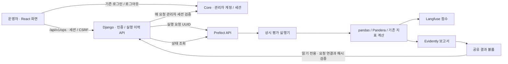
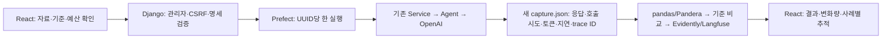

# LLMOps 개발 환경과 실행

[전략 문서](../../docs/langfuse-adoption-strategy.md) · [근거 답변 평가](../../evaluation/support-program-evidence/README.md)

구현 범위는 근거 답변 추적과 **저장 응답 재평가와 승인 기반 새 응답 생성 파이프라인**이다.
Langfuse 4.15.6, Prefect 3.8.6, pandas 3.0.6, Pandera 0.33.1, Evidently 0.7.23을
AI Service의 `uv.lock`으로 고정한다. 요청 처리에는 Langfuse만 설치하고 나머지는 `evaluation` 그룹으로 설치한다.
AI Service·Django Ops의 로컬·CI·Docker와 평가 실행기·Prefect 서버는 모두 Python 3.12를 사용한다.
AI 프로젝트는 `>=3.12,<3.13`으로 제한하며 `.python-version`과 `uv.lock`에 맞춰 설치한다.

## 개발 서버

저장소 루트에서 실행한다. Docker에는 약 8GB의 메모리를 확보하고, 13000·14200 포트가 비어 있는지 확인한다.
Langfuse Web·Worker, PostgreSQL, ClickHouse, Redis, MinIO와 Prefect를 별도 Compose 프로젝트에 둔다.
이미지는 digest로 고정하며 업무 서비스의 데이터베이스·볼륨을 공유하지 않는다.

```bash
python3 infrastructure/llmops/init_env.py
docker compose --env-file infrastructure/llmops/.env \
  -f infrastructure/llmops/compose.yaml --profile evaluation up -d
```

생성한 `.env`는 Git에서 제외되고 권한은 `0600`이다. 기존 파일은 덮어쓰지 않는다.
초기 DB migration과 사용자 생성이 끝날 때까지 수 분이 걸릴 수 있다.
Langfuse는 [localhost:13000](http://localhost:13000), Prefect는 [localhost:14200](http://localhost:14200)에서 확인한다.
Langfuse 이메일은 `llmops@localhost.test`, 비밀번호는 생성한 파일의 `LANGFUSE_ADMIN_PASSWORD`다.
두 UI는 loopback에만 공개한다. Prefect의 이 개발 구성에는 별도 인증을 설정하지 않는다.

개발 데이터는 named volume에 남는다. **7일 자동 삭제 정책은 아직 설정하지 않았다.**
운영 배포·보존 정책·외부 접근 인증은 별도 운영 작업이다.
종료할 때 다음 명령은 컨테이너만 정리하며 기록 볼륨은 유지한다.

```bash
docker compose --env-file infrastructure/llmops/.env \
  -f infrastructure/llmops/compose.yaml --profile evaluation down
```

## Django 운영 화면

화면은 기존 `frontend/web`의 React로 제공하고 Django는 인증·평가 API를 담당한다.

운영자가 브라우저에서 저장 자료 평가를 요청하고 실행 이력·결과를 확인하는 개발 구성이다.
[Ops 기능과 API](../../backend/ops-service/README.md#llmops-운영-화면)를 함께 참고한다.
Django는 별도 전용 MySQL을 사용한다. 기존 업무 Ops DB·계정·Langfuse 키를 변경하지 않는다.

기본 `.env`가 없는 경우 위 `init_env.py`를 먼저 실행한다. 다음 명령은 저장소 루트에서 실행하며,
`.env.ops`가 이미 있다면 생성 명령은 생략한다. 기존 파일은 덮어쓰지 않는다.

```bash
python3 infrastructure/llmops/init_ops_env.py

dc() {
  docker compose --env-file infrastructure/llmops/.env \
    --env-file infrastructure/llmops/.env.ops \
    -f infrastructure/llmops/compose.yaml \
    -f infrastructure/llmops/compose.ops.yaml --profile evaluation "$@"
}
dc up -d ops-mysql
dc build ops-service evaluation-runner
dc run --rm ops-service python manage.py migrate --noinput
dc up -d ops-service evaluation-runner

```

React 웹은 별도 터미널에서 저장소 루트 기준으로 실행한다(Node 24.x/pnpm 11.22.x).

```bash
pnpm install --frozen-lockfile
pnpm dev:web
```

[Core API](../../backend/core-service/README.md)를 먼저 실행하고
[운영 화면](http://localhost:5173/ops/evaluations)에서 **기존 프로젝트의 관리자 계정**으로 로그인한다.
로그인 화면은 기존 `/login`이며, 이미 관리자 로그인이 되어 있으면 바로 Ops를 볼 수 있다.
React의 `/api/v1/ops` 요청은 Vite가 Django `127.0.0.1:18001`로 전달한다.
Django는 `govbiz_session` 쿠키를 Core `/api/v1/admin/session`에 전달해 매 요청의 관리자 권한을 확인한다.
Core가 꺼지면 인증된 Ops 요청도 503으로 거절한다. Core 로그아웃 시 Ops도 접근할 수 없다.
브라우저는 동일한 `localhost:5173` 주소를 사용한다. 이전 `18001/ops/evaluations` 북마크는 React로 이동한다.
Django 계정 생성은 필요하지 않으며 이전 운영자 계정·이력·비밀번호를 변경하지 않는다.
`.env.ops`의 `OPS_ADMIN_PASSWORD`는 격리 CI fixture용이며 실제 관리자 로그인에 쓰지 않는다.

기본 Core 주소는 Vite에서 `127.0.0.1:8080`, Django 컨테이너에서 `host.docker.internal:8080`이다.
다른 Core를 사용할 때는 Vite의 `VITE_DEV_PROXY_TARGET`과 Compose의 `OPS_CORE_API_URL`을
같은 Core 서버로 맞춘다. Core가 `127.0.0.1`에만 바인딩된 호스트 환경에서는
Docker Desktop의 호스트 연결 지원 여부도 확인한다.
`평가 실행 → 상세 화면 → 결과 요약 → Evidently 보고서 / Langfuse 점수 / Prefect 로그` 순서로 확인한다.
Langfuse는 자체 로그인이 필요하며 Ops 로그인과 자동 공유하지 않는다.
과거 캡처는 모델 trace를 새로 만들지 않으므로 Langfuse 세션 상세가 존재하지 않을 수 있다.
Ops의 점수 링크는 해당 평가 ID의 `Session ID` 필터와 고정 조회 기간을 사용한다.
가상 6건 재현은 점수 22개, E01 비교의 후보 실행은 점수 4개다.

실행기는 `ops_flow.py`의 `govbiz-ops-evidence-evaluation/saved-capture` deployment를 등록하고
`serve(limit=1)`로 요청을 받는다. 스케줄은 등록하지 않는다. Django는 Prefect HTTP API만 호출하며
평가 의존성을 설치하지 않는다. UI는 저장된 가상 평가 6건 재현과 과거 프롬프트 실행의 공통 E01 비교를 제공한다.
자료를 선택하면 허용된 기준·후보 실행과 비교 사례가 표시된다. 상세 화면에서는 지표 차이, 사례별 상태·인용,
양쪽의 모델·프롬프트·실행기·캡처 식별자를 확인한다. 저장 응답 재평가 모드의 새 모델 호출은 0회다. 새 응답 생성은 아래 설정을 따른다.
두 프롬프트 캡처의 원본 사례는 각각 1건·4건이며, 비교 범위는 명시적으로 E01 한 건이다.
토큰 연결 정보가 없는 과거 실행과 의미 충실도는 미측정으로 표시한다. 이 비교는 현재 모델의 품질 측정이 아니다.
사용자의 새 실행 요청마다 UUID를 발급하지만 같은 자료의 평가 ID·Langfuse 점수 ID는 동일하므로
재계산이 중복 점수를 만들지 않는다. 요청 전송 재시도는 원래 UUID를 유지한다.



`ops-results` 볼륨의 `{요청 UUID}/request.json`이 Django 요청·기준/후보와 Prefect 실행을 연결하며,
`evaluation/` 아래에 기존 manifest·비교 요약·보고서를 보존한다. Django의 상태는 마지막 조회
시점의 Prefect 상태다. 상세 페이지를 열면 5초마다 갱신하며, 목록은 저장된 마지막 상태를 보여준다.
실행기가 꺼지면 새 요청은 대기 상태로 남고, Prefect 연결 실패·결과 파일 누락을 완료로 표시하지 않는다.
보고서 URL은 운영자만 접근할 수 있고 HTML에는 동일 출처 접근을 허용하지 않는 CSP sandbox를 적용한다.
비교 JSON과 보고서의 해시를 확인한 뒤 결과를 제공한다. `0002` migration을 먼저 적용하고 Ops·실행기를
갱신한다. 기존 이력·보고서는 유지되며, 이전 실행은 비교 상세가 없는 것으로 표시한다.

React 개발 서버 프록시를 경유한 기존 Core 관리자 로그인·CSRF·중복 요청·상태·보고서·공유 로그아웃 검증:

```bash
# 기존 Core 관리자 이메일·비밀번호를 환경변수 CORE_ADMIN_EMAIL / CORE_ADMIN_PASSWORD에 설정한다.
python3 infrastructure/llmops/ops_smoke.py --base-url http://localhost:5173 \
  --output work/llmops-core-admin-verification.json

# 같은 관리자 인증으로 기준·후보 비교 경로를 별도 검증한다.
python3 infrastructure/llmops/ops_smoke.py --base-url http://localhost:5173 \
  --compare-captures --output work/llmops-comparison-verification.json
```

이 검증은 새 평가 요청 1건을 생성하고 같은 요청을 재전송한다. `COMPLETED`, 가상 사례 6건의 요약,
동일 Prefect 실행 ID, 보고서 HTTP 200을 확인한다. 결과는 JSON에 보존하고 비밀번호는 출력하지 않는다.
실패·취소·접수 응답 유실·보고서 훼손·권한 오류는 Ops 단위/DB 통합 테스트에서도 검증한다.
`--compare-captures`는 E01의 지연 변화 `+117.477ms`, 미측정 토큰, 원본 4건 중 E01 비교,
같은 요청 UUID의 기준 변경 거절을 추가로 확인한다. 두 경로 모두 LLMOps CI에 연결되어 있다.

종료는 `dc down`으로 한다. 기존 Langfuse·Prefect와 이번 Ops 컨테이너를 정리하지만 모든 named volume은 유지한다.
운영 공개·여러 호스트의 결과 저장소·실제 모델 평가·정기 실행은 이 개발 구성에 포함하지 않는다.

## 무료 전체 검증

```bash
cd backend/ai-service
uv sync --locked --extra dev --group evaluation
cd ../..
set -a
source infrastructure/llmops/.env
set +a
backend/ai-service/.venv/bin/python infrastructure/llmops/smoke.py \
  --output-dir work/llmops-verification-001
```

새 출력 디렉터리를 지정한다. 검증은 다음을 실제 로컬 서버에서 확인하며 OpenAI API를 호출하지 않는다.

- 실제 답변 Service·Agent와 HTTP 모델 스텁을 통과한 정상·실패 trace 저장 및 조회
- 부모·자식 span 연결, 본문·키 미수집
- 6개 가상 사례의 저장 캡처를 pandas 표로 변환하고 Pandera로 입력·결과 검증
- Evidently 보고서와 Langfuse 점수 저장·조회
- 같은 캡처 재실행 시 동일한 평가 실행 ID·점수 ID 사용
- 정상 두 번과 잘못된 입력 한 번의 Prefect 서버 상태 `COMPLETED / COMPLETED / FAILED`

`verification.json`에 검증 결과가, 각 실행 폴더에는 `manifest.json`, `results.json`, `comparison.json`,
`report.html`, `evidently.json`이 남는다. 실패한 실행은 이미 만든 부분 산출물을 보존하고 manifest에 실패를 기록한다.
보고서에는 실행 ID와 기준 실행 ID가 있고, Langfuse 점수 metadata에는 동일한 평가 실행 ID가 있다.

## Ops에서 새 모델 평가

새 응답 생성은 기존 `govbiz-ops-evidence-evaluation/saved-capture` deployment의 명시적 live 모드다.
기존 요청·북마크 호환을 위해 deployment 이름을 유지한다. 기본 실행 방식은 replay, live 활성화는 false다.

1. 위 `dc build` → `dc run --rm ops-service python manage.py migrate --noinput`로 최신 코드와 migration 0003을 반영한다.
2. 전송할 자료와 예산을 승인한 후 Git에서 제외된 `.env.ops`에 `LLMOPS_LIVE_ENABLED=true`,
   `LLMOPS_LIVE_MODEL=gpt-6-luna`, `OPENAI_API_KEY=<승인된 프로젝트의 키>`를 설정한다.
   키를 커밋하거나 브라우저·Prefect 인자로 전송하지 않는다. 키는 evaluation-runner에만 주입된다.
3. `dc up -d ops-service evaluation-runner`로 두 서비스 설정을 반영한다.
4. Ops에서 **새 응답 생성**을 고르고 자료·기준·전송 내용·최대 호출 예산을 확인한 뒤 실행한다.

| 자료 | OpenAI로 전송하는 범위 | 호출 예산 |
|---|---|---|
| `fixed-context-e01-v1` | `fixture.json`의 E01 질문과 해당 가상 공고의 고정 근거 청크, 답변 지침 | 최대 1회 |
| `target-coverage-20260907-v1` | `target-coverage-fixture.json`의 TC01–TC06 질문과 해당 가상 공고의 고정 근거 청크, 답변 지침 | 최대 6회 |

호출당 출력은 최대 2,000토큰이며 재시도·검색·임베딩·외부 도구 호출은 없다. 금액이 아닌 호출 수와 출력 토큰 예산이다.
출력 상한은 reasoning 토큰도 포함하는 Responses API의 `max_output_tokens`로 전송된다.
[OpenAI 공식 API 문서](https://developers.openai.com/api/reference/python/resources/responses/methods/create)를 따른다.
실행기는 서버의 승인 명세, fixture 해시와 기준 캡처 완전성을 **모델 호출 전**에 확인한다.



같은 요청 UUID는 DB/Prefect에서 중복 접수를 막고 실행기도 새 UUID 디렉터리를 배타 생성한다.
수동 Prefect 재실행도 기존 요청의 모델 호출을 반복하지 않는다. 모델 실패·timeout은 부분 캡처를 남기고
작업 실패로 표시한다. 호출 시도 수는 요청 전송 직전에 저장하며 과금 확정 횟수는 아니다.
보고서/점수 등록 실패 후에도 새 캡처는 보존되지만 Ops에서 후처리만 재개하는 UI는 아직 없다.
새 캡처의 자동 기준 승격·품질 합격 판정·정기 평가도 이번 범위에 포함하지 않는다.

무료 테스트는 전송 명세·실패·중복·비교·UI 동작을 검증한다. 실제 OpenAI 품질 검증은 별도 승인/실행 전까지 미검증이다.
기존 캡처의 이름이나 모델 메타데이터를 현재 모델로 변경하지 않는다.

## 저장 캡처 평가

위 설치와 환경변수 설정 뒤 저장소 루트에서 실행한다.

```bash
backend/ai-service/.venv/bin/python evaluation/support-program-evidence/llmops.py \
  --fixture evaluation/support-program-evidence/target-coverage-fixture.json \
  --capture evaluation/support-program-evidence/runs/target-coverage-20260907-v1/capture.json \
  --reference evaluation/support-program-evidence/runs/target-coverage-20260907-v1/capture.json \
  --output-dir work/llmops-evaluation-001
```

이 예제는 같은 캡처의 재현 확인이다. 보고서의 `self-replay`는 모델 품질 개선을 뜻하지 않는다.
후보 캡처를 비교할 때는 같은 fixture와 선택 사례 목록을 사용한다.
실패·누락 사례를 제거하지 않으며, 부분 실행에는 전체 상태 일치율·인용 재현율을 내지 않는다.
미측정 의미 충실도는 계속 `null`이고, 참조 자료는 AI 작성 가상 사례로 표시한다.

기존 계산 함수를 재사용하며 표 집계와 기존 보고서의 값이 다르면 실패한다.
과거 캡처에는 새 모델 trace를 만들지 않고 평가 실행 ID에 session 점수를 연결한다.
새 평가의 실제 `traceId`가 있으면 해당 trace에 연결한다.
평가 실행 ID는 fixture·캡처·평가 코드 해시로 정하고 점수 ID에는 사례와 지표 이름도 포함한다.
등록·보고서 작업은 저장 결과로 한 번 재시도한다. 모델 실행 단계는 이 flow에 없으므로 모델 호출 예산은 0이다.
한 checkout의 수동 평가는 파일 잠금으로 동시 실행을 차단한다. 여러 호스트 배포·스케줄·전역 동시성 제어는 후속 범위다.

새 캡처는 사례별 `apiResponseIndexes`로 토큰 기록을 연결한다. 과거 캡처처럼 사례와 API 사용량의 연결 정보가 없으면
토큰은 `null`로 둔다. 지연·토큰 미제공을 0으로 집계하지 않는다.

## 실제 AI Service 추적 활성화

`LANGFUSE_ENABLED=false`가 기본값이다. 활성화 시 `LANGFUSE_BASE_URL`, `LANGFUSE_PUBLIC_KEY`,
`LANGFUSE_SECRET_KEY`를 명시해야 한다. `LANGFUSE_ENVIRONMENT`는 기본 `development`, `GIT_SHA`는
빌드 커밋을 확정한 경우 설정한다. 서버의 Langfuse 환경변수를 읽은 뒤 기존 AI Service 실행 명령을 사용한다.
서비스용 `OPENAI_API_KEY` 등 기존 설정은 별도로 필요하다. smoke 검증에는 필요하지 않다.

호출 흐름은 `HTTP /answers → AnswerService → AnswerAgent → LangChain → OpenAI`다.
`evidence.answer`에는 Service의 인용 검증까지, 하위 `evidence.model`에는 모델·토큰·지연을 기록한다.
LangChain 자동 콜백은 붙이지 않고 명시적인 두 span만 내보내므로 공통 LLM 호출부와 다른 기능의 추적 정책은 유지한다.
질문·답변·청크 본문과 예외 원문은 기록하지 않는다. 정상 근거 부족과 시스템 오류·시간 초과·취소를 구별한다.
Langfuse 전송 실패는 로컬 로그로 드러내며 모델 호출을 반복하지 않는다. 종료 대기는 최대 5초다.

기존 `evaluate.py --execute`도 같은 추적 초기화·종료를 사용하며 새 사례에 `traceId`를 남긴다.
이 기존 명령은 **유료 모델 실행**이므로 승인한 자료·호출 예산을 정한 경우에만 사용한다.
저장 캡처 재계산과 위 smoke 명령은 이 실행 모드를 사용하지 않는다.

업무 Compose의 AI 컨테이너에서 연결할 경우 `localhost`는 컨테이너 자신이다.
Docker Desktop에서는 `LANGFUSE_BASE_URL=http://host.docker.internal:13000`을 사용한다.
Linux에서는 두 Compose 네트워크의 연결 또는 호스트 게이트웨이 설정을 별도로 준비해야 한다.

## 테스트와 CI

```bash
cd backend/ai-service
uv run --locked --extra dev --group evaluation python -m pytest \
  tests/test_config.py tests/test_bootstrap.py tests/test_container_image_contract.py \
  tests/support_program_evidence/test_agent.py tests/support_program_evidence/test_tracing.py \
  ../../evaluation/support-program-evidence
```

[GovBiz CI](../../.github/workflows/ci.yml)는 기존 전체 AI 검증과 평가 도구 무료 테스트를 유지한다.
[LLMOps CI](../../.github/workflows/llmops-ci.yml)는 Python 3.12에서 실제 로컬 Langfuse·Prefect 저장·조회 검증을 수행한다.
React 운영 연결과 Core 변경도 LLMOps CI 대상이며 Node 24의 Vite 프록시를 통해 Ops smoke를 실행한다.
CI는 `compose.auth-test.yaml`로 실제 Core와 별도 빈 MySQL을 추가하고 `--seed-dev-accounts`로
fixture 계정만 생성한다. 일반 회원 접근 거절, 기존 로그인 API로 관리자 로그인, 평가·보고서,
Core 로그아웃 후 Ops 접근 거절을 검증한다. 이 fixture는 일반 개발 실행에 포함하지 않으며
기존 개발 회원 DB·볼륨을 공유하지 않는다. 개발 서버에서는 seed 플래그를 사용하지 않는다.
React 화면/라우팅 테스트·타입·빌드는 GovBiz CI, Django 전체 MySQL 테스트·컨테이너는 Ops CI가 담당한다.
AI·평가 도구 테스트는 동일한 Python 3.12의 GovBiz CI에서 수행하며 별도의 다중 버전 작업은 두지 않는다.
워크플로 추가는 원격 CI 통과나 브랜치 보호 설정 완료를 뜻하지 않는다.

2026-09-26 버전 통일 후 로컬 가상환경을 Python 3.12.14로 다시 구성했다.
`uv lock --check`와 설치된 188개 패키지의 `uv pip check`가 통과했으며, 위 선택 테스트는 **305개 통과**했다.
추적 검증 16개와 평가 파이프라인 검증 17개, 기존 설정·bootstrap·Agent·평가 도구 회귀를 포함한다.
평가 실행기의 실제 `execute()` 경로도 Langfuse 활성화·비활성화와 정상·실패 8종을 조합한 16개 테스트가
Python 3.12에서 통과했다. 저장한 `traceId`와 Service·Agent span의 연결, 응답별 토큰 기록 연결,
본문·키 제외 및 HTTP 클라이언트 종료를 검증했다. 모델 HTTP와 trace export는 테스트 대역을 사용하며,
이 검증을 실제 모델 품질 측정이나 AI Docker 이미지 검증으로 해석하지 않는다.
Prefect 개발 컨테이너도 Python 3.12.14 이미지로 갱신했고, 통일 후 실제 개발 서버 검증 기록은
`work/llmops-python312/verification.json`에 있다. 이 기록에는 평가 실행기의 Python 버전도 남긴다.
정상·실패 trace 2건, 평가 점수 22개의 등록·조회와 동일 ID 재등록, Prefect 정상 두 번·입력 오류 한 번의 상태를 확인했다.
모델 API 호출은 0회다. 원격 CI 전체 검증, AI Docker 이미지 재빌드와 운영 배포는 아직 실행하지 않았다.

2026-09-27 Django 연결은 실제 Python 3.12 컨테이너·격리 MySQL 8.4에서 Ops 테스트 19개,
AI/평가 관련 선택 테스트 31개가 통과했다. 점수 링크를 수정한 뒤 관련 완료·보고서 테스트도 재검증했다.
Ruff 검사·포맷, 잠금 파일, migration 정합성, Compose 설정을 확인했다.
`work/llmops-ops-verification.json`은 실제 HTTP 로그인·CSRF·중복 접수·6건 평가·보고서 200 검증 기록이다.
브라우저에서도 로그인과 평가 버튼, 완료 요약, Evidently 차트, Langfuse 점수 22개를 확인했다.
새 Ops·평가 실행기 이미지는 로컬에서 빌드·실행했다. 이전 Django 템플릿 구현 커밋 `4f28a05`의 원격 CI 5개는 통과했으며 운영 배포는 수행하지 않았다.

2026-09-27 React 전환은 Node 24.19.0/pnpm 11.22.0에서 React 운영·기존 라우팅·계정·프록시 관련
선택 테스트 186건과 타입·빌드를 확인했다. Django 평가·JSON 인증·CSRF 테스트 16건은 격리 MySQL 8.4에서
통과했다. Ruff, Oxlint, 워크플로 YAML 구문을 확인했다. `work/llmops-react-proxy-verification.json`은
Vite 프록시를 거친 실제 로그인·중복 접수·6건 평가·보고서·로그아웃 검증 기록이다.
브라우저에서 기존 Django 북마크의 React 이동, 기존 이력 유지, 새 평가 완료와 Evidently 차트를 확인했다.
React 전환 변경의 원격 CI와 운영 배포는 아직 수행하지 않았다.

2026-09-27 Core 관리자 연동 후 JDK 21의 Core 인증 선택 테스트 21건, 실제 MySQL 8.4의
Django 평가·인증 테스트 18건, React Ops 9건과 기존 계정·라우팅·프록시 관련 149건이 통과했다.
React 타입·Oxlint·빌드, Django Ruff, Compose 설정과 워크플로 구문도 확인했다.
`work/llmops-core-admin-verification.json`은 기존 Core 관리자 로그인, 저장 사례 6건의 평가 완료,
중복 접수 방지, CSRF, 보고서 HTTP 200, Core 로그아웃 후 Ops API·보고서 401을 확인한 기록이다.
브라우저에서도 기존 `/login`에서 로그인 후 Ops 상세 복귀와 공유 로그아웃을 확인했다.
Core·Ops DB와 기존 평가 이력은 유지했다. 최초 병렬 검증 중 인증 확인 timeout으로 503이 한 번
발생했으며, 부하가 줄어든 상태의 전체 HTTP 재검증은 통과했다. 오류를 정상 응답으로 대체하지 않는다.
전체 테스트·Core MySQL 통합 테스트·격리 CI 인증 fixture의 컨테이너 실행은 원격 CI 확인 대상이다.
이 변경의 원격 CI와 운영 배포는 아직 수행하지 않았다.

2026-09-27 기준·후보 비교 추가 후 Python 3.12 평가/flow 테스트 25건, 격리 MySQL 8.4의
Django 평가·인증 테스트 20건, React Ops 테스트 11건이 통과했다. Ruff·Oxlint·타입·웹 빌드,
Django 설정·migration 정합성, 캡처 목록 경로·워크플로 구문을 확인했다. 로컬 Ops와 실행기를
다시 빌드하고 기존 이력을 보존하는 `0002` migration을 적용했다.
`work/llmops-comparison-verification.json`은 기존 관리자 로그인부터 E01 비교 완료·보고서 200·로그아웃까지,
`work/llmops-replay-comparison-verification.json`은 기존 6건 재현 경로의 같은 HTTP 검증 기록이다.
브라우저에서도 자료 선택·실행·완료와 지표 차이·사례별 결과·미측정 표시를 확인했다.
최초 6건 검증에서는 인증 API 503과 Langfuse 점수 저장의 읽기 시간 초과가 발생해 실행이 실패했다.
서버 응답 확인 후 단독 재실행은 통과했으며, 실패 이력과 엄격한 오류 처리는 유지했다.
새 모델 호출은 0회다. 이 비교 변경의 전체 원격 CI와 운영 배포는 아직 수행하지 않았다.

### 새 응답 생성 연결의 로컬 검증

2026-09-27 변경에서는 무료 평가 테스트 93개(기존 90개와 추가 timeout·예산·생성→보고서 연결 3개),
실제 MySQL 8.4의 Ops 테스트 23개, React 테스트 15개가 통과했다. TypeScript, Oxlint, Ruff,
migration 정합성, Compose 구문과 두 서비스 이미지 빌드도 확인했다. 로컬 Ops에 migration 0003을 적용했다.
실제 Core 관리자 로그인→Django→Prefect→보고서/점수 경로는 저장 E01 비교로 완료했다
(`work/llmops-live-feature-replay-verification.json`, 요청 `7068d286-e16d-4594-9a48-b6d86d4dadf8`).
브라우저에서 새 응답 생성 선택·자료별 1회/6회 예산·비활성화 상태를 확인했다.
OpenAI 키와 별도 실행 승인이 없어 이번 변경의 실제 유료 호출은 0회이며, 모델 품질은 미검증이다.
변경된 평가 테스트는 기존 GovBiz CI의 `evaluation/support-program-evidence` 전체 테스트에 포함된다.
이 기록은 로컬 검증 결과이며, 원격 CI 통과나 운영 배포 완료를 의미하지 않는다.
